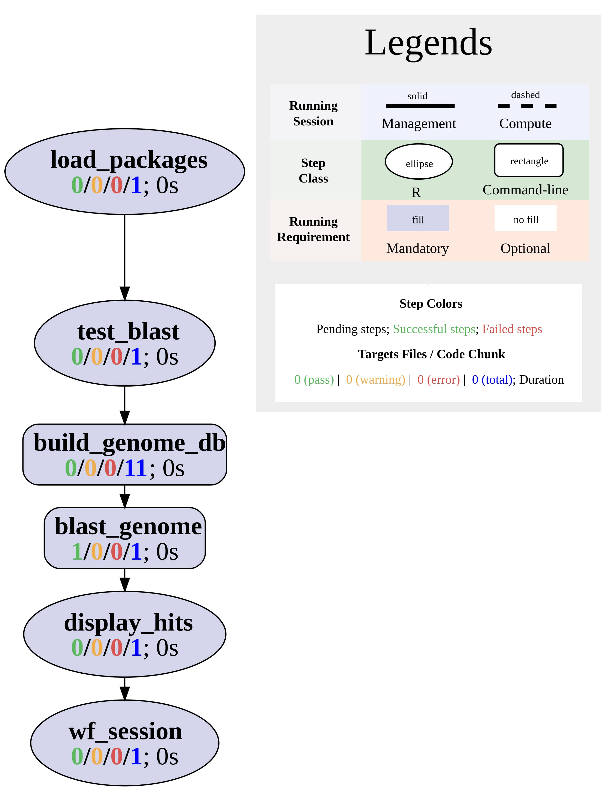

```{css, echo=FALSE}
pre code {
white-space: pre !important;
overflow-x: scroll !important;
word-break: keep-all !important;
word-wrap: initial !important;
}
```

```{r style, echo = FALSE, results = 'asis'}
BiocStyle::markdown()
options(width=60, max.print=1000)
knitr::opts_chunk$set(
    eval=as.logical(Sys.getenv("KNITR_EVAL", "TRUE")),
    cache=as.logical(Sys.getenv("KNITR_CACHE", "TRUE")), 
    tidy.opts=list(width.cutoff=60), tidy=TRUE)
```

```{r setup, echo=FALSE, message=FALSE, warning=FALSE, eval=FALSE}
suppressPackageStartupMessages({
    library(systemPipeR)
})
```

# About this template
This is the BLAST workflow template of the [systemPipeRdata](https://bioconductor.org/packages/devel/data/experiment/html/systemPipeRdata.html) 
package, a companion
package to [systemPipeR](https://www.bioconductor.org/packages/devel/bioc/html/systemPipeR.html) [@H_Backman2016-bt]. Like other workflow
templates, it can be loaded with a single command. Users have the
flexibility to utilize the template as is or modify it as needed. More in-depth
information can be found in the main vignette of [systemPipeRdata](https://bioconductor.org/packages/devel/data/experiment/vignettes/systemPipeRdata/inst/doc/systemPipeRdata.html). The BLAST
workflow template serves as a starting point for conducting sequence similarity
search routines. It employs [NCBI’s BLAST](https://blast.ncbi.nlm.nih.gov/Blast.cgi) software as an illustrative example,
enabling users to search a sequence database for entries that share sequence
similarity to one or multiple query sequences. The search results can be
presented in a concise tabular summary format, or the corresponding pairwise
alignments can be included. To utilize this workflow, users must download and
install the BLAST software from NCBI’s website [here](https://ftp.ncbi.nlm.nih.gov/blast/executables/blast+/LATEST/) and ensure it is added to
their system’s PATH environment variable.

The `Rmd` file (`SPblast.Rmd`) associated with this vignette serves a dual purpose.
It acts both as a template for executing the workflow and as a template for
generating a reproducible scientific analysis report. Thus, users want to
customize the text (and/or code) of this or other `systemPipeR` workflow vignettes to describe their
experimental design and analysis results. This typically involves deleting the
instructions how to work with this workflow, and customizing the text
describing experimental designs, other metadata and analysis results.

The following data analysis steps are included in this workflow template:

1. Validation of the BLAST installation 
2. Creation of an indexed sequence database that can be searched with BLAST 
3. BLAST search of indexed database with query sequence 

The topology graph of the BLAST workflow is shown in Figure 1.

```{r spblast-toplogy, eval=TRUE, warning= FALSE, echo=FALSE, out.width="100%", fig.align = "center", fig.cap= "Topology graph of BLAST workflow.", warning=FALSE}

```

# Workflow environment

The environment of the chosen workflow is generated with the `genWorenvir`
function. After this, the user’s R session needs to be directed into the
resulting directory (here `SPblast`).


```{r gen_spblast_wf, eval=FALSE}
systemPipeRdata::genWorkenvir(workflow = "SPblast", mydirname = "SPblast")
setwd("SPblast")
```

The `SPRproject` function initializes a new workflow project instance. This
function call creates an empty `SAL` workflow container and at the same time a
linked project log directory (default name `.SPRproject`) that acts as a
flat-file database of a workflow. For additional details, please visit this
[section](https://www.bioconductor.org/packages/devel/bioc/vignettes/systemPipeR/inst/doc/systemPipeR.html#5_Detailed_tutorial) 
in `systemPipeR's` main vignette.

```{r create_workflow, message=FALSE, eval=FALSE}
library(systemPipeR)
sal <- SPRproject()
sal
```

The `importWF` function allows to import all the workflow steps outlined in
the source Rmd file of this vignette into a `SAL` (`SYSargsList`) workflow
container. Once imported, the entire workflow can be executed from start to
finish using the `runWF` function. More details regarding this process are
provided in the following section [here](#importwf).

```{r load_workflow_default, eval=FALSE}
sal <- importWF(sal, "SPblast.Rmd")
sal <- runWF(sal)
```

## Step 1: Load packages 

Next, the `systemPipeR` package needs to be loaded in a workflow.

```{r load_packages, eval=FALSE, spr=TRUE}
appendStep(sal) <- LineWise(
    code = {
        library(systemPipeR)
    }, 
    step_name = "load_packages"
)
```

## Step 2: Test BLAST install

The following step is optional. It tests the availability of the BLAST software on the user’s system.

```{r test_blast, eval=FALSE, spr=TRUE}
appendStep(sal) <- LineWise(
    code = {
        # If you have a modular system, then enable the following line
        # moduleload("ncbi-blast") 
        blast_check <- tryCMD("blastn", silent = TRUE)
        if(blast_check  == "error") stop("Check your BLAST installation path.")
    }, 
    step_name = "test_blast",
    dependency = "load_packages"
)
```

## Step 3: BLASTable database

This step creates an indexed sequence database that can be searched with BLAST.
The sample sequences used for creating the databases are stored in a file named 
`tair10.fasta` under the `data` directory of the workflow environment. The exact command-line (CL)
call used for creating the indexed database can be returned with `cmdlist(sal, step=3)`.


```{r build_genome_db, eval=FALSE, spr=TRUE}
appendStep(sal) <- SYSargsList(
    step_name = "build_genome_db", 
    dir = FALSE, 
    targets=NULL, 
    wf_file = "blast/makeblastdb.cwl", 
    input_file="blast/makeblastdb.yml",
    dir_path="param/cwl", 
    dependency = "test_blast"
)
```

## Step 4: BLAST search

Next, the BLASTable database is searched with a set of query sequences to find sequences in the 
database that share sequence similarity with the queries. As above, the exact CL 
call used in this step can be returned with `cmdlist(sal, step=4)`.

```{r blast_genome, eval=FALSE, spr=TRUE}
appendStep(sal) <- SYSargsList(
    step_name = "blast_genome", 
    dir = FALSE,
    targets="targets_blast.txt", 
    wf_file = "blast/blastn.cwl", 
    input_file="blast/blastn.yml",
    inputvars = c(
        FileName = "_query_file_",
        SampleName = "_SampleName_"
    ),
    dir_path="param/cwl", 
    dependency = "build_genome_db"
)
```

## Step 5: View top hits

This step displays the top hits identified by the BLAST search in the previous step. 
The `e_value` and `bit_score` columns allow to rank the BLAST results by sequence similarity.

```{r display_hits, eval=FALSE, spr=TRUE}
appendStep(sal) <- LineWise(
    code = {
        # get the output file path from a Sysargs step using `getColumn`
        tbl_tair10 <- read.delim(getColumn(sal, step = "blast_genome")[1], header = FALSE, stringsAsFactors = FALSE)
        names(tbl_tair10) <- c(
          "query", "subject", "identity", "alignment_length", "mismatches", 
          "gap_openings", "q_start", "q_end", "s_start", "s_end", 
          "e_value", "bit_score"
        )
        print(head(tbl_tair10, n = 20))
    }, 
    step_name = "display_hits",
    dependency = "blast_genome"
)
```

## Version Information

```{r wf_session, eval=FALSE, spr=TRUE}
appendStep(sal) <- LineWise(
    code = {
        sessionInfo()
    }, 
    step_name = "wf_session", 
    dependency = "display_hits")
```

# Automated routine {#importwf}

Once the above workflow steps have been loaded into `sal` from the source `Rmd`
file of this vignette, the workflow can be executed from start to finish (or
partially) with the `runWF` command. Subsequently, scientific and technical
workflow reports can be generated with the `renderReport`  and `renderLogs`
functions, respectively.

__Note:__ To demonstrate 'systemPipeR's' automation routines without regenerating a new workflow 
environment from scratch, the first line below uses the `overwrite=TRUE` option of the `SPRproject` function. 
This option is generally discouraged as it erases the existing workflow project and `sal` container. 
For information on resuming and restarting workflow runs, users want to consult the relevant section of 
the main vignette (see [here](https://www.bioconductor.org/packages/devel/bioc/vignettes/systemPipeR/inst/doc/systemPipeR.html#10_Restarting_and_resetting_workflows).)

```{r , import_run_routine, eval=FALSE}
sal <- SPRproject(overwrite = TRUE) # Avoid 'overwrite=TRUE' in real runs.
sal <- importWF(sal, file_path = "SPblast.Rmd") # Imports above steps from new.Rmd.
sal <- runWF(sal) # Runs ggworkflow.
plotWF(sal) # Plot toplogy graph of workflow
sal <- renderReport(sal) # Renders scientific report.
sal <- renderLogs(sal) # Renders technical report from log files.
```

## CL tools used 
The `listCmdTools` (and `listCmdModules`) return the CL tools that 
are used by a workflow. To include a CL tool list in a workflow report, 
one can use the following code. Additional details on this topic 
can be found in the main vignette [here](https://www.bioconductor.org/packages/devel/bioc/vignettes/systemPipeR/inst/doc/systemPipeR.html#111_Accessor_methods).

```{r list_tools}
if(file.exists(file.path(".SPRproject", "SYSargsList.yml"))) {
    local({
        sal <- systemPipeR::SPRproject(resume = TRUE)
        systemPipeR::listCmdTools(sal)
        systemPipeR::listCmdModules(sal)
    })
} else {
    cat(crayon::blue$bold("Tools and modules required by this workflow are:\n"))
    cat(c("BLAST 2.16.0+"), sep = "\n")
}
```

## Session Info
This is the session information for rendering this R Markdown report. To access the 
session information for the workflow run, generate the technical HTML report with `renderLogs`. 

```{r report_session_info, eval=TRUE}
sessionInfo()
```
