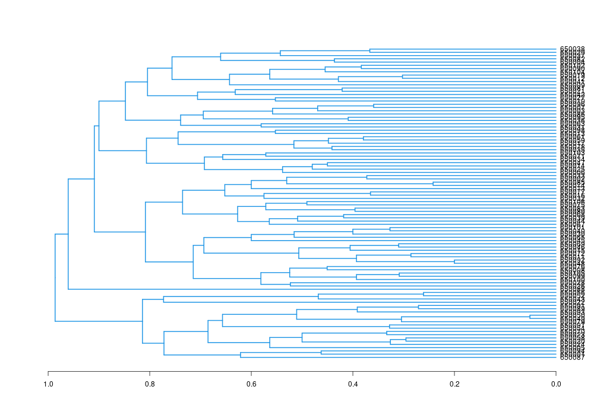
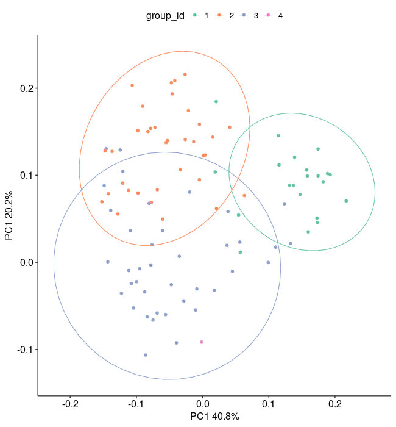
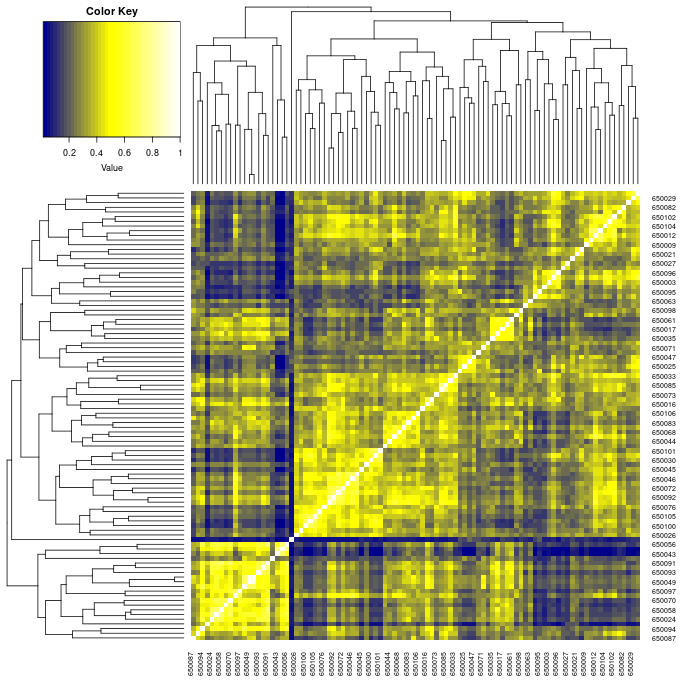

<!--
Config css and r style
-->

```{css, echo=FALSE}
pre code {
white-space: pre !important;
overflow-x: scroll !important;
word-break: keep-all !important;
word-wrap: initial !important;
}
```

```{r style, echo = FALSE, results = 'asis'}
BiocStyle::markdown()
options(width=60, max.print=1000)
knitr::opts_chunk$set(
    eval=as.logical(Sys.getenv("KNITR_EVAL", "TRUE")),
    cache=as.logical(Sys.getenv("KNITR_CACHE", "TRUE")), 
    tidy.opts=list(width.cutoff=60), tidy=TRUE)
```

```{r setup, echo=FALSE, message=FALSE, warning=FALSE, eval=FALSE}
suppressPackageStartupMessages({
    library(systemPipeR)
})
```

# About the template
This section provides general description and how to use this cheminformatics workflow. In the actual analysis report, this 
section is usually **removed**. 

This cheminformatics workflow template is based on the 
[ChemmineR](https://www.bioconductor.org/packages/release/bioc/vignettes/ChemmineR/inst/doc/ChemmineR.html)
package and should be downloaded from 
[Bioconductor](https://www.bioconductor.org/packages/release/bioc/html/ChemmineR.html)
before running the workflow. This template is a workflow that does:

1. Loads molecules from SDF format.
2. Help users visualize specified molecules.
3. Convert molecules to AP and FP format. 
4. Compute the similarity and distance between molecules 
5. Plot the distance matrix. 

There is no other command-line software required in this workflow. All  are written in R (`Linewise`) steps.


# Introduction

Users want to provide here background information about the design of their
cheminformatics project.

This report describes the analysis of a cheminformatics project studying drug ...

## Experimental design

Typically, users want to specify here all information relevant for the
analysis of their Cheminformatics study. This includes detailed descriptions of
files, experimental design, reference genome, gene annotations,
etc.

# Workflow environment

_`systemPipeR`_ workflows can be designed and built from start to finish with a 
single command, importing from an R Markdown file or stepwise in interactive 
mode from the R console. 

This tutorial will demonstrate how to build the workflow in an interactive mode, 
appending each step. The workflow is constructed by connecting each step via 
`appendStep` method. Each `SYSargsList` instance contains instructions needed 
for processing a set of input files with a specific command-line or R software 
and the paths to the corresponding outfiles generated by a particular tool/step. 

To create a Workflow within _`systemPipeR`_, we can start by defining an empty
container and checking the directory structure:

```{r create_workflow, message=FALSE, eval=FALSE}
library(systemPipeR)
sal <- SPRproject()
sal
```

## Load packages 

This is an empty template that contains only one demo step. 
Refer to our [website](https://systempipe.org/sp/spr/spr_run/) for how to 
add more steps. If you prefer a more enriched template, 
[read this page](https://systempipe.org/sp/spr/templates/) for other 
pre-configured templates.

```{r load_packages, eval=FALSE, spr=TRUE}
cat(crayon::blue$bold("To use this workflow, following R packages are expected:\n"))
cat(c("'ChemmineR", "ggplot2", "tibble", "readr", "ggpubr", "gplots'\n"), sep = "', '")
###pre-end
appendStep(sal) <- LineWise(
    code = {
        library(systemPipeR)
        library(ChemmineR)
    }, 
    step_name = "load_packages"
)
```

## Load SDF dataset
Molecules can be loaded or downloaded. This example dataset has 100 molecules.
```{r load_data, eval=FALSE, spr=TRUE}
# Here, the dataset is downloaded. If you already have the data locally, change URL to local path.
appendStep(sal) <- LineWise(
    code = {
        sdfset <- read.SDFset("http://faculty.ucr.edu/~tgirke/Documents/R_BioCond/Samples/sdfsample.sdf") 
        # rename molecule IDs by IDs in the header. If your molecules' header does not have ID or
        # not unique, remove following code and use the default IDs
        cid(sdfset) <- makeUnique(sdfid(sdfset))
    }, 
    step_name = "load_data",
    dependency = "load_packages"
)
```

## Visualize molecules
```{r vis_mol, eval=FALSE, spr=TRUE}
appendStep(sal) <- LineWise(
    code = {
        png("results/mols_plot.png", 700, 600)
        # Here only first 4 are plotted. Please choose the ones you want to plot.
        ChemmineR::plot(sdfset[1:4])
        dev.off()
    }, 
    step_name = "vis_mol", 
    dependency = "load_data",
    run_step = "optional"
)
```


## Basic molecule inforamtion
Compute some basic molecule information and store to file, such as atom frequency matrix, molecular weight and formula.
```{r basic_mol_info, eval=FALSE, spr=TRUE}
appendStep(sal) <- LineWise(
    code = {
        propma <- data.frame(MF=MF(sdfset), MW=MW(sdfset), atomcountMA(sdfset))
        readr::write_csv(propma, "results/basic_mol_info.csv")
    }, 
    step_name = "basic_mol_info", 
    dependency = "load_data",
    run_step = "optional"
)
```


The information can be visualized, for example, a boxplot of atom frequency.
```{r mol_info_plot, eval=FALSE, spr=TRUE}
appendStep(sal) <- LineWise(
    code = {
        png("results/atom_req.png", 700, 700)
        boxplot(propma[, 3:ncol(propma)], col="#6cabfa", main="Atom Frequency")
        dev.off()
    }, 
    step_name = "mol_info_plot", 
    dependency = "basic_mol_info",
    run_step = "optional"
)
```


## Convert SDF to AP/FP
Tanimoto similarity requires molecules to be converted into searchable format. In this workflow, either atom pair (AP) or fingerprint (FP) should be used as input. 
This step convert SDF molecules to these formats. 

```{r apfp_convert, eval=FALSE, spr=TRUE}
appendStep(sal) <- LineWise(
    code = {
         apset <- sdf2ap(sdfset)
         fpset <- desc2fp(apset, descnames=1024, type="FPset") 
         # save them to a file so they can be loaded directly next time
         readr::write_rds(apset, "results/apset.rds")
         readr::write_rds(fpset, "results/fpset.rds")
    }, 
    step_name = "apfp_convert", 
    dependency = "load_data"
)
```


## Remove duplicates 
When molecules are converted to AP/FP, there is chance some very similar molecules end up with idenitical AP/FP, for example some stereoisomers. This is the shortness of these standardization methods. For the downstream clustering part, we need to remove the AP/FP duplicated ones. 
In this workflow, FPset is used for similarity and clustering computation, FP deduplication is demonstrated here. It will be very similar for AP.

```{r fp_dedup, eval=FALSE, spr=TRUE}
appendStep(sal) <- LineWise(
    code = {
         fpset <- fpset[which(!cmp.duplicated(apset))]
    }, 
    step_name = "fp_dedup", 
    dependency = "apfp_convert"
)
```


## Similarity compute
In this step, the pairwise similarity is computed. 
```{r fp_similarity, eval=FALSE, spr=TRUE}
appendStep(sal) <- LineWise(
    code = {
          # If your set is very large, compute a small portion is a better idea, e.g. 
          # sapply(cid(fpset)[1:10], ...
          simMAfp <- sapply(cid(fpset), function(x) fpSim(x=fpset[x], fpset, sorted=FALSE)) 
    }, 
    step_name = "fp_similarity", 
    dependency = "fp_dedup"
)
```

## Hierarchical clustering
After the similarity computation, we can do some clustering. In this step, hierarchical clustering (hclust) is performed. 
```{r hclust, eval=FALSE, spr=TRUE}
appendStep(sal) <- LineWise(
    code = {
          hc <- hclust(as.dist(1-simMAfp))
          png("results/hclust.png", 1000, 700)
          plot(as.dendrogram(hc), edgePar=list(col=4, lwd=2), horiz=TRUE) 
          dev.off()
          # to see the tree groupings, one need to cut the tree, for example, by height of 0.9
          tree_cut <- cutree(hc, h = 0.9)
          grouping <- tibble::tibble(
              cid = names(tree_cut),
              group_id = tree_cut
          ) 
          readr::write_csv(grouping, "results/hclust_grouping.csv")
    }, 
    step_name = "hclust", 
    dependency = "fp_similarity",
    run_step = "optional"
)
```



With the group information, directly plotting the hclust does not look nice. We can use other 
methods to visulize the grouping. Here, PCA is used. 

```{r PCA, eval=FALSE, spr=TRUE}
appendStep(sal) <- LineWise(
    code = {
        library(magrittr)
        library(ggplot2)
        # simMAfp is already 0-1 value, no need to normalize again 
        mol_pca <- princomp(simMAfp)
        # find the variance 
        mol_pca_var <- mol_pca$sdev[1:2]^2 / sum(mol_pca$sdev^2)
        # plot 
        png("results/mol_pca.png", 650, 700)
        tibble::tibble(
              PC1 = mol_pca$loadings[, 1],
              PC2 = mol_pca$loadings[, 2],
              group_id = as.factor(grouping$group_id)
          ) %>% 
            # here only group labels are used to color, if you have experimental conditions
            # or drug types, the coloring or shaping will be more meaningful.
            ggplot(aes(x = PC1, y = PC2, color = group_id)) + 
            geom_point(size = 2) +
            stat_ellipse() +
            labs(
                x = paste0("PC1 ", round(mol_pca_var[1], 3)*100, "%"),
                y = paste0("PC1 ", round(mol_pca_var[2], 3)*100, "%")
            ) +
            ggpubr::theme_pubr(base_size = 16) +
            scale_color_brewer(palette = "Set2")
        dev.off()
    }, 
    step_name = "PCA", 
    dependency = "hclust",
    run_step = "optional"
)
```



## Heatmap
Alternatively, we can plot a heatmap to see the similarities between molecules.
```{r heatmap, eval=FALSE, spr=TRUE}
appendStep(sal) <- LineWise(
    code = {
        library(gplots) 
        png("results/mol_heatmap.png", 700, 700)
        heatmap.2(simMAfp, Rowv=as.dendrogram(hc), Colv=as.dendrogram(hc), 
             col=colorpanel(40, "darkblue", "yellow", "white"), 
             density.info="none", trace="none") 
        dev.off()
    }, 
    step_name = "heatmap", 
    dependency = "fp_similarity",
    run_step = "optional"
)
```




## Workflow session

```{r wf_session, eval=FALSE, spr=TRUE}
appendStep(sal) <- LineWise(
    code = {
        sessionInfo()
    }, 
    step_name = "wf_session", 
    dependency = "heatmap")
```

# Manage the workflow

For running the workflow, `runWF` function will execute all the steps store in 
the workflow container. The execution will be on a single machine without 
submitting to a queuing system of a computer cluster. 

```{r runWF, eval=FALSE}
sal <- runWF(sal)
```

- To use complex workflow control options, such as parallelization, subsetting samples, selecting steps, read the [documents](https://systempipe.org/sp/spr/sp_run/step_run/) on our website. 
- Explore [other details of the workflow object](https://systempipe.org/sp/spr/sp_run/sal_explore/).
- Create [logs and reports](https://systempipe.org/sp/spr/sp_run/step_reports/).
- [Visualize the workflow](https://systempipe.org/sp/spr/sp_run/step_vis/).

# About the workflow
## Tools used 
To check command-line tools used in this workflow, use `listCmdTools`, and use `listCmdModules`
to check if you have a modular system.

The following code will print out tools required in your custom SPR project in the report. 
In case you are running the workflow for the first and do not have a project yet, or you 
just want to browser this workflow, following code displays the tools required by default.
```{r list_tools}
if(file.exists(file.path(".SPRproject", "SYSargsList.yml"))) {
    local({
        sal <- systemPipeR::SPRproject(resume = TRUE)
        systemPipeR::listCmdTools(sal)
        systemPipeR::listCmdModules(sal)
    })
} else {
    cat(crayon::blue$bold("Tools and modules required by this workflow are:\n"))
    cat(c("No other tool is required"), sep = "\n")
}
```


## Session Info
This is the session information for rendering this report. To access the session information
of workflow running, check HTML report of `renderLogs`. 
```{r report_session_info, eval=TRUE}
sessionInfo()
```
