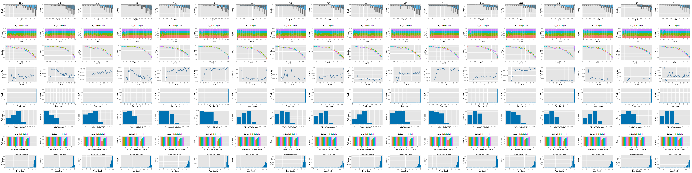
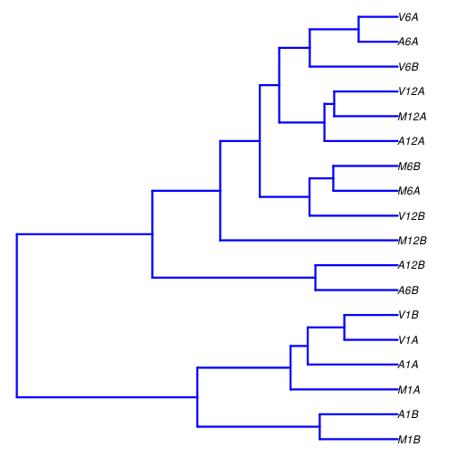
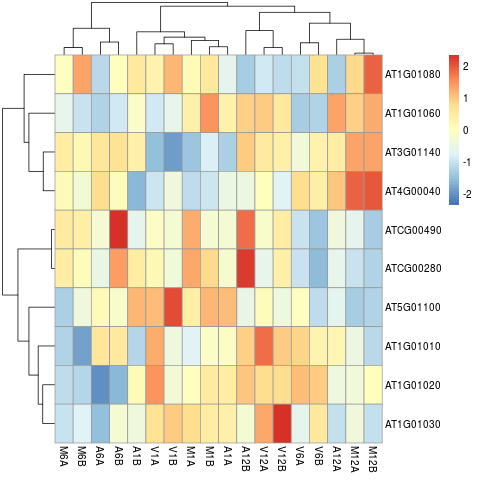

<!--
# Compile from command-line
Rscript -e "rmarkdown::render('systemPipeRNAseq.Rmd', c('BiocStyle::html_document'), clean=FALSE); knitr::knit('systemPipeRNAseq.Rmd', tangle=TRUE)"; Rscript -e "rmarkdown::render('systemPipeRNAseq.Rmd', c('BiocStyle::pdf_document'))"
-->

```{css, echo=FALSE}
pre code {
white-space: pre !important;
overflow-x: scroll !important;
word-break: keep-all !important;
word-wrap: initial !important;
}
```

```{r style, echo = FALSE, results = 'asis'}
BiocStyle::markdown()
options(width = 60, max.print = 1000)
knitr::opts_chunk$set(
    eval = as.logical(Sys.getenv("KNITR_EVAL", "TRUE")),
    cache = as.logical(Sys.getenv("KNITR_CACHE", "TRUE")), 
    tidy.opts = list(width.cutoff = 60), tidy = TRUE)
```

```{r setup, echo=FALSE, messages=FALSE, warnings=FALSE}
suppressPackageStartupMessages({
    library(systemPipeR)
})
```

# Introduction

Users want to provide here background information about the design of their RNA-Seq project.

# Samples and environment settings

## Environment settings and input data

[*systemPipeRdata*](http://bioconductor.org/packages/release/data/experiment/html/systemPipeRdata.html) package is a helper package to generate a fully populated [*systemPipeR*](http://bioconductor.org/packages/release/bioc/html/systemPipeR.html)
workflow environment in the current working directory with a single command. 
All the instruction for generating the workflow are provide in the *systemPipeRdata* vignette [here](http://www.bioconductor.org/packages/devel/data/experiment/vignettes/systemPipeRdata/inst/doc/systemPipeRdata.html#1_Introduction). 

```{r genNew_wf, eval=FALSE}
systemPipeRdata::genWorkenvir(workflow = "rnaseq", mydirname = "rnaseq")
setwd("rnaseq")
```

Typically, the user wants to record here the sources and versions of the
reference genome sequence along with the corresponding annotations. In
the provided sample data set all data inputs are stored in a `data`
subdirectory and all results will be written to a separate `results` directory,
while the `systemPipeRNAseq.Rmd` workflow and the `targets` file are expected to be 
located in the parent directory. 

The chosen data set used by this report [SRP010938](http://www.ncbi.nlm.nih.gov/sra/?term=SRP010938)
contains 18 paired-end (PE) read sets from *Arabidposis thaliana*
[@Howard2013-fq]. To minimize processing time during testing, each FASTQ
file has been subsetted to 90,000-100,000 randomly sampled PE reads that
map to the first 100,000 nucleotides of each chromosome of the *A.
thaliana* genome. The corresponding reference genome sequence (FASTA) and
its GFF annotation files have been truncated accordingly. This way the entire 
test sample data set is less than 200MB in storage space. A PE read set has been
chosen for this test data set for flexibility, because it can be used for testing both types
of analysis routines requiring either SE (single end) reads or PE reads.

To work with real data, users want to organize their own data similarly
and substitute all test data for their own data. To rerun an established
workflow on new data, the initial `targets` file along with the corresponding
FASTQ files are usually the only inputs the user needs to provide.

For more details, please consult the documentation 
[here](http://www.bioconductor.org/packages/release/bioc/vignettes/systemPipeR/inst/doc/systemPipeR.html). More information about the `targets` files from *systemPipeR* can be found [here](http://www.bioconductor.org/packages/release/bioc/vignettes/systemPipeR/inst/doc/systemPipeR.html#42_Structure_of_initial_targets_data). 

### Experiment definition provided by `targets` file

The `targets` file defines all FASTQ files and sample comparisons of the analysis workflow.

```{r load_targets_file, eval=TRUE}
targetspath <- system.file("extdata", "targetsPE.txt", package = "systemPipeR")
targets <- read.delim(targetspath, comment.char = "#")
targets[1:4,-c(5,6)]
```

To work with custom data, users need to generate a _`targets`_ file containing 
the paths to their own FASTQ files. 

# Workflow environment

_`systemPipeR`_ workflows can be designed and built from start to finish with a 
single command, importing from an R Markdown file or stepwise in interactive 
mode from the R console. 

This tutorial will demonstrate how to build the workflow in an interactive mode, 
appending each step. The workflow is constructed by connecting each step via 
`appendStep` method. Each `SYSargsList` instance contains instructions for 
processing a set of input files with a specific command-line or R software 
and the paths to the corresponding outfiles generated by a particular command-line 
software/step.

To create a workflow within _`systemPipeR`_, we can start by defining an empty
container and checking the directory structure:

```{r create_workflow, message=FALSE, eval=FALSE}
library(systemPipeR)
sal <- SPRproject()
sal
```

## Required packages and resources

The `systemPipeR` package needs to be loaded [@H_Backman2016-bt].

```{r load_SPR, message=FALSE, eval=FALSE, spr=TRUE}
appendStep(sal) <- LineWise(code = {
                library(systemPipeR)
                }, step_name = "load_SPR")
```

## Read preprocessing

### Preprocessing with `preprocessReads` function

The function `preprocessReads` allows to apply predefined or custom
read preprocessing functions to all FASTQ files referenced in a
`SYSargsList` container, such as quality filtering or adapter trimming
routines. Internally, `preprocessReads` uses the `FastqStreamer` function from
the `ShortRead` package to stream through large FASTQ files in a
memory-efficient manner. The following example performs adapter trimming with
the `trimLRPatterns` function from the `Biostrings` package.

Here, we are appending this step to the `SYSargsList` object created previously. 
All the parameters are defined on the `preprocessReads/preprocessReads-pe.yml` file.

```{r preprocessing, message=FALSE, eval=FALSE, spr=TRUE}
appendStep(sal) <- SYSargsList(
    step_name = "preprocessing",
    targets = "targetsPE.txt", dir = TRUE,
    wf_file = "preprocessReads/preprocessReads-pe.cwl",
    input_file = "preprocessReads/preprocessReads-pe.yml",
    dir_path = system.file("extdata/cwl", package = "systemPipeR"),
    inputvars = c(
        FileName1 = "_FASTQ_PATH1_",
        FileName2 = "_FASTQ_PATH2_",
        SampleName = "_SampleName_"
    ),
    dependency = c("load_SPR"))
```

After the preprocessing step, the `outfiles` files can be used to generate the new 
targets files containing the paths to the trimmed FASTQ files. The new targets 
information can be used for the next workflow step instance, _e.g._ running the 
NGS alignments with the trimmed FASTQ files. The `appendStep` function is
automatically handling this connectivity between steps. Please check the next 
step for more details.

The following example shows how one can design a custom read _'preprocessReads'_
function using utilities provided by the `ShortRead` package, and then run it
in batch mode with the _'preprocessReads'_ function. Here, it is possible to 
replace the function used on the `preprocessing` step and modify the `sal` object. 
Because it is a custom function, it is necessary to save the part in the R object, 
and internally the `preprocessReads.doc.R` is loading the custom function.
If the R object is saved with a different name (here `"param/customFCT.RData"`),
please replace that accordingly in the `preprocessReads.doc.R`.

Please, note that this step is not added to the workflow, here just for
demonstration.

First, we defined the custom function in the workflow:

```{r custom_preprocessing_function, eval=FALSE}
appendStep(sal) <- LineWise(
    code = {
        filterFct <- function(fq, cutoff = 20, Nexceptions = 0) {
            qcount <- rowSums(as(quality(fq), "matrix") <= cutoff, na.rm = TRUE)
            # Retains reads where Phred scores are >= cutoff with N exceptions
            fq[qcount <= Nexceptions]
        }
        save(list = ls(), file = "param/customFCT.RData")
    },
    step_name = "custom_preprocessing_function",
    dependency = "preprocessing"
)
```

After, we can edit the input parameter:

```{r editing_preprocessing, message=FALSE, eval=FALSE}
yamlinput(sal, "preprocessing")$Fct
yamlinput(sal, "preprocessing", "Fct") <- "'filterFct(fq, cutoff=20, Nexceptions=0)'"
yamlinput(sal, "preprocessing")$Fct ## check the new function
cmdlist(sal, "preprocessing", targets = 1) ## check if the command line was updated with success
```

### Read trimming with Trimmomatic

[Trimmomatic](http://www.usadellab.org/cms/?page=trimmomatic) software [@Bolger2014-yr] 
performs a variety of useful trimming tasks for Illumina paired-end and single
ended data. Here, an example of how to perform this task using parameters template
files for trimming FASTQ files.

This step is optional.

```{r trimming, eval=FALSE, spr=TRUE}
appendStep(sal) <- SYSargsList(
    step_name = "trimming",
    targets = "targetsPE.txt", 
    wf_file = "trimmomatic/trimmomatic-pe.cwl", input_file = "trimmomatic/trimmomatic-pe.yml",
    dir_path = system.file("extdata/cwl", package = "systemPipeR"),
    inputvars=c(FileName1="_FASTQ_PATH1_", FileName2="_FASTQ_PATH2_", SampleName="_SampleName_"), 
    dependency = "load_SPR", 
    run_step = "optional")
```

### FASTQ quality report

The following `seeFastq` and `seeFastqPlot` functions generate and plot a series of useful 
quality statistics for a set of FASTQ files, including per cycle quality box
plots, base proportions, base-level quality trends, relative k-mer
diversity, length, and occurrence distribution of reads, number of reads
above quality cutoffs and mean quality distribution. The results are
written to a png file named `fastqReport.png`.

```{r fastq_report, eval=FALSE, message=FALSE, spr=TRUE}
appendStep(sal) <- LineWise(code = {
                fastq <- getColumn(sal, step = "preprocessing", "targetsWF", column = 1)
                fqlist <- seeFastq(fastq = fastq, batchsize = 10000, klength = 8)
                png("./results/fastqReport.png", height = 162, width = 288 * length(fqlist))
                seeFastqPlot(fqlist)
                dev.off()
                }, step_name = "fastq_report", 
                dependency = "preprocessing")
``` 



<div align="center">Figure 1: FASTQ quality report for 18 samples</div></br>

## Alignments

### Read mapping with `HISAT2`

The following steps will demonstrate how to use the short read aligner `Hisat2`
[@Kim2015-ve]. First, the `Hisat2` index needs to be created.

```{r hisat2_index, eval=FALSE, spr=TRUE}
appendStep(sal) <- SYSargsList(
    step_name = "hisat2_index", 
    dir = FALSE, 
    targets=NULL, 
    wf_file = "hisat2/hisat2-index.cwl", 
    input_file="hisat2/hisat2-index.yml",
    dir_path="param/cwl", 
    dependency = "load_SPR"
)
```

### `HISAT2` mapping

The parameter settings of the aligner are defined in the `workflow_hisat2-pe.cwl` 
and `workflow_hisat2-pe.yml` files. The following shows how to construct the 
corresponding *SYSargsList* object.

```{r hisat2_mapping, eval=FALSE, spr=TRUE}
appendStep(sal) <- SYSargsList(
    step_name = "hisat2_mapping",
    dir = TRUE, 
    targets ="preprocessing", 
    wf_file = "workflow-hisat2/workflow_hisat2-pe.cwl",
    input_file = "workflow-hisat2/workflow_hisat2-pe.yml",
    dir_path = "param/cwl",
    inputvars = c(preprocessReads_1 = "_FASTQ_PATH1_", preprocessReads_2 = "_FASTQ_PATH2_", 
                  SampleName = "_SampleName_"),
    rm_targets_col = c("FileName1", "FileName2"), 
    dependency = c("preprocessing", "hisat2_index")
)
```

To double-check the command line for each sample, please use the following:

```{r bowtie2_alignment, eval=FALSE}
cmdlist(sal, step="hisat2_mapping", targets=1)
```

### Read and alignment stats

The following provides an overview of the number of reads in each sample
and how many of them aligned to the reference.

```{r align_stats, eval=FALSE, spr=TRUE}
appendStep(sal) <- LineWise(
    code = {
        fqpaths <- getColumn(sal, step = "preprocessing", "targetsWF", column = "FileName1")
        bampaths <- getColumn(sal, step = "hisat2_mapping", "outfiles", column = "samtools_sort_bam")
        read_statsDF <- alignStats(args = bampaths, fqpaths = fqpaths, pairEnd = TRUE)
        write.table(read_statsDF, "results/alignStats.xls", row.names=FALSE, quote=FALSE, sep="\t")
        }, 
    step_name = "align_stats", 
    dependency = "hisat2_mapping")
```

## Create symbolic links for viewing BAM files in IGV

The `symLink2bam` function creates symbolic links to view the BAM alignment files in a
genome browser such as IGV without moving these large files to a local
system. The corresponding URLs are written to a file with a path
specified under `urlfile`, here `IGVurl.txt`. 
Please replace the directory and the user name. 

```{r bam_IGV, eval=FALSE, spr=TRUE}
appendStep(sal) <- LineWise(
    code = {
        bampaths <- getColumn(sal, step = "hisat2_mapping", "outfiles", 
                  column = "samtools_sort_bam")
        symLink2bam(
            sysargs = bampaths, htmldir = c("~/.html/", "somedir/"),
            urlbase = "http://cluster.hpcc.ucr.edu/~tgirke/",
            urlfile = "./results/IGVurl.txt")
    },
    step_name = "bam_IGV",
    dependency = "hisat2_mapping",
    run_step = "optional"
)
```

## Read quantification

Reads overlapping with annotation ranges of interest are counted for
each sample using the `summarizeOverlaps` function [@Lawrence2013-kt]. 
The read counting is preformed for exon gene regions in a non-strand-specific 
manner while ignoring overlaps among different genes. Subsequently, the expression
count values are normalized by *reads per kp per million mapped reads*
(RPKM). The raw read count table (`countDFeByg.xls`) and the corresponding 
RPKM table (`rpkmDFeByg.xls`) are written to separate files in the directory of 
this project. Parallelization is achieved with the `BiocParallel` package, 
here using 4 CPU cores.

### Create a database for gene annotation

```{r create_db, eval=FALSE, spr=TRUE}
appendStep(sal) <- LineWise(
    code = {
        library(GenomicFeatures)
        txdb <- suppressWarnings(makeTxDbFromGFF(file="data/tair10.gff", format="gff", dataSource="TAIR", organism="Arabidopsis thaliana"))
        saveDb(txdb, file="./data/tair10.sqlite")
        }, 
    step_name = "create_db", 
    dependency = "hisat2_mapping")
```

### Read counting with `summarizeOverlaps` in parallel mode using multiple cores

```{r read_counting, eval=FALSE, spr=TRUE}
appendStep(sal) <- LineWise(
    code = {
        library(GenomicFeatures); library(BiocParallel)
        txdb <- loadDb("./data/tair10.sqlite")
        outpaths <- getColumn(sal, step = "hisat2_mapping", "outfiles", column = "samtools_sort_bam")
        eByg <- exonsBy(txdb, by = c("gene"))
        bfl <- BamFileList(outpaths, yieldSize = 50000, index = character())
        multicoreParam <- MulticoreParam(workers = 4); register(multicoreParam); registered()
        counteByg <- bplapply(bfl, function(x) summarizeOverlaps(eByg, x, mode = "Union", 
                                                                 ignore.strand = TRUE, 
                                                                 inter.feature = FALSE, 
                                                                 singleEnd = FALSE, 
                                                                 BPPARAM = multicoreParam))
        countDFeByg <- sapply(seq(along=counteByg), function(x) assays(counteByg[[x]])$counts)
        rownames(countDFeByg) <- names(rowRanges(counteByg[[1]])); colnames(countDFeByg) <- names(bfl)
        rpkmDFeByg <- apply(countDFeByg, 2, function(x) returnRPKM(counts=x, ranges=eByg))
        write.table(countDFeByg, "results/countDFeByg.xls", col.names=NA, quote=FALSE, sep="\t")
        write.table(rpkmDFeByg, "results/rpkmDFeByg.xls", col.names=NA, quote=FALSE, sep="\t")
        ## Creating a SummarizedExperiment object
        colData <- data.frame(row.names=SampleName(sal, "hisat2_mapping"), 
                              condition=getColumn(sal, "hisat2_mapping", position = "targetsWF", column = "Factor"))
        colData$condition <- factor(colData$condition)
        countDF_se <- SummarizedExperiment::SummarizedExperiment(assays = countDFeByg, 
                                                                 colData = colData)
        ## Add results as SummarizedExperiment to the workflow object
        SE(sal, "read_counting") <- countDF_se
        }, 
    step_name = "read_counting", 
    dependency = "create_db")
```

When providing a `BamFileList` as in the example above, `summarizeOverlaps` methods
use by default `bplapply` and use the register interface from BiocParallel package. 
If the number of workers is not set, `MulticoreParam` will use the number of cores 
returned by `parallel::detectCores()`. For more information, 
please check `help("summarizeOverlaps")` documentation.

Note, for most statistical differential expression or abundance analysis
methods, such as `edgeR` or `DESeq2`, the raw count values should be used as input. The
usage of RPKM values should be restricted to specialty applications
required by some users, *e.g.* manually comparing the expression levels
among different genes or features.

### Sample-wise correlation analysis

The following computes the sample-wise Spearman correlation coefficients from
the `rlog` transformed expression values generated with the `DESeq2` package. After
transformation to a distance matrix, hierarchical clustering is performed with
the `hclust` function and the result is plotted as a dendrogram
(also see file `sample_tree.png`).

```{r sample_tree, eval=FALSE, spr=TRUE}
appendStep(sal) <- LineWise(
    code = {
        library(DESeq2, quietly=TRUE); library(ape, warn.conflicts=FALSE)
        ## Extracting SummarizedExperiment object 
        se <- SE(sal, "read_counting")
        dds <- DESeqDataSet(se, design = ~ condition)
        d <- cor(assay(rlog(dds)), method="spearman")
        hc <- hclust(dist(1-d))
        png("results/sample_tree.png")
        plot.phylo(as.phylo(hc), type="p", edge.col="blue", edge.width=2, show.node.label=TRUE, no.margin=TRUE)
        dev.off()
        }, 
    step_name = "sample_tree", 
    dependency = "read_counting")
```


<div align="center">Figure 2: Correlation dendrogram of samples</div></br>

## Analysis of DEGs

The analysis of differentially expressed genes (DEGs) is performed with
the `glm` method of the `edgeR` package [@Robinson2010-uk]. The sample
comparisons used by this analysis are defined in the header lines of the 
`targets.txt` file starting with `<CMP>`.

### Run `edgeR`

```{r run_edger, eval=FALSE, spr=TRUE}
appendStep(sal) <- LineWise(
    code = {
        library(edgeR)
        countDF <- read.delim("results/countDFeByg.xls", row.names=1, check.names=FALSE) 
        cmp <- readComp(stepsWF(sal)[['hisat2_mapping']], format="matrix", delim="-")
        edgeDF <- run_edgeR(countDF=countDF, targets=targetsWF(sal)[['hisat2_mapping']], cmp=cmp[[1]], independent=FALSE, mdsplot="")
        }, 
    step_name = "run_edger", 
    dependency = "read_counting")
```

### Add gene descriptions

```{r custom_annot, eval=FALSE, spr=TRUE}
appendStep(sal) <- LineWise(
    code = {
        library("biomaRt")
        m <- useMart("plants_mart", dataset="athaliana_eg_gene", host="https://plants.ensembl.org")
        desc <- getBM(attributes=c("tair_locus", "description"), mart=m)
        desc <- desc[!duplicated(desc[,1]),]
        descv <- as.character(desc[,2]); names(descv) <- as.character(desc[,1])
        edgeDF <- data.frame(edgeDF, Desc=descv[rownames(edgeDF)], check.names=FALSE)
        write.table(edgeDF, "./results/edgeRglm_allcomp.xls", quote=FALSE, sep="\t", col.names = NA)
        },
    step_name = "custom_annot", 
    dependency = "run_edger")
```

### Plot DEG results

Filter and plot DEG results for up and down regulated genes. The
definition of *up* and *down* is given in the corresponding help
file. To open it, type `?filterDEGs` in the R console.

```{r filter_degs, eval=FALSE, spr=TRUE}
appendStep(sal) <- LineWise(
    code = {
        edgeDF <- read.delim("results/edgeRglm_allcomp.xls", row.names=1, check.names=FALSE) 
        png("results/DEGcounts.png")
        DEG_list <- filterDEGs(degDF=edgeDF, filter=c(Fold=2, FDR=20))
        dev.off()
        write.table(DEG_list$Summary, "./results/DEGcounts.xls", quote=FALSE, sep="\t", row.names=FALSE)
        }, 
    step_name = "filter_degs", 
    dependency = "custom_annot")
```

### Venn diagrams of DEG sets

The `overLapper` function can compute Venn intersects for large numbers of sample
sets (up to 20 or more) and plots 2-5 way Venn diagrams. A useful
feature is the possibility to combine the counts from several Venn
comparisons with the same number of sample sets in a single Venn diagram
(here for 4 up and down DEG sets).

```{r venn_diagram, eval=FALSE, spr=TRUE}
appendStep(sal) <- LineWise(
    code = {
        vennsetup <- overLapper(DEG_list$Up[6:9], type="vennsets")
        vennsetdown <- overLapper(DEG_list$Down[6:9], type="vennsets")
        png("results/vennplot.png")
        vennPlot(list(vennsetup, vennsetdown), mymain="", mysub="", colmode=2, ccol=c("blue", "red"))
        dev.off()
        }, 
    step_name = "venn_diagram", 
    dependency = "filter_degs")
```

## GO term enrichment analysis

### Obtain gene-to-GO mappings

The following shows how to obtain gene-to-GO mappings from `biomaRt` (here for *A.
thaliana*) and how to organize them for the downstream GO term
enrichment analysis. Alternatively, the gene-to-GO mappings can be
obtained for many organisms from Bioconductor’s `*.db` genome annotation
packages or GO annotation files provided by various genome databases.
For each annotation this relatively slow preprocessing step needs to be
performed only once. Subsequently, the preprocessed data can be loaded
with the `load` function as shown in the next subsection.

```{r get_go_annot, eval=FALSE, spr=TRUE}
appendStep(sal) <- LineWise(
    code = {
        library("biomaRt")
        # listMarts() # To choose BioMart database
        # listMarts(host="plants.ensembl.org")
        m <- useMart("plants_mart", host="https://plants.ensembl.org")
        #listDatasets(m)
        m <- useMart("plants_mart", dataset="athaliana_eg_gene", host="https://plants.ensembl.org")
        # listAttributes(m) # Choose data types you want to download
        go <- getBM(attributes=c("go_id", "tair_locus", "namespace_1003"), mart=m)
        go <- go[go[,3]!="",]; go[,3] <- as.character(go[,3])
        go[go[,3]=="molecular_function", 3] <- "F"; go[go[,3]=="biological_process", 3] <- "P"; go[go[,3]=="cellular_component", 3] <- "C"
        go[1:4,]
        if(!dir.exists("./data/GO")) dir.create("./data/GO")
        write.table(go, "data/GO/GOannotationsBiomart_mod.txt", quote=FALSE, row.names=FALSE, col.names=FALSE, sep="\t")
        catdb <- makeCATdb(myfile="data/GO/GOannotationsBiomart_mod.txt", lib=NULL, org="", colno=c(1,2,3), idconv=NULL)
        save(catdb, file="data/GO/catdb.RData")
        }, 
    step_name = "get_go_annot", 
    dependency = "filter_degs")
```

### Batch GO term enrichment analysis

Apply the enrichment analysis to the DEG sets obtained the above differential
expression analysis. Note, in the following example the `FDR` filter is set
here to an unreasonably high value, simply because of the small size of the toy
data set used in this vignette. Batch enrichment analysis of many gene sets is
performed with the function. When `method=all`, it returns all GO terms passing
the p-value cutoff specified under the `cutoff` arguments. When `method=slim`,
it returns only the GO terms specified under the `myslimv` argument. The given
example shows how a GO slim vector for a specific organism can be obtained from
`BioMart`.

```{r go_enrich, eval=FALSE, spr=TRUE}
appendStep(sal) <- LineWise(
    code = {
        library("biomaRt")
        load("data/GO/catdb.RData")
        DEG_list <- filterDEGs(degDF=edgeDF, filter=c(Fold=2, FDR=50), plot=FALSE)
        up_down <- DEG_list$UporDown; names(up_down) <- paste(names(up_down), "_up_down", sep="")
        up <- DEG_list$Up; names(up) <- paste(names(up), "_up", sep="")
        down <- DEG_list$Down; names(down) <- paste(names(down), "_down", sep="")
        DEGlist <- c(up_down, up, down)
        DEGlist <- DEGlist[sapply(DEGlist, length) > 0]
        BatchResult <- GOCluster_Report(catdb=catdb, setlist=DEGlist, method="all", id_type="gene", CLSZ=2, cutoff=0.9, gocats=c("MF", "BP", "CC"), recordSpecGO=NULL)
        m <- useMart("plants_mart", dataset="athaliana_eg_gene", host="https://plants.ensembl.org")
        goslimvec <- as.character(getBM(attributes=c("goslim_goa_accession"), mart=m)[,1])
        BatchResultslim <- GOCluster_Report(catdb=catdb, setlist=DEGlist, method="slim", id_type="gene", myslimv=goslimvec, CLSZ=10, cutoff=0.01, gocats=c("MF", "BP", "CC"), recordSpecGO=NULL)
        write.table(BatchResultslim, "results/GOBatchSlim.xls", row.names=FALSE, quote=FALSE, sep="\t")
        }, 
    step_name = "go_enrich", 
    dependency = "get_go_annot")
```

### Plot batch GO term results

The `data.frame` generated by `GOCluster` can be plotted with the `goBarplot` function. Because of the
variable size of the sample sets, it may not always be desirable to show
the results from different DEG sets in the same bar plot. Plotting
single sample sets is achieved by subsetting the input data frame as
shown in the first line of the following example.

```{r go_plot, eval=FALSE, spr=TRUE}
appendStep(sal) <- LineWise(
    code = {
        gos <- BatchResultslim[grep("M6-V6_up_down", BatchResultslim$CLID), ]
        gos <- BatchResultslim
        png("results/GOslimbarplotMF.png", height=8, width=10)
        goBarplot(gos, gocat="MF")
        goBarplot(gos, gocat="BP")
        goBarplot(gos, gocat="CC")
        dev.off()
        },
    step_name = "go_plot", 
    dependency = "go_enrich")
```


<div align="center">Figure 5: GO Slim Barplot for MF Ontology</div></br>

## Clustering and heat maps

The following example performs hierarchical clustering on the `rlog`
transformed expression matrix subsetted by the DEGs identified in the above
differential expression analysis. It uses a Pearson correlation-based distance
measure and complete linkage for cluster joining.

```{r heatmap, eval=FALSE, spr=TRUE}
appendStep(sal) <- LineWise(
    code = {
        library(pheatmap)
        geneids <- unique(as.character(unlist(DEG_list[[1]])))
        y <- assay(rlog(dds))[geneids, ]
        png("results/heatmap1.png")
        pheatmap(y, scale="row", clustering_distance_rows="correlation", clustering_distance_cols="correlation")
        dev.off()
        }, 
    step_name = "heatmap", 
    dependency = "go_enrich")
```


<div align="center">Figure 6: Heat Map with Hierarchical Clustering Dendrograms of DEGs</div></br>

## Version Information

```{r sessionInfo, eval=FALSE, spr=TRUE}
appendStep(sal) <- LineWise(
    code = {
        sessionInfo()
        }, 
    step_name = "sessionInfo", 
    dependency = "heatmap")
```

# Running workflow

## Interactive job submissions in a single machine

For running the workflow, `runWF` function will execute all the steps store in 
the workflow container. The execution will be on a single machine without 
submitting to a queuing system of a computer cluster. 

```{r runWF, eval=FALSE}
sal <- runWF(sal)
```

## Parallelization on clusters

Alternatively, the computation can be greatly accelerated by processing many files 
in parallel using several compute nodes of a cluster, where a scheduling/queuing
system is used for load balancing. 

The `resources` list object provides the number of independent parallel cluster 
processes defined under the `Njobs` element in the list. The following example 
will run 18 processes in parallel using each 4 CPU cores. 
If the resources available on a cluster allow running all 18 processes at the 
same time, then the shown sample submission will utilize in a total of 72 CPU cores.

Note, `runWF` can be used with most queueing systems as it is based on utilities 
from the `batchtools` package, which supports the use of template files (_`*.tmpl`_)
for defining the run parameters of different schedulers. To run the following 
code, one needs to have both a `conffile` (see _`.batchtools.conf.R`_ samples [here](https://mllg.github.io/batchtools/)) 
and a `template` file (see _`*.tmpl`_ samples [here](https://github.com/mllg/batchtools/tree/master/inst/templates)) 
for the queueing available on a system. The following example uses the sample 
`conffile` and `template` files for the Slurm scheduler provided by this package. 

The resources can be appended when the step is generated, or it is possible to 
add these resources later, as the following example using the `addResources` 
function:

```{r runWF_cluster, eval=FALSE}
resources <- list(conffile=".batchtools.conf.R",
                  template="batchtools.slurm.tmpl", 
                  Njobs=18, 
                  walltime=120, ## minutes
                  ntasks=1,
                  ncpus=4, 
                  memory=1024, ## Mb
                  partition = "short"
                  )
sal <- addResources(sal, c("hisat2_mapping"), resources = resources)
sal <- runWF(sal)
```

## Visualize workflow

_`systemPipeR`_ workflows instances can be visualized with the `plotWF` function.

```{r plotWF, eval=FALSE}
plotWF(sal, rstudio = TRUE)
```

## Checking workflow status

To check the summary of the workflow, we can use:

```{r statusWF, eval=FALSE}
sal
statusWF(sal)
```

## Accessing logs report

_`systemPipeR`_ compiles all the workflow execution logs in one central location,
making it easier to check any standard output (`stdout`) or standard error
(`stderr`) for any command-line tools used on the workflow or the R code stdout.

```{r logsWF, eval=FALSE}
sal <- renderLogs(sal)
```

## Session Info
This is the session information for rendering this report. To access the session information
of workflow running, check HTML report of `renderLogs`. 
```{r report_session_info, eval=TRUE}
sessionInfo()
```

# Funding

This project is funded by NSF award [ABI-1661152](https://www.nsf.gov/awardsearch/showAward?AWD_ID=1661152). 

# References
