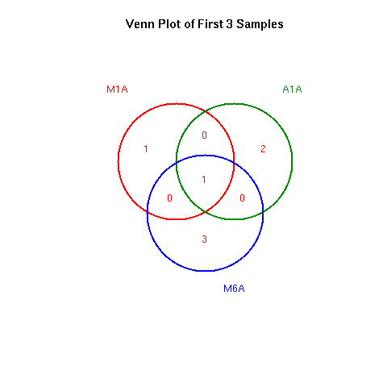

<!--
# Compile from command-line
Rscript -e "rmarkdown::render('systemPipeVARseq.Rmd', c('BiocStyle::html_document'), clean=FALSE); knitr::knit('systemPipeVARseq.Rmd', tangle=TRUE)""
-->

```{css, echo=FALSE}
pre code {
white-space: pre !important;
overflow-x: scroll !important;
word-break: keep-all !important;
word-wrap: initial !important;
}
```

```{r style, echo = FALSE, results = 'asis'}
BiocStyle::markdown()
options(width = 60, max.print = 1000)
knitr::opts_chunk$set(
    eval = as.logical(Sys.getenv("KNITR_EVAL", "TRUE")),
    cache = as.logical(Sys.getenv("KNITR_CACHE", "TRUE")),
    tidy.opts = list(width.cutoff = 60), tidy = TRUE
)
```

```{r setup, echo=FALSE, message=FALSE, warning=FALSE, eval=TRUE}
suppressPackageStartupMessages({
    library(systemPipeR)
})
```

# Introduction

Users want to provide here background information about the design of their
VAR-Seq project.

This report describes the analysis of a VAR-Seq project studying the
genetic differences among several strains ... from *organism* ....

## Experimental design

Typically, users want to specify here all information relevant for the
analysis of their VAR-Seq study. This includes detailed descriptions of
FASTQ files, experimental design, reference genome, gene annotations,
etc.

# Workflow environment

## Generate workflow environment

[*systemPipeRdata*](http://bioconductor.org/packages/release/data/experiment/html/systemPipeRdata.html) 
package is a helper package to generate a fully populated [*systemPipeR*](http://bioconductor.org/packages/release/bioc/html/systemPipeR.html)
workflow environment in the current working directory with a single command. 
All the instruction for generating the pre-configured workflow templates are provide 
in the [*systemPipeRdata* vignette](http://www.bioconductor.org/packages/devel/data/experiment/vignettes/systemPipeRdata/inst/doc/systemPipeRdata.html#1_Introduction). 

```{r genNew_wf, eval=FALSE}
systemPipeRdata::genWorkenvir(workflow = "varseq", mydirname = "varseq")
setwd("varseq")
```

This step can be skipped if you already have the environment to run the analysis. 
If not, you can run it, and it will create the directory structure and populate 
all the necessary param and demo data files. 

After building and loading the workflow environment generated by `genWorkenvir` 
from `systemPipeRdata` all data inputs are stored in
a `data/` directory and all analysis results will be written to a separate
`results/` directory, while the `systemPipeVARseq.Rmd` script and the `targets` 
file are expected to be located in the parent directory. The R session is expected 
to run from this parent directory. Additional parameter files are stored under `param/`.

To work with real data, users want to organize their own data similarly
and substitute all test data for their own data. To rerun an established
workflow on new data, the initial `targets` file along with the corresponding
FASTQ files are usually the only inputs the user needs to provide.

For more details, please consult the documentation 
[here](http://www.bioconductor.org/packages/release/bioc/vignettes/systemPipeR/inst/doc/systemPipeR.html).
More information about the `targets` files from *systemPipeR* can be found [here](http://www.bioconductor.org/packages/release/bioc/vignettes/systemPipeR/inst/doc/systemPipeR.html#42_Structure_of_initial_targets_data). 

## Build the Workflow with a single command

This template provides some common steps for a `VARseq` workflow. One can add, remove,
modify workflow steps by operating on the `SYSargsList` workflow object.
For more details of all the features and utilities, please consult the [main vignette](http://www.bioconductor.org/packages/release/bioc/vignettes/systemPipeR/inst/doc/systemPipeR.html).

To initiate a VARseq workflow, this entire Rmarkdown file will be imported as a
`SYSargsList` workflow object, by using the `importWF("systemPipeVARseq.Rmd")` command.

In this template, code chunks with the option `spr = TRUE'` will be added to the workflow. 
Other R code chunks without this option will be ignored. The option `eval = FALSE` 
can be ignored when imported and build the workflow object. Please be aware of this 
possibility. 

The template can provide more than one alternative for each step, such as 
different mapping methods, that will receive the `mandatory` or `optional` flag. 
One can run just the `mandatory` steps, `ALL`, or `optional` steps when running 
the workflow.

Also, each one of the steps can be run on compute clusters (`compute` option)
or on the current session, here called `management` session. 
For the demonstration of this template, a `management` session will be chosen. 

## Workflow initialization

The other alternative is to initialize the workflow and append each of the steps 
in the workflow object.

```{r create_sal, message=FALSE, eval=FALSE}
sal <- SPRproject()
```

## Required packages and resources

_`systemPipeR`_ workflows can be designed and built from start to finish with a 
single command, importing from an R Markdown file or stepwise in interactive 
mode from the R console. 
This tutorial will demonstrate how to build the workflow in an interactive mode, 
appending each step. The workflow is constructed by connecting each step via 
`appendStep` method. Each `SYSargsList` instance contains instructions needed 
for processing a set of input files with a specific command-line or R software 
and the paths to the corresponding outfiles generated by a particular tool/step. 

The `systemPipeR` package needs to be loaded [@H_Backman2016-bt].

```{r load_SPR, message=FALSE, eval=FALSE, spr=TRUE}
# Some samples in the test dataset do not work well in VARseq, and VARseq workflow 
# takes long time to process each sample. To better test and speed up the test workflow,
# sample set is reduced to the first 8 samples.
# Please REMOVE the next two lines in your real analysis
cat(crayon::red$bold("Some samples in targets are removed for test workflow. Please change the template to disable this in your real analysis.\n"))
writeLines(readLines("targetsPE.txt")[1:13], "targetsPE.txt")

appendStep(sal) <- LineWise(
    code = {
        library(systemPipeR)
        }, 
    step_name = "load_SPR"
)
```

## FASTQ quality report

The following `seeFastq` and `seeFastqPlot` functions generate and plot a series of useful 
quality statistics for a set of FASTQ files including per cycle quality box
plots, base proportions, base-level quality trends, relative k-mer
diversity, length, and occurrence distribution of reads, number of reads
above quality cutoffs and mean quality distribution. The results are
written to a PDF file named `fastqReport.pdf`.

This is the pre-trimming fastq report. Another post-trimming fastq report step 
is not included in the default. It is recommended to run this step first to
decide whether the trimming is needed.

Please note that initial targets files are being used here. In this case, 
it has been added to the first step, and later, we used the function `getColumn` 
to extract a named vector. 

```{r fastq_report_pre, eval=FALSE, message=FALSE, spr=TRUE}
appendStep(sal) <- LineWise(
    code = {
        targets <- read.delim("targetsPE.txt", comment.char = "#")
        updateColumn(sal, step = "load_SPR", position = "targetsWF") <- targets
        fq_files <- getColumn(sal, "load_SPR", "targetsWF", column = 1)
        fqlist <- seeFastq(fastq = fq_files, batchsize = 10000, klength = 8)
        pdf("./results/fastqReport_pre.pdf", height = 18, width = 4 * length(fqlist))
        seeFastqPlot(fqlist)
        dev.off()
    },
    step_name = "fastq_report_pre",
    dependency = "load_SPR"
)
```


<div align="center">Figure 1: FASTQ quality report for 18 samples</div></br>

## Read preprocessing

### Read trimming with Trimmomatic

Next, we need to populate the object created with the first step in the
workflow. Here, an example of how to perform this task using parameters template
files for trimming FASTQ files with [Trimmomatic](http://www.usadellab.org/cms/?page=trimmomatic) 
software [@Bolger2014-yr].
For this step, the `SYSargsList` function has been used to build the command-line
and append to `sal` object. For more details of all the features and utilities, 
please consult the [main vignette](http://www.bioconductor.org/packages/release/bioc/vignettes/systemPipeR/inst/doc/systemPipeR.html).

If GATK (default) is used for variant calling, any type of fastq trimming is 
strongly depreciated. GATK have internal function to handle low quality posistions.

```{r trimmomatic, eval=FALSE, spr=TRUE}
appendStep(sal) <- SYSargsList(
    step_name = "trimmomatic",
    targets = "targetsPE.txt",
    wf_file = "trimmomatic/trimmomatic-pe.cwl",
    input_file = "trimmomatic/trimmomatic-pe.yml",
    dir_path = "param/cwl",
    inputvars = c(
        FileName1 = "_FASTQ_PATH1_",
        FileName2 = "_FASTQ_PATH2_",
        SampleName = "_SampleName_"
    ),
    dependency = c("fastq_report_pre"),
    run_step = "optional"
)
```

### Preprocessing with _`preprocessReads`_ function

The function _`preprocessReads`_ allows to apply predefined or custom
read preprocessing functions to all FASTQ files referenced in a
_`SYSargsList`_ container, such as quality filtering or adaptor trimming
routines. Internally, _`preprocessReads`_ uses the _`FastqStreamer`_ function from
the _`ShortRead`_ package to stream through large FASTQ files in a
memory-efficient manner. The following example performs adaptor trimming with
the _`trimLRPatterns`_ function from the _`Biostrings`_ package.

Here, we are appending this step at the _`SYSargsList`_ object created previously. 
All the parameters are defined on the _`preprocessReads/preprocessReads-pe.yml`_ file.

```{r preprocessing, message=FALSE, eval=FALSE, spr=TRUE}
appendStep(sal) <- SYSargsList(
    step_name = "preprocessing",
    targets = "targetsPE.txt", dir = TRUE,
    wf_file = "preprocessReads/preprocessReads-pe.cwl",
    input_file = "preprocessReads/preprocessReads-pe.yml",
    dir_path = "param/cwl",
    inputvars = c(
        FileName1 = "_FASTQ_PATH1_",
        FileName2 = "_FASTQ_PATH2_",
        SampleName = "_SampleName_"
    ),
    dependency = c("fastq_report_pre"),
    run_step = "optional"
)
```

After the trimming step, the `outfiles` files can be used to generate the new 
targets files containing the paths to the trimmed FASTQ files. The new targets 
information can be used for the next workflow step instance, _e.g._ running the 
NGS alignments with the trimmed FASTQ files.

The following example shows how one can design a custom read _'preprocessReads'_
function using utilities provided by the _`ShortRead`_ package, and then run it
in batch mode with the _'preprocessReads'_ function. For here, it is possible to 
replace the function used on the `preprocessing` step and modify the `sal` object. 
Because it is a custom function, it is necessary to save the part in the R object, 
and internally the `preprocessReads.doc.R` is loading the function. If the R object
is saved with a different name (here `"param/customFCT.RData"`), please replace 
that accordingly in the `preprocessReads.doc.R`.

Please, note that this step is not added to the workflow, here just for demonstration.

First, we defined the function in the workflow:

```{r custom_preprocessing_function, eval=FALSE}
appendStep(sal) <- LineWise(
    code = {
        filterFct <- function(fq, cutoff = 20, Nexceptions = 0) {
            qcount <- rowSums(as(quality(fq), "matrix") <= cutoff, na.rm = TRUE)
            # Retains reads where Phred scores are >= cutoff with N exceptions
            fq[qcount <= Nexceptions]
        }
        save(list = ls(), file = "param/customFCT.RData")
    },
    step_name = "custom_preprocessing_function",
    dependency = "preprocessing"
)
```

After, we can edit the input parameter:

```{r editing_preprocessing, message=FALSE, eval=FALSE}
yamlinput(sal, "preprocessing")$Fct
yamlinput(sal, "preprocessing", "Fct") <- "'filterFct(fq, cutoff=20, Nexceptions=0)'"
yamlinput(sal, "preprocessing")$Fct ## check the new function
cmdlist(sal, "preprocessing", targets = 1) ## check if the command line was updated with success
```

## FASTQ quality after Trimming

This is the post-trimming fastq quality report. If the trimming step is included, it is 
recommended to add this step to compare trimming of fastq before and after.

```{r fastq_report_pos, eval=FALSE, message=FALSE, spr=TRUE}
appendStep(sal) <- LineWise(
    code = {
        fq_files <- getColumn(sal, "preprocessing", "outfiles", column = 1) ## get outfiles path
        fqlist <- seeFastq(fastq = fq_files, batchsize = 10000, klength = 8)
        pdf("./results/fastqReport_pos.pdf", height = 18, width = 4 * length(fqlist))
        seeFastqPlot(fqlist)
        dev.off()
    },
    step_name = "fastq_report_pos",
    dependency = "trimmomatic",
    run_step = "optional"
)
```

## Read mapping with `BWA-MEM` 

The NGS reads of this project are aligned against the reference genome
sequence using the highly variant tolerant short read aligner `BWA-MEM`
[@Li2013-oy; @Li2009-oc]. The parameter settings of the aligner are
defined in the `param/cwl/gatk/bwa-pe.cwl`.

This test code uses untrimmed fastq files since the demo data is minimal and 
limited. However, it is best to test with `FASTQ quality report` function provided 
above to verify your real data first.

### Build index and dictionary files for BWA and GATK

Build the index and dictionary files for BWA and GATK to run. 

```{r bwa_index, eval=FALSE, spr=TRUE}
appendStep(sal) <- SYSargsList(
    step_name = "bwa_index",
    dir = FALSE, targets = NULL,
    wf_file = "gatk/workflow_bwa-index.cwl",
    input_file = "gatk/gatk.yaml",
    dir_path = "param/cwl",
    dependency = "load_SPR"
)
```

Create reference `fasta` dictionary.

```{r fasta_index, eval=FALSE, spr=TRUE}
appendStep(sal) <- SYSargsList(
    step_name = "fasta_index",
    dir = FALSE, targets = NULL,
    wf_file = "gatk/workflow_fasta_dict.cwl",
    input_file = "gatk/gatk.yaml",
    dir_path = "param/cwl",
    dependency = "bwa_index"
)
```

Create dictionary index.

```{r faidx_index, eval=FALSE, spr=TRUE}
appendStep(sal) <- SYSargsList(
    step_name = "faidx_index",
    dir = FALSE, targets = NULL,
    wf_file = "gatk/workflow_fasta_faidx.cwl",
    input_file = "gatk/gatk.yaml",
    dir_path = "param/cwl",
    dependency = "fasta_index"
)
```

### Mapping reads with BWA

```{r bwa_alignment, eval=FALSE, spr=TRUE}
appendStep(sal) <- SYSargsList(
    step_name = "bwa_alignment",
    targets = "targetsPE.txt",
    wf_file = "gatk/workflow_bwa-pe.cwl",
    input_file = "gatk/gatk.yaml",
    dir_path = "param/cwl",
    inputvars = c(
        FileName1 = "_FASTQ_PATH1_",
        FileName2 = "_FASTQ_PATH2_",
        SampleName = "_SampleName_"
    ),
    dependency = c("faidx_index")
)
```

## Read and alignment stats

The following provides an overview of the number of reads in each sample
and how many of them aligned to the reference.

```{r align_stats, eval=FALSE, spr=TRUE}
appendStep(sal) <- LineWise(
    code = {
        bampaths <- getColumn(sal, step = "bwa_alignment", "outfiles", column = "samtools_sort_bam")
        fqpaths <- getColumn(sal, step = "bwa_alignment", "targetsWF", column = "FileName1")
        read_statsDF <- alignStats(args = bampaths, fqpaths = fqpaths, pairEnd = TRUE)
        write.table(read_statsDF, "results/alignStats.xls", row.names = FALSE, quote = FALSE, sep = "\t")
    },
    step_name = "align_stats",
    dependency = "bwa_alignment",
    run_step = "optional"
)
```

## Create symbolic links for viewing BAM files in IGV

The `symLink2bam` function creates symbolic links to view the BAM alignment files in a
genome browser such as IGV. The corresponding URLs are written to a file
with a path specified under `urlfile` in the `results` directory.

```{r bam_urls, eval=FALSE, spr=TRUE}
appendStep(sal) <- LineWise(
    code = {
        bampaths <- getColumn(sal, step = "bwa_alignment", "outfiles", column = "samtools_sort_bam")
        symLink2bam(
            sysargs = bampaths, htmldir = c("~/.html/", "somedir/"),
            urlbase = "http://cluster.hpcc.ucr.edu/~tgirke/",
            urlfile = "./results/IGVurl.txt"
        )
    },
    step_name = "bam_urls",
    dependency = "bwa_alignment",
    run_step = "optional"
)
```

## Variant calling

The following performs variant calling with `GATK` and `BCFtools` on a single 
machine by `runWF` function for each sample sequentially. If a cluster compute
is available, running in parallel mode on a compute cluster can be performed by 
`runWF`, making available the resources and choose `run_session = "compute"`. 

Not all users have a cluster system, so here to demonstrate an example of variant calling 
workflow, only single-machine commands are shown. For cluster jobs, please refer 
to our main [vignette](http://www.bioconductor.org/packages/release/bioc/vignettes/systemPipeR/inst/doc/systemPipeR.html). 

In addition, the user would choose only one variant caller here rather than 
running several ones. However, the workflow manager allows keeping multiple 
options available for running the analysis.

### Variant calling with `GATK`

The following steps are based on `GATK 4.1.1.0` [Best Practice](https://software.broadinstitute.org/gatk/best-practices/). 
There are 10 individual steps where the user can choose where to jump in and where to skip. 
All scripts are located at `param/cwl/gatk`. `BQSR` (Base Quality Score Recalibration) 
and `VQSR` (Variant Quality Score Recalibration) are very specific 
to a limited species like human, so this workflow does not support these steps. 

### Step1: `fastq` to `ubam`

Convert `fastq` files to `bam` files to prepare for the following step. It is very 
important to specific your sequencing platform, default is `illumina`. User need 
to change `param/cwl/gatk/gatk_fastq2ubam.cwl` if the platform is different. Platform information 
is needed for the variant caller in later steps to correct calling parameters.

```{r fastq2ubam, eval=FALSE, spr=TRUE}
appendStep(sal) <- SYSargsList(
    step_name = "fastq2ubam",
    targets = "targetsPE.txt",
    wf_file = "gatk/workflow_gatk_fastq2ubam.cwl",
    input_file = "gatk/gatk.yaml",
    dir_path = "param/cwl",
    inputvars = c(
        FileName1 = "_FASTQ_PATH1_",
        FileName2 = "_FASTQ_PATH2_",
        SampleName = "_SampleName_"
    ),
    dependency = c("faidx_index")
)
```

### Step2: Merge `bam` and `ubam`

This step merges a `bam` and `ubam` and creates a third `bam` file that contains 
alignment information and remaining information that was removed by the aligner like `BWA`. 
The removed information is essential for variant statistics calculation. Previous steps are 
recommended, but variant calling can still be performed without these steps.

```{r merge_bam, eval=FALSE, spr=TRUE}
appendStep(sal) <- SYSargsList(
    step_name = "merge_bam",
    targets = c("bwa_alignment", "fastq2ubam"),
    wf_file = "gatk/workflow_gatk_mergebams.cwl",
    input_file = "gatk/gatk.yaml",
    dir_path = "param/cwl",
    inputvars = c(
        bwa_men_sam = "_bwasam_",
        ubam = "_ubam_",
        SampleName = "_SampleName_"
    ),
    rm_targets_col = c("preprocessReads_1", "preprocessReads_2"),
    dependency = c("bwa_alignment", "fastq2ubam")
)
```


### Step3: Sort `bam` files by genomic coordinates

Sort `bam` files by genomic coordinates.

```{r sort, eval=FALSE, spr=TRUE}
appendStep(sal) <- SYSargsList(
    step_name = "sort",
    targets = "merge_bam",
    wf_file = "gatk/workflow_gatk_sort.cwl",
    input_file = "gatk/gatk.yaml",
    dir_path = "param/cwl",
    inputvars = c(merge_bam = "_mergebam_", SampleName = "_SampleName_"),
    rm_targets_col = c(
        "bwa_men_sam", "ubam", "SampleName_fastq2ubam",
        "Factor_fastq2ubam", "SampleLong_fastq2ubam",
        "Experiment_fastq2ubam", "Date_fastq2ubam"
    ),
    dependency = c("merge_bam")
)
```

### Step4: Mark duplicates

Mark PCR artifacts in sequencing. A `duplicate_metrics` file will also be produced 
by this step, but will not be used for the next step. This file is just for the user 
to check duplicates status summary.

```{r mark_dup, eval=FALSE, spr=TRUE}
appendStep(sal) <- SYSargsList(
    step_name = "mark_dup",
    targets = "sort",
    wf_file = "gatk/workflow_gatk_markduplicates.cwl",
    input_file = "gatk/gatk.yaml",
    dir_path = "param/cwl",
    inputvars = c(sort_bam = "_sort_", SampleName = "_SampleName_"),
    rm_targets_col = c("merge_bam"),
    dependency = c("sort")
)
```

### Step5: Fixing tags

Takes the `bam` from the last step and calculates the NM, MD, and UQ tags. 
These tags are important for variant calling and filtering. 
This step is recommended but can be skipped.  

```{r fix_tag, eval=FALSE, spr=TRUE}
appendStep(sal) <- SYSargsList(
    step_name = "fix_tag",
    targets = "mark_dup",
    wf_file = "gatk/workflow_gatk_fixtag.cwl",
    input_file = "gatk/gatk.yaml",
    dir_path = "param/cwl",
    inputvars = c(mark_bam = "_mark_", SampleName = "_SampleName_"),
    rm_targets_col = c("sort_bam"),
    dependency = c("mark_dup")
)
```

Up till this step, sample preprocess is done. All analysis ready `BAM` files and 
their index `.bai` files are created. Individual and cohort calling by 
`HaplotypeCaller` is performed from the next step.

### Step6: HaplotypeCaller `gvcf`

The `HaplotypeCaller` is running a **gvcf** mode in this step. G stands for 'genomic'. 
The file not only contains variant sites information but also non-variant sites information; 
thus, at the following step, the cohort caller can use this information to validate the true variants.

```{r hap_caller, eval=FALSE, spr=TRUE}
appendStep(sal) <- SYSargsList(
    step_name = "hap_caller",
    targets = "fix_tag",
    wf_file = "gatk/workflow_gatk_haplotypecaller.cwl",
    input_file = "gatk/gatk.yaml",
    dir_path = "param/cwl",
    inputvars = c(fixtag_bam = "_fixed_", SampleName = "_SampleName_"),
    rm_targets_col = c("mark_bam"),
    dependency = c("fix_tag")
)
```

### Step7: Import all `gvcfs`

It is recommended to import all **gvcfs** to a 
[TileDB](https://github.com/Intel-HLS/GenomicsDB/wiki) database for fast cohort 
variant calling at the following step. Note: if you are working with non-diploid data, 
use `CombineGVCFs` function from `GATK` and change the `gvcf_db_folder` parameter 
in `param/cwl/gatk/gatk.yaml` to be your combined **gvcf** file path.

**Important**: Make sure all samples' `*.g.vcf.gz` files are in the results folder,
also the `tbi index` files also should be there.

```{r import, eval=FALSE, spr=TRUE}
appendStep(sal) <- SYSargsList(
    step_name = "import",
    targets = NULL, dir = FALSE,
    wf_file = "gatk/workflow_gatk_genomicsDBImport.cwl",
    input_file = "gatk/gatk.yaml",
    dir_path = "param/cwl",
    dependency = c("hap_caller")
)
```

### Step8: Cohort calling of `gvcf`

Assess variants by information from all `gvcfs`. A collective `vcf` called 
`samples.vcf.gz` is created by default naming.

```{r call_variants, eval=FALSE, spr=TRUE}
appendStep(sal) <- SYSargsList(
    step_name = "call_variants",
    targets = NULL, dir = FALSE,
    wf_file = "gatk/workflow_gatk_genotypeGVCFs.cwl",
    input_file = "gatk/gatk.yaml",
    dir_path = "param/cwl",
    dependency = c("import")
)
```

### Step9: Cohort hard filter variants

Variant Quality Score Recalibration (VQSR) is not included in this workflow. 
Variants are hard filtered together.
See this [Post](https://gatkforums.broadinstitute.org/gatk/discussion/2806/howto-apply-hard-filters-to-a-call-set) for parameters for hard filtering. Change these settings in `param/cwl/gak/gatk_variantFiltration.sh` if needed. VQSR requires a large quantity of 
samples to be training data before you can do filtering. Read this 
[post](https://gatk.broadinstitute.org/hc/en-us/articles/360035531612-Variant-Quality-Score-Recalibration-VQSR-) for more information.

```{r filter, eval=FALSE, spr=TRUE}
appendStep(sal) <- SYSargsList(
    step_name = "filter",
    targets = NULL, dir = FALSE,
    wf_file = "gatk/workflow_gatk_variantFiltration.cwl",
    input_file = "gatk/gatk.yaml",
    dir_path = "param/cwl",
    dependency = c("call_variants")
)
```

### Step10: Extract variant

After cohort calling, filtering, all variants for all samples are stored in one big file. 
Extract variants for each sample and save them separately (only variants that have 
passed the filters are stored).

```{r create_vcf, eval=FALSE, spr=TRUE}
appendStep(sal) <- SYSargsList(
    step_name = "create_vcf",
    targets = "hap_caller",
    wf_file = "gatk/workflow_gatk_select_variant.cwl",
    input_file = "gatk/gatk.yaml",
    dir_path = "param/cwl",
    inputvars = c(SampleName = "_SampleName_"),
    dependency = c("hap_caller", "filter")
)
```

## Variant calling with `BCFtools`

Alternative option with `BCFtool`: 

The following runs the variant calling with `BCFtools`. This tool takes `BWA` 
aligned `BAM` files, sort, mark duplicates by `samtools` and finally call variants 
by `BCFtools`. 
**For legacy reasons we keep this option.**

```{r create_vcf_BCFtool, eval=FALSE, spr=TRUE}
appendStep(sal) <- SYSargsList(
    step_name = "create_vcf_BCFtool",
    targets = "bwa_alignment", dir = TRUE,
    wf_file = "workflow-bcftools/workflow_bcftools.cwl",
    input_file = "workflow-bcftools/bcftools.yml",
    dir_path = "param/cwl",
    inputvars = c(bwa_men_sam = "_bwasam_", SampleName = "_SampleName_"),
    rm_targets_col = c("preprocessReads_1", "preprocessReads_2"),
    dependency = "bwa_alignment",
    run_step = "optional"
)
```

Variant calling ends here. Downstream analysis starts from the next section.

## Inspect VCF file 

Scripts of downstream analysis are stored in `param/cwl/varseq_downstream`.

**optional**: This step is not included in the default workflow. After successfully 
execute the entire workflow, users may load individual vcf files to R for 
other analysis like below.

VCF files can be imported into R with the `readVcf` function. 
Both `VCF` and `VRanges` objects provide convenient data structure for
working with variant data (_e.g._ SNP quality filtering). 

This step is not included in the default workflow steps, but can be useful to 
inspect individual sample's raw variants.

```{r inspect_vcf, eval=FALSE}
library(VariantAnnotation)
vcf_raw <- getColumn(sal, "create_vcf")
vcf <- readVcf(vcf_raw[1], "A. thaliana")
vcf
vr <- as(vcf, "VRanges")
vr
```

## Filter variants

The function `filterVars` filters VCF files based on user definable
quality parameters. It sequentially imports each VCF file into R, applies the
filtering on an internally generated `VRanges` object and then writes
the results to a new subsetted VCF file. The filter parameters are passed on to
the corresponding argument as a character string. The function applies this
filter to the internally generated `VRanges` object using the standard
subsetting syntax for two dimensional objects such as: `vr[filter, ]`.

### Filter variants called by `GATK` 

The below example filters for variants that are supported by `>=x`
reads and >=80% of them support the called variants. In addition, all
variants need to pass `>=x` of the soft filters recorded in the VCF
files generated by GATK. Since the toy data used for this workflow is
very small, the chosen settings are unreasonabley relaxed. A more
reasonable filter setting is given in the line below (here commented
out).

There is already some cohort filtering in GATK step 10. Some additional hard 
filtering is provided here. This step is included here, but in a real analysis,
you may skip this step.

For real samples, use following filters:
`filter <- "totalDepth(vr) >= 20 & (altDepth(vr) / totalDepth(vr) >= 0.8)"`

```{r filter_vcf, eval=FALSE, spr=TRUE}
appendStep(sal) <- LineWise(
    code = {
        vcf_raw <- getColumn(sal, "create_vcf")
        library(VariantAnnotation)
        filter <- "totalDepth(vr) >= 2 & (altDepth(vr) / totalDepth(vr) >= 0.8)"
        vcf_filter <- suppressWarnings(filterVars(vcf_raw, filter, organism = "A. thaliana", out_dir = "results/vcf_filter"))
        # dump the filtered path variable to running enviornment so 
        # other sysArg steps can get its values
        updateColumn(sal, 'create_vcf', "outfiles") <- data.frame(vcf_filter=vcf_filter)
    },
    step_name = "filter_vcf",
    dependency = "create_vcf"
)
```


### Filter variants called by `BCFtools`  

The following shows how to filter the VCF files generated by `BCFtools` using
similar parameter settings as in the previous filtering of the GATK
results.

```{r filter_vcf_BCFtools, eval=FALSE, spr=TRUE}
appendStep(sal) <- LineWise(
    code = {
        vcf_raw <- getColumn(sal, step = "create_vcf_BCFtool", 
                             position = "outfiles", column = "bcftools_call")
        library(VariantAnnotation)
        filter <- "rowSums(vr) >= 2 & (rowSums(vr[,3:4])/rowSums(vr[,1:4]) >= 0.8)"
        vcf_filter_bcf <- suppressWarnings(filterVars(vcf_raw, filter, organism = "A. thaliana", out_dir = "results/vcf_filter_BCFtools", varcaller = "bcftools"))
        
        updateColumn(sal, 'create_vcf', "outfiles") <- data.frame(vcf_filter_bcf=vcf_filter_bcf)
    },
    step_name = "filter_vcf_BCFtools",
    dependency = "create_vcf_BCFtool",
    run_step = "optional"
)
```

Check filtering outcome for one sample

This mini step can be used to compare `vcfs` files before and after filtering.
This can be used once the workflow has been run, and make sure "filter_vcf" is 
done, since it is an optional step.

```{r check_filter, eval=FALSE}
copyEnvir(sal, "vcf_raw", globalenv())
copyEnvir(sal, "vcf_filter", globalenv())
length(as(readVcf(vcf_raw[1], genome = "Ath"), "VRanges")[, 1])
length(as(readVcf(vcf_filter[1], genome = "Ath"), "VRanges")[, 1])
```

## Annotate filtered variants

The function `variantReport` generates a variant report using
utilities provided by the `VariantAnnotation` package. The report for
each sample is written to a tabular file containing genomic context annotations
(_e.g._ coding or non-coding SNPs, amino acid changes, IDs of affected
genes, etc.) along with confidence statistics for each variant. The CWL
file `param/cwl/varseq_downstream/annotate.cwl` defines the paths to the input 
and output files which are stored in a `SYSargs2` instance. 

### Basics of annotating variants

This step can be run after running the default workflow, not included in the default. 

Variants overlapping with common annotation features can be identified with `locateVariants`.

```{r annotate_basics, eval=FALSE}
library("GenomicFeatures")
# comment the next line if optional step "filter_vcf" is included
vcf_filter <- getColumn(sal, "create_vcf")
# uncomment the next line if optional step "filter_vcf" is included
# copyEnvir(sal, "vcf_filter", globalenv())
txdb <- loadDb("./data/tair10.sqlite")
vcf <- readVcf(vcf_filter[1], "A. thaliana")
locateVariants(vcf, txdb, CodingVariants())
```

Synonymous/non-synonymous variants of coding sequences are computed by the 
`predictCoding` function for variants overlapping with coding regions.

```{r annotate_basics_non-synon, eval=FALSE}
fa <- FaFile("data/tair10.fasta")
predictCoding(vcf, txdb, seqSource = fa)
```

### Annotate filtered variants `GATK` or `BCFtools`

**required**

```{r annotate_vcf, eval=FALSE, spr=TRUE}
appendStep(sal) <- LineWise(
    code = {
        # get the filtered vcf path from R running environment
        copyEnvir(sal, "vcf_filter", globalenv())  
        library("GenomicFeatures")
        txdb <- loadDb("./data/tair10.sqlite")
        fa <- FaFile("data/tair10.fasta")
        vcf_anno <- suppressMessages(suppressWarnings(variantReport(vcf_filter, txdb = txdb, fa = fa, organism = "A. thaliana", out_dir = "results/vcf_anno")))
    },
    step_name = "annotate_vcf",
    dependency = "filter_vcf"
)
```

View annotation result for single sample
```{r view_annotation, eval=FALSE}
copyEnvir(sal, "vcf_anno", globalenv())
read.delim(vcf_anno[1])[38:40, ]
```

## Combine annotation results among samples

To simplify comparisons among samples, the `combineVarReports`
function combines all variant annotation reports referenced in a
`SYSargs2` instance (here `args`). At the same time the function
allows to consider only certain feature types of interest. For instance, the
below setting `filtercol=c(Consequence="nonsynonymous")` will include
only nonsysynonymous variances listed in the `Consequence` column of
the annotation reports. To omit filtering, one can use the setting
`filtercol="All"`.

### Combine results 

**required**

```{r combine_var, eval=FALSE, spr=TRUE}
appendStep(sal) <- LineWise(
    code = {
        combineDF <- combineVarReports(vcf_anno, filtercol = c(Consequence = "nonsynonymous"))
        write.table(combineDF, "./results/combineDF_nonsyn.tsv", quote = FALSE, row.names = FALSE, sep = "\t")
    },
    step_name = "combine_var",
    dependency = "annotate_vcf"
)
```

## Summary statistics of variants

The `varSummary` function counts the number of variants for each feature type
included in the annotation reports.

## Summary of variants

**required**

```{r summary_var, eval=FALSE, spr=TRUE}
appendStep(sal) <- LineWise(
    code = {
        write.table(varSummary(vcf_anno), "./results/variantStats.tsv", quote = FALSE, col.names = NA, sep = "\t")
    },
    step_name = "summary_var",
    dependency = "combine_var"
)
```

## Venn diagram of variants

**Optional** but included in the default

The venn diagram utilities defined by the `systemPipeR` package can be used to
identify common and unique variants reported for different samples
and/or variant callers. The below generates a 3-way venn diagram
comparing 3 samples for each of the two variant callers.

```{r venn_diagram, eval=FALSE, spr=TRUE}
appendStep(sal) <- LineWise(
    code = {
        ## make a list of first three samples
        varlist <- sapply(names(vcf_anno[1:3]), function(x) as.character(read.delim(vcf_anno[x])$VARID))
        vennset <- overLapper(varlist, type = "vennsets")
        pdf("./results/vennplot_var.pdf")
        vennPlot(list(vennset), mymain = "Venn Plot of First 3 Samples", mysub = "", colmode = 2, ccol = c("red", "blue"))
        dev.off()
    },
    step_name = "venn_diagram",
    dependency = "annotate_vcf"
)
```


<div align="center">Figure 2: Venn Diagram for 3 samples from GATK and BCFtools</div></br>

## Plot variants programmatically 

**Optional** but included in default

The following plots a selected variant with `ggbio`.

In this example, the input `BAM` file is from the `GATK` step 5, analysis ready bam. 
You can use other aligned `BAMs` as well, but make sure they are indexed. The `VCF` 
file is taken from `Inspect VCF file ` section or you can load your own vcf.

```{r plot_variant, eval=FALSE, spr=TRUE}
appendStep(sal) <- LineWise(
    code = {
        # get the filtered vcf path from R running environment
        copyEnvir(sal, "vcf_filter", globalenv())  
        library(ggbio)
        library(VariantAnnotation)
        mychr <- "ChrM"
        mystart <- 19000
        myend <- 21000
        bams <- getColumn(sal, "fix_tag")
        vcf <- suppressWarnings(readVcf(vcf_filter["M6B"], "A. thaliana"))
        ga <- readGAlignments(bams["M6B"], use.names = TRUE, param = ScanBamParam(which = GRanges(mychr, IRanges(mystart, myend))))
        p1 <- autoplot(ga, geom = "rect")
        p2 <- autoplot(ga, geom = "line", stat = "coverage")
        p3 <- autoplot(vcf[seqnames(vcf) == mychr], type = "fixed") +
            xlim(mystart, myend) +
            theme(legend.position = "none", axis.text.y = element_blank(), axis.ticks.y = element_blank())
        p4 <- autoplot(loadDb("./data/tair10.sqlite"), which = GRanges(mychr, IRanges(mystart, myend)), names.expr = "gene_id")
        p1_4 <- tracks(Reads = p1, Coverage = p2, Variant = p3, Transcripts = p4, heights = c(0.3, 0.2, 0.1, 0.35)) + ylab("")
        ggbio::ggsave(p1_4, filename = "./results/plot_variant.png", units = "in")
    },
    step_name = "plot_variant",
    dependency = "filter_vcf"
)
```


<div align="center">Figure 3: Plot variants with programmatically.</div></br>

## Version Information

```{r sessionInfo}
sessionInfo()
```

# Running workflow

## Interactive job submissions in a single machine

For running the workflow, `runWF` function will execute all the steps store in 
the workflow container. The execution will be on a single machine without 
submitting to a queuing system of a computer cluster. 

```{r runWF, eval=FALSE}
sal <- runWF(sal)
```

## Parallelization on clusters

Alternatively, the computation can be greatly accelerated by processing many files 
in parallel using several compute nodes of a cluster, where a scheduling/queuing
system is used for load balancing. 

The `resources` list object provides the number of independent parallel cluster 
processes defined under the `Njobs` element in the list. The following example 
will run 18 processes in parallel using each 4 CPU cores. 
If the resources available on a cluster allow running all 18 processes at the 
same time, then the shown sample submission will utilize in a total of 72 CPU cores.

Note, `runWF` can be used with most queueing systems as it is based on utilities 
from the `batchtools` package, which supports the use of template files (_`*.tmpl`_)
for defining the run parameters of different schedulers. To run the following 
code, one needs to have both a `conffile` (see _`.batchtools.conf.R`_ samples [here](https://mllg.github.io/batchtools/)) 
and a `template` file (see _`*.tmpl`_ samples [here](https://github.com/mllg/batchtools/tree/master/inst/templates)) 
for the queueing available on a system. The following example uses the sample 
`conffile` and `template` files for the Slurm scheduler provided by this package. 

The resources can be appended when the step is generated, or it is possible to 
add these resources later, as the following example using the `addResources` 
function:

```{r runWF_cluster, eval=FALSE}
resources <- list(conffile=".batchtools.conf.R",
                  template="batchtools.slurm.tmpl", 
                  Njobs=18, 
                  walltime=120, ## minutes
                  ntasks=1,
                  ncpus=4, 
                  memory=1024, ## Mb
                  partition = "short"
                  )
sal <- addResources(sal, c("hisat2_mapping"), resources = resources)
sal <- runWF(sal)
```

## Visualize workflow

_`systemPipeR`_ workflows instances can be visualized with the `plotWF` function.

```{r plotWF, eval=FALSE}
plotWF(sal, rstudio = TRUE)
```

## Checking workflow status

To check the summary of the workflow, we can use:

```{r statusWF, eval=FALSE}
sal
statusWF(sal)
```

## Accessing logs report

_`systemPipeR`_ compiles all the workflow execution logs in one central location,
making it easier to check any standard output (`stdout`) or standard error
(`stderr`) for any command-line tools used on the workflow or the R code stdout.

```{r logsWF, eval=FALSE}
sal <- renderLogs(sal)
```

# Funding

This project was supported by funds from the National Institutes of
Health (NIH) and the National Science Foundation (NSF).

# References
