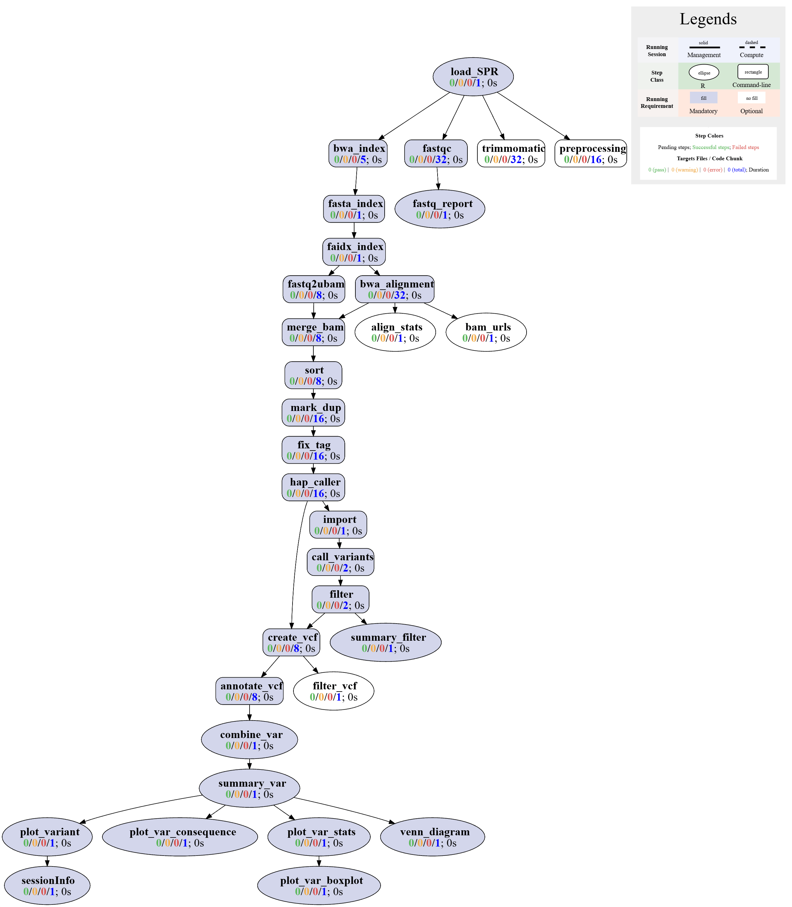
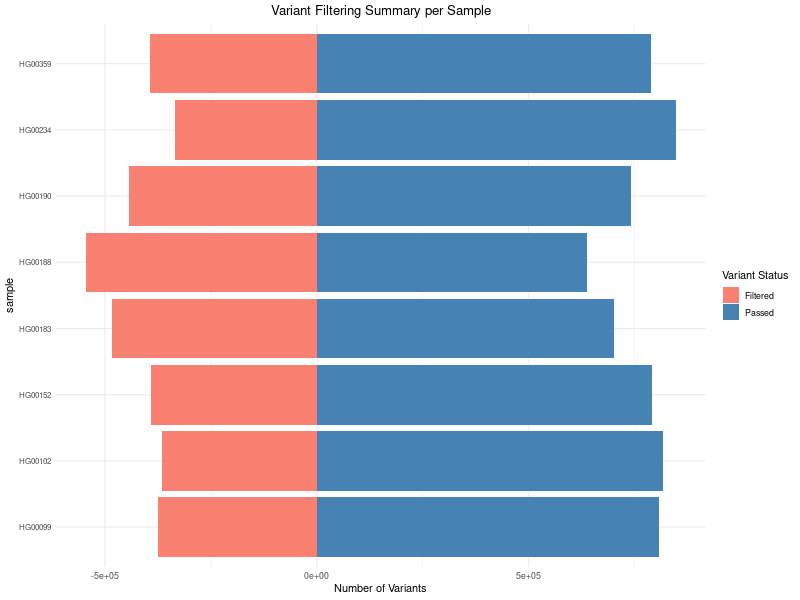
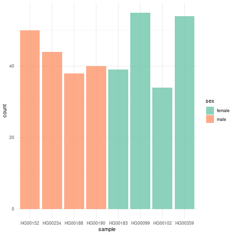
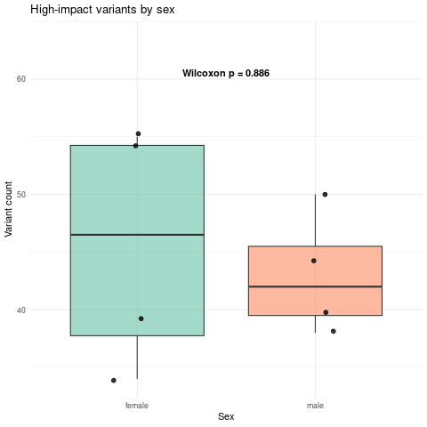
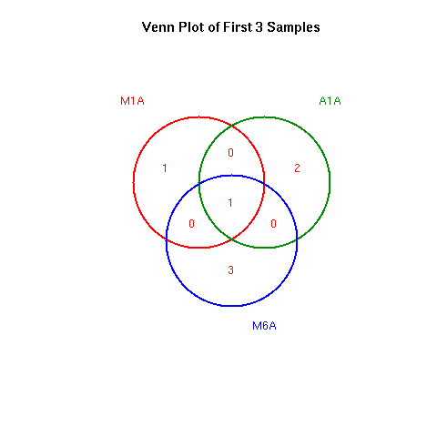
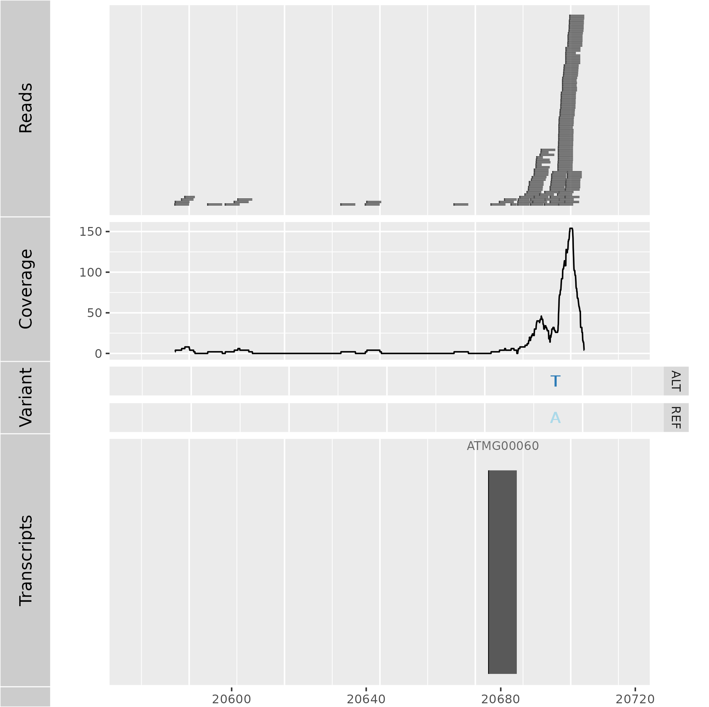

<!--
# Compile from command-line
Rscript -e "rmarkdown::render('systemPipeVARseq.Rmd', c('BiocStyle::html_document'), clean=FALSE); knitr::knit('systemPipeVARseq.Rmd', tangle=TRUE)""
-->

```{css, echo=FALSE}
pre code {
white-space: pre !important;
overflow-x: scroll !important;
word-break: keep-all !important;
word-wrap: initial !important;
}
```

```{r style, echo = FALSE, results = 'asis'}
BiocStyle::markdown()
options(width = 60, max.print = 1000)
knitr::opts_chunk$set(
    eval = as.logical(Sys.getenv("KNITR_EVAL", "TRUE")),
    cache = as.logical(Sys.getenv("KNITR_CACHE", "TRUE")),
    tidy.opts = list(width.cutoff = 60), tidy = TRUE
)
```

```{r setup, echo=FALSE, message=FALSE, warning=FALSE, eval=TRUE}
suppressPackageStartupMessages({
    library(systemPipeR)
})
```

# Introduction

## Overview

This workflow template is for analyzing VAR-Seq data. It is provided by
[systemPipeRdata](https://bioconductor.org/packages/devel/data/experiment/html/systemPipeRdata.html), 
a companion package to [systemPipeR](https://www.bioconductor.org/packages/devel/bioc/html/systemPipeR.html) [@H_Backman2016-bt].
Similar to other `systemPipeR` workflow templates, a single command generates
the necessary working environment. This includes the expected directory
structure for executing `systemPipeR` workflows and parameter files for running
command-line (CL) software utilized in specific analysis steps. For learning
and testing purposes, the template now ships with eight paired-end human
whole-exome FASTQ files curated from the 1000 Genomes Project (HG00152,
HG00234, HG00188, HG00190, HG00183, HG00099, HG00102, HG00359) together with
the hg38 reference sequence and annotations.
This enables users to seamlessly run the numerous analysis steps of
this workflow from start to finish if all required data is downloaded.
After testing the workflow, users have the flexibility to employ the
template as is with their own data or modify it to suit their specific needs.
For more comprehensive information on designing and executing workflows, users
want to refer to the main vignettes of
[systemPipeR](https://www.bioconductor.org/packages/devel/bioc/vignettes/systemPipeR/inst/doc/systemPipeR.html)
and
[systemPipeRdata](https://www.bioconductor.org/packages/devel/data/experiment/vignettes/systemPipeRdata/inst/doc/systemPipeRdata.html). 

The `Rmd` file (`systemPipeVARseq.Rmd`) associated with this vignette serves a dual purpose. It acts
both as a template for executing the workflow and as a template for generating
a reproducible scientific analysis report. Thus, users want to customize the text
(and/or code) of this vignette to describe their experimental design and
analysis results. This typically involves deleting the instructions how to work
with this workflow, and customizing the text describing experimental designs,
other metadata and analysis results.

## Experimental design

Typically, the user wants to describe here the sources and versions of the
reference genome sequence along with the corresponding annotations. The standard
directory structure of `systemPipeR` (see [here](https://www.bioconductor.org/packages/devel/bioc/vignettes/systemPipeR/inst/doc/systemPipeR.html#3_Directory_structure)), 
expects the input data in a subdirectory named `data`
and all results will be written to a separate `results` directory. The Rmd source file 
for executing the workflow and rendering its report (here `systemPipeVARseq.Rmd`) is 
expected to be located in the parent directory. 

Data and resources can be downloaded following commands. 

This part read in the targets file and translate it into executable 
bash commands. Run the following R code chunk to and copy the
outputted commands into your terminal to download the data files.

```{r download_commands, eval=TRUE}
targets <- read.delim("targetsPE_varseq.txt", comment.char = "#")

build_wget <- function(url_base, file_path) {
    url_clean <- sub("/+$$", "", url_base)
    src <- paste0(url_clean, "/", basename(file_path))
    dest <- file_path
    sprintf("wget %s -O %s", src, dest)
}

commands <- unlist(Map(function(url, f1, f2) {
    c(build_wget(url, f1), build_wget(url, f2))
}, targets$url, targets$FileName1, targets$FileName2))

cat(paste0(paste0(commands, " &\n", collapse = ""), "wait\n"))
```

Some additional commands to download resources. Directly run in terminal:

```{bash eval=FALSE}
# hg38 reference gnome 
wget https://hgdownload.soe.ucsc.edu/goldenPath/hg38/bigZips/hg38.fa.gz
gunzip hg38.fa.gz

# Download SnpEff
wget https://snpeff.odsp.astrazeneca.com/versions/snpEff_latest_core.zip
unzip snpEff_latest_core.zip
rm snpEff_latest_core.zip
# the tool path can be used with `java -jar snpEff/snpEff.jar`
```

The dataset used by this template is derived from the 1000 Genomes Project
(Phase 3) and contains eight paired-end human whole-exome libraries (four
male and four female samples). Using paired-end reads
maintains flexibility because the same files can exercise both single- and
paired-end analysis routines.

To use their own VAR-Seq and reference genome data, users want to move or link the
data to the designated `data` directory and execute the workflow from the parent directory 
using their customized `Rmd` file. Beginning with this template, users should delete the provided test
data and move or link their custom data to the designated locations.
Alternatively, users can create an environment skeleton (named `new` [here](https://www.bioconductor.org/packages/devel/data/experiment/vignettes/systemPipeRdata/inst/doc/new.html)) or
build one from scratch. To perform a VAR-Seq analysis with new FASTQ files
from the same reference genome, users only need to provide the FASTQ files and
an experimental design file called 'targets' file that outlines the experimental 
design. The structure and utility of targets files is described in `systemPipeR's`
main vignette [here](https://www.bioconductor.org/packages/devel/bioc/vignettes/systemPipeR/inst/doc/systemPipeR.html#4_The_targets_file).

## Workflow steps

The default analysis steps included in this VAR-Seq workflow template are listed below. Users 
can modify the existing steps, add new ones or remove steps as needed.

__Default analysis steps__

1. Read preprocessing
    + FastQC report
2. Alignments: _`BWA`_ (or any other DNA aligner)
3. Alignment stats 
4. Variant calling 
    + with `GATK`, substeps 1-10
    + with `BCFtools`, 1 substep
5. Filter variants
    + Filter variants called by `GATK` 
    + Filter variants called by `BCFtools` 
6. Annotate filtered variants with `SnpEff`
7. Combine annotation results among samples
8. Calculate Summary statistics of variants
9. Plot variant statistics
10. Plot variants in group comparisons
11. Plot Venn diagram of variants

## Load workflow environment {#load-wf}

The environment for this VAR-Seq workflow is auto-generated below with the 
`genWorkenvir` function (selected under `workflow="varseq"`). It is fully populated 
with a small test data set, including FASTQ files, reference genome and annotation data. The name of the
resulting workflow directory can be specified under the `mydirname` argument.
The default `NULL` uses the name of the chosen workflow. An error is issued if
a directory of the same name and path exists already. After this, the user’s R
session needs to be directed into the resulting `varseq` directory (here with
`setwd`). 

```{r generate_workenvir, eval=FALSE}
library(systemPipeRdata)
genWorkenvir(workflow = "varseq", mydirname = "varseq")
setwd("varseq")
```

### Input data: `targets` file

The `targets` file defines the input files (e.g. FASTQ or BAM) and sample
comparisons used in a data analysis workflow. It can also store any number of
additional descriptive information for each sample. The following shows the first
four lines of the `targets` file used in this workflow template.


```{r load_targets_file, eval=TRUE}
targetspath <- system.file("extdata", "workflows", "varseq", "targetsPE_varseq.txt", package = "systemPipeRdata")
targets <- read.delim(targetspath, comment.char = "#")
targets[1:4, -(5:8)]
```

To work with custom data, users need to generate a _`targets`_ file containing
the paths to their own FASTQ files. [Here](https://www.bioconductor.org/packages/devel/bioc/vignettes/systemPipeR/inst/doc/systemPipeR.html#4_The_targets_file) is a detailed description of the structure and 
utility of `targets` files.

# Quick start {#quick-start}

After a workflow environment has been created with the above `genWorkenvir` 
function call and the corresponding R session directed into the resulting directory (here `varseq`), 
the `SPRproject` function is used to initialize a new workflow project instance. The latter 
creates an empty `SAL` workflow container (below `sal`) and at the same time a
linked project log directory (default name `.SPRproject`) that acts as a
flat-file database of a workflow. Additional details about this process and 
the SAL workflow control class are provided in `systemPipeR's` main vignette 
[here](https://www.bioconductor.org/packages/devel/bioc/vignettes/systemPipeR/inst/doc/systemPipeR.html#11_Workflow_control_class)
and [here](https://www.bioconductor.org/packages/devel/bioc/vignettes/systemPipeR/inst/doc/systemPipeR.html#5_Detailed_tutorial).

Next, the `importWF` function imports all the workflow steps outlined in the
source Rmd file of this vignette (here `systemPipeVARseq.Rmd`) into the `SAL` workflow container.
An overview of the workflow steps and their status information can be returned
at any stage of the loading or run process by typing `sal`.

```{r project_varseq, eval=FALSE}
library(systemPipeR)
sal <- SPRproject() 
sal <- importWF(sal, file_path = "systemPipeVARseq.Rmd", verbose = FALSE)
sal
```

After loading the workflow  into `sal`, it can be executed from start to finish
(or partially) with the `runWF` command. Running the workflow will only be
possible if all dependent CL software is installed on a user's system. Their
names and availability on a system can be listed with `listCmdTools(sal,
check_path=TRUE)`. For more information about the `runWF` command, refer to the
help file and the corresponding section in the main vignette
[here](https://www.bioconductor.org/packages/devel/bioc/vignettes/systemPipeR/inst/doc/systemPipeR.html#61_Overview). 

Running workflows in parallel mode on computer clusters is a straightforward
process in `systemPipeR`. Users can simply append the resource parameters (such
as the number of CPUs) for a cluster run to the `sal` object after importing
the workflow steps with `importWF` using the `addResources` function. More
information about parallelization can be found in the corresponding section at
the end of this vignette [here](#paralellization) and in the main vignette
[here](https://www.bioconductor.org/packages/devel/bioc/vignettes/systemPipeR/inst/doc/systemPipeR.html#63_Parallel_evaluation). 

```{r run_varseq, eval=FALSE}
sal <- runWF(sal)
```
Workflows can be visualized as topology graphs using the `plotWF` function.

```{r plot_varseq, eval=FALSE}
plotWF(sal)
```

```{r varseq-toplogy, eval=TRUE, warning= FALSE, echo=FALSE, out.width="100%", fig.align = "center", fig.cap= "Toplogy graph of VAR-Seq workflow.", warning=FALSE}

```

Scientific and technical reports can be generated with the `renderReport` and 
`renderLogs` functions, respectively. Scientific reports can also be generated 
with the `render` function of the `rmarkdown` package. The technical reports are
based on log information that `systemPipeR` collects during workflow runs.

```{r report_varseq, eval=FALSE}
# Scientific report
sal <- renderReport(sal)
rmarkdown::render("systemPipeVARseq.Rmd", clean = TRUE, output_format = "BiocStyle::html_document") 

# Technical (log) report
sal <- renderLogs(sal)
```

The `statusWF` function returns a status summary for each step in a `SAL` workflow instance.

```{r status_varseq, eval=FALSE}
statusWF(sal)
```

# Workflow steps

The data analysis steps of this workflow are defined by the following workflow code chunks.
They can be loaded into `SAL` interactively, by executing the code of each step in the 
R console, or all at once with the `importWF` function used under the Quick start section. 
R and CL workflow steps are declared in the code chunks of `Rmd` files with the 
`LineWise` and `SYSargsList` functions, respectively, and then added to the `SAL` workflow 
container with `appendStep<-`. Their syntax and usage is described 
[here](https://www.bioconductor.org/packages/devel/bioc/vignettes/systemPipeR/inst/doc/systemPipeR.html#52_Constructing_workflows). 

## Required packages and resources

The first step loads the `systemPipeR` package.

```{r load_SPR, message=FALSE, eval=FALSE, spr=TRUE}
cat(crayon::blue$bold("To use this workflow, following R packages are expected:\n"))
cat(c("'ggplot2', 'dplyr'\n"), sep = "', '")
###pre-end
appendStep(sal) <- LineWise(
    code = {
        library(systemPipeR)
        }, 
    step_name = "load_SPR"
)
```

## FASTQ quality report

### Read-level summaries with FastQC

`systemPipeR` supports wrapping the canonical [FastQC](https://www.bioinformatics.babraham.ac.uk/projects/fastqc/)
command-line utility so the familiar per-sample HTML and ZIP outputs are generated
alongside the R-based plots. Running FastQC captures quality diagnostics (adapter content, sequence
duplication, over-represented sequences) of the reads.

```{r fastqc, eval=FALSE, spr=TRUE}
appendStep(sal) <- SYSargsList(
    step_name = "fastqc",
    targets = "targetsPE_varseq.txt",
    wf_file = "fastqc/workflow_fastqc.cwl",
    input_file = "fastqc/fastqc.yml",
    dir_path = "param/cwl",
    inputvars = c(
        FileName1  = "_FASTQ_PATH1_",
        FileName2  = "_FASTQ_PATH2_"
    ),
    dependency = "load_SPR"
)
```

FastQC writes one HTML and one zipped report per input FASTQ into
`results/fastqc` (configurable in `fastqc.yml`). Review these outputs together
with the `seeFastq` plots to decide whether adapter trimming or additional
filtering is required.

## Read preprocessing

### Read trimming with Trimmomatic

Next, we need to populate the object created with the first step in the
workflow. Here, an example of how to perform this task using parameters template
files for trimming FASTQ files with [Trimmomatic](http://www.usadellab.org/cms/?page=trimmomatic) 
software [@Bolger2014-yr].
For this step, the `SYSargsList` function has been used to build the command-line
and append to `sal` object. For more details of all the features and utilities, 
please consult the [main vignette](http://www.bioconductor.org/packages/release/bioc/vignettes/systemPipeR/inst/doc/systemPipeR.html).

If GATK (default) is used for variant calling, any type of fastq trimming is 
strongly **depreciated**. GATK have internal function to handle low quality posistions.

```{r trimmomatic, eval=FALSE, spr=TRUE}
appendStep(sal) <- SYSargsList(
    step_name = "trimmomatic",
    targets = "targetsPE_varseq.txt",
    wf_file = "trimmomatic/trimmomatic-pe.cwl",
    input_file = "trimmomatic/trimmomatic-pe.yml",
    dir_path = "param/cwl",
    inputvars = c(
        FileName1 = "_FASTQ_PATH1_",
        FileName2 = "_FASTQ_PATH2_",
        SampleName = "_SampleName_"
    ),
    dependency = c("load_SPR"),
    run_step = "optional"
)
```

### Preprocessing with _`preprocessReads`_ function

The function _`preprocessReads`_ allows to apply predefined or custom
read preprocessing functions to all FASTQ files referenced in a
_`SYSargsList`_ container, such as quality filtering or adaptor trimming
routines. Internally, _`preprocessReads`_ uses the _`FastqStreamer`_ function from
the _`ShortRead`_ package to stream through large FASTQ files in a
memory-efficient manner. The following example performs adaptor trimming with
the _`trimLRPatterns`_ function from the _`Biostrings`_ package.

Here, we are appending this step at the _`SYSargsList`_ object created previously. 
All the parameters are defined on the _`preprocessReads/preprocessReads-pe.yml`_ file.

```{r preprocessing, message=FALSE, eval=FALSE, spr=TRUE}
appendStep(sal) <- SYSargsList(
    step_name = "preprocessing",
    targets = "targetsPE_varseq.txt", dir = TRUE,
    wf_file = "preprocessReads/preprocessReads-pe.cwl",
    input_file = "preprocessReads/preprocessReads-pe.yml",
    dir_path = "param/cwl",
    inputvars = c(
        FileName1 = "_FASTQ_PATH1_",
        FileName2 = "_FASTQ_PATH2_",
        SampleName = "_SampleName_"
    ),
    dependency = c("load_SPR"),
    run_step = "optional"
)
```

After the trimming step, the `outfiles` files can be used to generate the new 
targets files containing the paths to the trimmed FASTQ files. The new targets 
information can be used for the next workflow step instance, _e.g._ running the 
NGS alignments with the trimmed FASTQ files.

The following example shows how one can design a custom read _'preprocessReads'_
function using utilities provided by the _`ShortRead`_ package, and then run it
in batch mode with the _'preprocessReads'_ function. For here, it is possible to 
replace the function used on the `preprocessing` step and modify the `sal` object. 
Because it is a custom function, it is necessary to save the part in the R object, 
and internally the `preprocessReads.doc.R` is loading the function. If the R object
is saved with a different name (here `"param/customFCT.RData"`), please replace 
that accordingly in the `preprocessReads.doc.R`.

Please, note that this step is not added to the workflow, here just for demonstration.

First, we defined the function in the workflow:

```{r custom_preprocessing_function, eval=FALSE}
appendStep(sal) <- LineWise(
    code = {
        filterFct <- function(fq, cutoff = 20, Nexceptions = 0) {
            qcount <- rowSums(as(quality(fq), "matrix") <= cutoff, na.rm = TRUE)
            # Retains reads where Phred scores are >= cutoff with N exceptions
            fq[qcount <= Nexceptions]
        }
        save(list = ls(), file = "param/customFCT.RData")
    },
    step_name = "custom_preprocessing_function",
    dependency = "preprocessing"
)
```

After, we can edit the input parameter:

```{r editing_preprocessing, message=FALSE, eval=FALSE}
yamlinput(sal, "preprocessing")$Fct
yamlinput(sal, "preprocessing", "Fct") <- "'filterFct(fq, cutoff=20, Nexceptions=0)'"
yamlinput(sal, "preprocessing")$Fct ## check the new function
cmdlist(sal, "preprocessing", targets = 1) ## check if the command line was updated with success
```

## Read mapping with `BWA-MEM` 

The NGS reads of this project are aligned against the reference genome
sequence using the highly variant tolerant short read aligner `BWA-MEM`
[@Li2013-oy; @Li2009-oc]. The parameter settings of the aligner are
defined in the `param/cwl/gatk/bwa-pe.cwl`.

This test code uses untrimmed fastq files since the demo data is minimal and 
limited. However, it is best to test with `FASTQ quality report` function provided 
above to verify your real data first.

### Build index and dictionary files for BWA and GATK

Build the index and dictionary files for BWA and GATK to run. 

```{r bwa_index, eval=FALSE, spr=TRUE}
appendStep(sal) <- SYSargsList(
    step_name = "bwa_index",
    dir = FALSE, targets = NULL,
    wf_file = "gatk/workflow_bwa-index.cwl",
    input_file = "gatk/gatk.yaml",
    dir_path = "param/cwl",
    dependency = "load_SPR"
)
```

Create reference `fasta` dictionary.

```{r fasta_index, eval=FALSE, spr=TRUE}
appendStep(sal) <- SYSargsList(
    step_name = "fasta_index",
    dir = FALSE, targets = NULL,
    wf_file = "gatk/workflow_fasta_dict.cwl",
    input_file = "gatk/gatk.yaml",
    dir_path = "param/cwl",
    dependency = "bwa_index"
)
```

Create dictionary index.

```{r faidx_index, eval=FALSE, spr=TRUE}
appendStep(sal) <- SYSargsList(
    step_name = "faidx_index",
    dir = FALSE, targets = NULL,
    wf_file = "gatk/workflow_fasta_faidx.cwl",
    input_file = "gatk/gatk.yaml",
    dir_path = "param/cwl",
    dependency = "fasta_index"
)
```

### Mapping reads with BWA

```{r bwa_alignment, eval=FALSE, spr=TRUE}
appendStep(sal) <- SYSargsList(
    step_name = "bwa_alignment",
    targets = "targetsPE_varseq.txt",
    wf_file = "gatk/workflow_bwa-pe.cwl",
    input_file = "gatk/gatk.yaml",
    dir_path = "param/cwl",
    inputvars = c(
        FileName1 = "_FASTQ_PATH1_",
        FileName2 = "_FASTQ_PATH2_",
        SampleName = "_SampleName_"
    ),
    dependency = c("faidx_index")
)
```

## Read and alignment stats

The following provides an overview of the number of reads in each sample
and how many of them aligned to the reference.

```{r align_stats, eval=FALSE, spr=TRUE}
appendStep(sal) <- LineWise(
    code = {
        bampaths <- getColumn(sal, step = "bwa_alignment", "outfiles", column = "samtools_sort_bam")
        fqpaths <- getColumn(sal, step = "bwa_alignment", "targetsWF", column = "FileName1")
        read_statsDF <- alignStats(args = bampaths, fqpaths = fqpaths, pairEnd = TRUE)
        write.table(read_statsDF, "results/alignStats.xls", row.names = FALSE, quote = FALSE, sep = "\t")
    },
    step_name = "align_stats",
    dependency = "bwa_alignment",
    run_step = "optional"
)
```

## Create symbolic links for viewing BAM files in IGV

The `symLink2bam` function creates symbolic links to view the BAM alignment files in a
genome browser such as IGV. The corresponding URLs are written to a file
with a path specified under `urlfile` in the `results` directory.

```{r bam_urls, eval=FALSE, spr=TRUE}
appendStep(sal) <- LineWise(
    code = {
        bampaths <- getColumn(sal, step = "bwa_alignment", "outfiles", column = "samtools_sort_bam")
        symLink2bam(
            sysargs = bampaths, htmldir = c("~/.html/", "somedir/"),
            urlbase = "http://cluster.hpcc.ucr.edu/~tgirke/",
            urlfile = "./results/IGVurl.txt"
        )
    },
    step_name = "bam_urls",
    dependency = "bwa_alignment",
    run_step = "optional"
)
```

## Variant calling

The following performs variant calling with `GATK` and `BCFtools` on a single 
machine by `runWF` function for each sample sequentially. If a cluster compute
is available, running in parallel mode on a compute cluster can be performed by 
`runWF`, making available the resources and choose `run_session = "compute"`. 

Not all users have a cluster system, so here to demonstrate an example of variant calling 
workflow, only single-machine commands are shown. For cluster jobs, please refer 
to our main [vignette](http://www.bioconductor.org/packages/release/bioc/vignettes/systemPipeR/inst/doc/systemPipeR.html). 

In addition, the user would choose only one variant caller here rather than 
running several ones. However, the workflow manager allows keeping multiple 
options available for running the analysis.

### Variant calling with `GATK`

The following steps are based on `GATK 4.1.1.0` [Best Practice](https://software.broadinstitute.org/gatk/best-practices/). 
There are 10 individual steps where the user can choose where to jump in and where to skip. 
All scripts are located at `param/cwl/gatk`. `BQSR` (Base Quality Score Recalibration) 
and `VQSR` (Variant Quality Score Recalibration) are very specific 
to a limited species like human, so this workflow does not support these steps. 

### Step1: `fastq` to `ubam`

Convert `fastq` files to `bam` files to prepare for the following step. It is very 
important to specific your sequencing platform, default is `illumina`. User need 
to change `param/cwl/gatk/gatk_fastq2ubam.cwl` if the platform is different. Platform information 
is needed for the variant caller in later steps to correct calling parameters.

```{r fastq2ubam, eval=FALSE, spr=TRUE}
appendStep(sal) <- SYSargsList(
    step_name = "fastq2ubam",
    targets = "targetsPE_varseq.txt",
    wf_file = "gatk/workflow_gatk_fastq2ubam.cwl",
    input_file = "gatk/gatk.yaml",
    dir_path = "param/cwl",
    inputvars = c(
        FileName1 = "_FASTQ_PATH1_",
        FileName2 = "_FASTQ_PATH2_",
        SampleName = "_SampleName_"
    ),
    dependency = c("faidx_index")
)
```

### Step2: Merge `bam` and `ubam`

This step merges a `bam` and `ubam` and creates a third `bam` file that contains 
alignment information and remaining information that was removed by the aligner like `BWA`. 
The removed information is essential for variant statistics calculation. Previous steps are 
recommended, but variant calling can still be performed without these steps.

```{r merge_bam, eval=FALSE, spr=TRUE}
appendStep(sal) <- SYSargsList(
    step_name = "merge_bam",
    targets = c("bwa_alignment", "fastq2ubam"),
    wf_file = "gatk/workflow_gatk_mergebams.cwl",
    input_file = "gatk/gatk.yaml",
    dir_path = "param/cwl",
    inputvars = c(
        bwa_men_sam = "_bwasam_",
        ubam = "_ubam_",
        SampleName = "_SampleName_"
    ),
    rm_targets_col = c("preprocessReads_1", "preprocessReads_2"),
    dependency = c("bwa_alignment", "fastq2ubam")
)
```


### Step3: Sort `bam` files by genomic coordinates

Sort `bam` files by genomic coordinates.

```{r sort, eval=FALSE, spr=TRUE}
appendStep(sal) <- SYSargsList(
    step_name = "sort",
    targets = "merge_bam",
    wf_file = "gatk/workflow_gatk_sort.cwl",
    input_file = "gatk/gatk.yaml",
    dir_path = "param/cwl",
    inputvars = c(merge_bam = "_mergebam_", SampleName = "_SampleName_"),
    rm_targets_col = c(
        "bwa_men_sam", "ubam", "SampleName_fastq2ubam",
        "Factor_fastq2ubam", "SampleLong_fastq2ubam",
        "Experiment_fastq2ubam", "Date_fastq2ubam"
    ),
    dependency = c("merge_bam")
)
```

### Step4: Mark duplicates

Mark PCR artifacts in sequencing. A `duplicate_metrics` file will also be produced 
by this step, but will not be used for the next step. This file is just for the user 
to check duplicates status summary.

```{r mark_dup, eval=FALSE, spr=TRUE}
appendStep(sal) <- SYSargsList(
    step_name = "mark_dup",
    targets = "sort",
    wf_file = "gatk/workflow_gatk_markduplicates.cwl",
    input_file = "gatk/gatk.yaml",
    dir_path = "param/cwl",
    inputvars = c(sort_bam = "_sort_", SampleName = "_SampleName_"),
    rm_targets_col = c("merge_bam"),
    dependency = c("sort")
)
```

### Step5: Fixing tags

Takes the `bam` from the last step and calculates the NM, MD, and UQ tags. 
These tags are important for variant calling and filtering. 
This step is recommended but can be skipped.  

```{r fix_tag, eval=FALSE, spr=TRUE}
appendStep(sal) <- SYSargsList(
    step_name = "fix_tag",
    targets = "mark_dup",
    wf_file = "gatk/workflow_gatk_fixtag.cwl",
    input_file = "gatk/gatk.yaml",
    dir_path = "param/cwl",
    inputvars = c(mark_bam = "_mark_", SampleName = "_SampleName_"),
    rm_targets_col = c("sort_bam"),
    dependency = c("mark_dup")
)
```

Up till this step, sample preprocess is done. All analysis ready `BAM` files and 
their index `.bai` files are created. Individual and cohort calling by 
`HaplotypeCaller` is performed from the next step.

### Step6: HaplotypeCaller `gvcf`

The `HaplotypeCaller` is running a **gvcf** mode in this step. G stands for 'genomic'. 
The file not only contains variant sites information but also non-variant sites information; 
thus, at the following step, the cohort caller can use this information to validate the true variants.

```{r hap_caller, eval=FALSE, spr=TRUE}
appendStep(sal) <- SYSargsList(
    step_name = "hap_caller",
    targets = "fix_tag",
    wf_file = "gatk/workflow_gatk_haplotypecaller.cwl",
    input_file = "gatk/gatk.yaml",
    dir_path = "param/cwl",
    inputvars = c(fixtag_bam = "_fixed_", SampleName = "_SampleName_"),
    rm_targets_col = c("mark_bam"),
    dependency = c("fix_tag")
)
```

### Step7: Import all `gvcfs`

It is recommended to import all **gvcfs** to a 
[TileDB](https://github.com/Intel-HLS/GenomicsDB/wiki) database for fast cohort 
variant calling at the following step. Note: if you are working with non-diploid data, 
use `CombineGVCFs` function from `GATK` and change the `gvcf_db_folder` parameter 
in `param/cwl/gatk/gatk.yaml` to be your combined **gvcf** file path.

**Important**: Make sure all samples' `*.g.vcf.gz` files are in the results folder,
also the `tbi index` files also should be there.

```{r import, eval=FALSE, spr=TRUE}
appendStep(sal) <- SYSargsList(
    step_name = "import",
    targets = NULL, dir = FALSE,
    wf_file = "gatk/workflow_gatk_genomicsDBImport.cwl",
    input_file = "gatk/gatk.yaml",
    dir_path = "param/cwl",
    dependency = c("hap_caller")
)
```

### Step8: Cohort calling of `gvcf`

Assess variants by information from all `gvcfs`. A collective `vcf` called 
`samples.vcf.gz` is created by default naming.

```{r call_variants, eval=FALSE, spr=TRUE}
appendStep(sal) <- SYSargsList(
    step_name = "call_variants",
    targets = NULL, dir = FALSE,
    wf_file = "gatk/workflow_gatk_genotypeGVCFs.cwl",
    input_file = "gatk/gatk.yaml",
    dir_path = "param/cwl",
    dependency = c("import")
)
```

### Step9: Cohort hard filter variants

Variant Quality Score Recalibration (VQSR) is not included in this workflow. 
Variants are hard filtered together.
See this [Post](https://gatkforums.broadinstitute.org/gatk/discussion/2806/howto-apply-hard-filters-to-a-call-set) for parameters for hard filtering. Change these settings in `param/cwl/gak/gatk_variantFiltration.sh` if needed. VQSR requires a large quantity of 
samples to be training data before you can do filtering. Read this 
[post](https://gatk.broadinstitute.org/hc/en-us/articles/360035531612-Variant-Quality-Score-Recalibration-VQSR-) for more information.

```{r filter, eval=FALSE, spr=TRUE}
appendStep(sal) <- SYSargsList(
    step_name = "filter",
    targets = NULL, dir = FALSE,
    wf_file = "gatk/workflow_gatk_variantFiltration.cwl",
    input_file = "gatk/gatk.yaml",
    dir_path = "param/cwl",
    dependency = c("call_variants")
)
```

### Step10: Extract variant

After cohort calling, filtering, all variants for all samples are stored in one big file. 
Extract variants for each sample and save them separately (only variants that have 
passed the filters are stored).

```{r create_vcf, eval=FALSE, spr=TRUE}
appendStep(sal) <- SYSargsList(
    step_name = "create_vcf",
    targets = "hap_caller",
    wf_file = "gatk/workflow_gatk_select_variant.cwl",
    input_file = "gatk/gatk.yaml",
    dir_path = "param/cwl",
    inputvars = c(SampleName = "_SampleName_"),
    dependency = c("hap_caller", "filter")
)
```

## Variant calling with `BCFtools`

Alternative option with `BCFtool`: 

The following runs the variant calling with `BCFtools`. This tool takes `BWA` 
aligned `BAM` files, sort, mark duplicates by `samtools` and finally call variants 
by `BCFtools`. 
**For legacy reasons we keep this option.**

```{r create_vcf_BCFtool, eval=FALSE, spr=TRUE}
appendStep(sal) <- SYSargsList(
    step_name = "create_vcf_BCFtool",
    targets = "bwa_alignment", dir = TRUE,
    wf_file = "workflow-bcftools/workflow_bcftools.cwl",
    input_file = "workflow-bcftools/bcftools.yml",
    dir_path = "param/cwl",
    inputvars = c(bwa_men_sam = "_bwasam_", SampleName = "_SampleName_"),
    rm_targets_col = c("preprocessReads_1", "preprocessReads_2"),
    dependency = "bwa_alignment",
    run_step = "optional"
)
```

Variant calling ends here. Downstream analysis starts from the next section.

## Inspect VCF file 

Scripts of downstream analysis are stored in `param/cwl/varseq_downstream`.

**optional**: This step is not included in the default workflow. After successfully 
execute the entire workflow, users may load individual vcf files to R for 
other analysis like below.

VCF files can be imported into R with the `readVcf` function. 
Both `VCF` and `VRanges` objects provide convenient data structure for
working with variant data (_e.g._ SNP quality filtering). 

This step is not included in the default workflow steps, but can be useful to 
inspect individual sample's raw variants.

```{r inspect_vcf, eval=FALSE}
library(VariantAnnotation)
vcf_raw <- getColumn(sal, "create_vcf")
vcf <- readVcf(vcf_raw[1], "Homo sapiens")
vcf
vr <- as(vcf, "VRanges")
vr
```

## Filter variants

The function `filterVars` filters VCF files based on user definable
quality parameters. It sequentially imports each VCF file into R, applies the
filtering on an internally generated `VRanges` object and then writes
the results to a new subsetted VCF file. The filter parameters are passed on to
the corresponding argument as a character string. The function applies this
filter to the internally generated `VRanges` object using the standard
subsetting syntax for two dimensional objects such as: `vr[filter, ]`.

### Filter variants called by `GATK` 

The below example filters for variants that are supported by `>=x`
reads and >=80% of them support the called variants. In addition, all
variants need to pass `>=x` of the soft filters recorded in the VCF
files generated by GATK. 

There is already some cohort filtering in GATK step 10. Some additional hard 
filtering is provided here. This step is included here, but in a real analysis,
you may skip this step.

```{r filter_vcf, eval=FALSE, spr=TRUE}
appendStep(sal) <- LineWise(
    code = {
        vcf_raw <- getColumn(sal, "create_vcf")
        library(VariantAnnotation)
        filter <- "totalDepth(vr) >= 20 & (altDepth(vr) / totalDepth(vr) >= 0.8)"
        vcf_filter <- suppressWarnings(filterVars(vcf_raw, filter, organism = "Homo sapiens", out_dir = "results/vcf_filter"))
    },
    step_name = "filter_vcf",
    dependency = "create_vcf",
    run_step = "optional"
)
```


### Filter variants called by `BCFtools`  

The following shows how to filter the VCF files generated by `BCFtools` using
similar parameter settings as in the previous filtering of the GATK
results.

```{r filter_vcf_BCFtools, eval=FALSE, spr=TRUE}
appendStep(sal) <- LineWise(
    code = {
        vcf_raw <- getColumn(sal, step = "create_vcf_BCFtool", 
                             position = "outfiles", column = "bcftools_call")
        library(VariantAnnotation)
        filter <- "rowSums(vr) >= 2 & (rowSums(vr[,3:4])/rowSums(vr[,1:4]) >= 0.8)"
        vcf_filter_bcf <- suppressWarnings(filterVars(vcf_raw, filter, organism = "Homo sapiens", out_dir = "results/vcf_filter_BCFtools", varcaller = "bcftools"))
        
        updateColumn(sal, 'create_vcf', "outfiles") <- data.frame(vcf_filter_bcf=vcf_filter_bcf)
    },
    step_name = "filter_vcf_BCFtools",
    dependency = "create_vcf_BCFtool",
    run_step = "optional"
)
```

Check filtering outcome for one sample

This mini step can be used to compare `vcfs` files before and after filtering.
This can be used once the workflow has been run, and make sure "filter_vcf" is 
done, since it is an optional step.

```{r check_filter, eval=FALSE}
copyEnvir(sal, "vcf_raw", globalenv())
copyEnvir(sal, "vcf_filter", globalenv())
length(as(readVcf(vcf_raw[1], genome = "Homo sapiens"), "VRanges")[, 1])
length(as(readVcf(vcf_filter[1], genome = "Homo sapiens"), "VRanges")[, 1])
```

### Filter statistics

**Optional** but included in the default

After variant filtering, raw variants and filtered variants can be compared.
This step uses the filtered variants from GATK step 9 to generate summary statistics.

```{r summary_filter, eval=FALSE, spr=TRUE}
appendStep(sal) <- LineWise(
    code = {
          # read in the cohort VCF file
          vcf_all <- suppressWarnings(VariantAnnotation::readVcf("./results/samples_filter.vcf.gz", "Homo sapiens"))
  
          filter_values <- VariantAnnotation::filt(vcf_all)
          filter_values[is.na(filter_values)] <- "" # ensure character comparisons work
          overall_counts <- table(filter_values) |>
             dplyr::as_tibble() |>
             dplyr::arrange(dplyr::desc(n))
          
          vcf_all_ft <- VariantAnnotation::geno(vcf_all)$FT
          passes_per_sample <- apply(vcf_all_ft, 2, function(x) sum(x == "PASS", na.rm = TRUE))
          fails_per_sample <- apply(vcf_all_ft, 2, function(x) sum(x != "PASS", na.rm = TRUE))
          sample_filter_summary <- dplyr::tibble(
              sample = names(passes_per_sample),
              passed = passes_per_sample,
              filtered = fails_per_sample
          )
  
          write.table(overall_counts, file = "results/summary_filter_overall.tsv", sep = "\t", quote = FALSE, row.names = FALSE)
          write.table(sample_filter_summary, file = "results/summary_filter_per_sample.tsv", sep = "\t", quote = FALSE, row.names = FALSE)

          p_filter <- ggplot2::ggplot(sample_filter_summary, ggplot2::aes(x = sample)) +
            ggplot2::geom_bar(ggplot2::aes(y = passed, fill = "Passed"), stat = "identity") +
            ggplot2::geom_bar(ggplot2::aes(y = -filtered, fill = "Filtered"), stat = "identity") +
            ggplot2::coord_flip() +
            ggplot2::labs(y = "Number of Variants", fill = "Variant Status", title = "Variant Filtering Summary per Sample") +
            ggplot2::theme_minimal() +
            ggplot2::scale_fill_manual(values = c("Passed" = "steelblue", "Filtered" = "salmon")) +
            ggplot2::theme(
                plot.title = ggplot2::element_text(hjust = 0.5),
                axis.text.y = ggplot2::element_text(size = 8)
            )
          png("results/summary_filter_plot.png", width = 800, height = 600)
          print(p_filter)
          dev.off()
          
          # clean up RAM
          try(rm(vcf_all, vcf_all_ft, filter_values, passes_per_sample, fails_per_sample), silent = TRUE)
          invisible(gc())

    },
    step_name = "summary_filter",
    dependency = "filter"
)
```


<div align="center">Figure 2: Variant Filtering Summary per Sample</div></br>

## Annotate filtered variants

### Annotate filtered variants `GATK` or `BCFtools`

In this step, we use _SnpEff_ to annotate the filtered variants. This tool 
provides a powerful way to predict the effects of genetic variants on genes and proteins.

**required**

```{r annotate_vcf, eval=FALSE, spr=TRUE}
appendStep(sal) <- SYSargsList(
  step_name = "annotate_vcf",
  targets = "create_vcf", dir = TRUE,
  wf_file = "gatk/snpeff.cwl",
  input_file = "gatk/gatk.yaml",
  dir_path = "param/cwl",
  inputvars = c(SampleName = "_SampleName_", vcf_raw = "_vcf_raw_"),
  dependency = c("create_vcf")
)
```

## Combine annotation results among samples

When the annotation is done on each vcf file, next, all annotated vcfs 
can be imported as single lists with large vranges. 

### Combine results 

**required**

```{r combine_var, eval=FALSE, spr=TRUE}
appendStep(sal) <- LineWise(
  code = {
    vcf_anno <- getColumn(sal, "annotate_vcf", position = "outfiles", column = "ann_vcf")
    
    clean_vcf_file <- function(path) {
      lines <- readLines(path, warn = FALSE)
      if (!length(lines)) return(path)
      header_start <- which(grepl("^##fileformat=", lines, perl = TRUE))[1]
      if (is.na(header_start) || header_start <= 1) return(path)
      writeLines(lines[header_start:length(lines)], path)
      path
    }
    
    vcf_anno <- vapply(vcf_anno, clean_vcf_file, FUN.VALUE = character(1))
    vr_from_vcf <- function(path) {
      message("Importing annotated VCF: ", path)
      vcf <- suppressWarnings(VariantAnnotation::readVcf(path, "Homo sapiens"))
      
      ft <- VariantAnnotation::geno(vcf)$FT
      if (!is.null(ft) && !isTRUE(is.character(ft))) {
        ft_vec <- as.character(ft)
        ft_clean <- matrix(ft_vec, ncol = 1)
        if (!is.null(dim(ft))) {
          ft_clean <- matrix(ft_vec, nrow = nrow(ft), dimnames = dimnames(ft))
        }
        VariantAnnotation::geno(vcf)$FT <- ft_clean
      }
      suppressWarnings(as(vcf, "VRanges"))
    }
    
    vcf_vranges <- lapply(vcf_anno, vr_from_vcf)
  },
  step_name = "combine_var",
  dependency = "annotate_vcf"
)
```

## Summary statistics of variants

To clean up the vranges objects into more human-readable summaries, 
we extract key annotation fields along with other key variant information
into a long format table, where each row corresponds to a single variant annotation
of a sample.

## Summary of variants

**required**

```{r summary_var, eval=FALSE, spr=TRUE}
appendStep(sal) <- LineWise(
    code = {
        ann_cols <- c(
            "allele", "consequence", "effect", "gene", "gene_id", "feature_type",
            "feature_id", "transcript_biotype", "rank", "hgvs_c", "hgvs_p",
            "cdna", "cds", "aa", "distance", "warnings"
        )

        extract_ann_strings <- function(ann_obj, n) {
            if (is.null(ann_obj)) {
                return(rep(NA_character_, n))
            }
            if (inherits(ann_obj, "CompressedList") || is.list(ann_obj)) {
                ann_list <- as.list(ann_obj)
                return(vapply(ann_list, function(x) {
                    if (length(x)) x[1] else NA_character_
                }, character(1)))
            }
            if (is.character(ann_obj)) {
                return(vapply(ann_obj, function(x) {
                    if (is.na(x) || !nzchar(x)) return(NA_character_)
                    strsplit(x, ",", fixed = TRUE)[[1]][1]
                }, character(1)))
            }
            rep(NA_character_, n)
        }

        expand_ann_fields <- function(strings) {
            if (!length(strings)) {
                return(matrix(NA_character_, nrow = 0, ncol = length(ann_cols), dimnames = list(NULL, ann_cols)))
            }
            mats <- lapply(strings, function(entry) {
                row <- rep(NA_character_, length(ann_cols))
                if (!is.na(entry) && nzchar(entry)) {
                    tokens <- strsplit(entry, "\\|", fixed = FALSE)[[1]]
                    row[seq_len(min(length(tokens), length(ann_cols)))] <- tokens[seq_len(min(length(tokens), length(ann_cols)))]
                }
                row
            })
            mat <- do.call(rbind, mats)
            colnames(mat) <- ann_cols
            mat
        }

        summarize_sample <- function(sample_id, vr) {
            if (!length(vr)) return(NULL)
            ann_vec <- extract_ann_strings(S4Vectors::mcols(vr)$ANN, length(vr))
            ann_df <- as.data.frame(expand_ann_fields(ann_vec), stringsAsFactors = FALSE)
            if (!nrow(ann_df)) return(NULL)
            data.frame(
                sample = sample_id,
                seqnames = as.character(GenomicRanges::seqnames(vr)),
                start = BiocGenerics::start(vr),
                end = BiocGenerics::end(vr),
                ref = as.character(VariantAnnotation::ref(vr)),
                alt = as.character(VariantAnnotation::alt(vr)),
                gene = ann_df$gene,
                consequence = ann_df$consequence,
                effect = ann_df$effect,
                stringsAsFactors = FALSE
            )
        }

        variant_tables <- Map(summarize_sample, names(vcf_vranges), vcf_vranges)
        variant_tables <- Filter(function(x) !is.null(x) && nrow(x), variant_tables)

        summary_var <- dplyr::bind_rows(variant_tables) |>
          dplyr::as_tibble() |>
          dplyr::mutate(location = paste0(seqnames, ":", start)) |>
          dplyr::relocate(location, .after = "sample")
        utils::write.table(summary_var, file = "results/variant_summary_long.tsv", sep = "\t", quote = FALSE, row.names = FALSE)
    },
    step_name = "summary_var",
    dependency = "combine_var"
)
```

## Plot variants stats

**Optional** but included in the default

After the summary table is created, we can plot some statistics of the variants.
Here this step plots the number of _nonsynonymous_ and _HIGH_ impact variants
for each sample.

```{r plot_var_stats, eval=FALSE, spr=TRUE}
appendStep(sal) <- LineWise(
    code = {
        library(ggplot2)
        plot_summary_data <- summary_var |>
          dplyr::filter(
            consequence %in% c(
              "nonsynonymous_variant", "stop_gained", "frameshift_variant", 
              "splice_acceptor_variant", "splice_donor_variant",
              "start_lost", "stop_lost"
            ),
            effect == "HIGH"
          ) |>
          dplyr::mutate(
            sample = factor(sample, levels = getColumn(sal, step = "annotate_vcf", position = "targetsWF", column = "SampleName")),
            sex = getColumn(sal, step = "annotate_vcf", position = "targetsWF", column = "Factor")[sample]
          )
                assign("plot_summary_data", plot_summary_data, envir = .GlobalEnv)
        
        png("./results/var_summary.png")
        p_var_summary <- ggplot(plot_summary_data) +
          geom_bar(aes(x = sample, fill = sex), alpha = 0.75) +
          scale_fill_brewer(palette = "Set2") +
          theme_minimal()
        print(p_var_summary)
        dev.off()
    },
    step_name = "plot_var_stats",
    dependency = "summary_var"
)
```


<div align="center">Figure 3: high impact variant summary</div></br>


## Compare high-impact variants by sex

**Optional** but included in the default

To visualize whether male and female samples carry different burdens of
high-impact variants, the following step reuses the `plot_summary_data`
object, produces a simple boxplot across the two groups, and overlays a
Wilcoxon rank-sum p-value for a quick statistical comparison.

```{r plot_var_boxplot, eval=FALSE, spr=TRUE}
appendStep(sal) <- LineWise(
    code = {
        if (!exists("plot_summary_data", inherits = FALSE)) {
            stop("'plot_summary_data' not found. Please run 'plot_var_stats' first.")
        }
        library(ggplot2)
        boxplot_data <- plot_summary_data |>
            dplyr::count(sample, sex, name = "n_variants")

        p_label <- tryCatch({
            if (dplyr::n_distinct(boxplot_data$sex) < 2) return("Wilcoxon test not applicable")
            p_val <- stats::wilcox.test(n_variants ~ sex, data = boxplot_data)$p.value
            paste0("Wilcoxon p = ", signif(p_val, 3))
        }, error = function(...) "Wilcoxon test failed")

        label_y <- max(boxplot_data$n_variants, na.rm = TRUE) * 1.1

        png("./results/var_summary_boxplot.png")
        p_summary_boxplot <- ggplot(boxplot_data, aes(x = sex, y = n_variants, fill = sex)) +
            geom_boxplot(alpha = 0.6, outlier.shape = NA) +
            geom_jitter(width = 0.15, size = 2, alpha = 0.8) +
            labs(
                title = "High-impact variants by sex",
                x = "Sex",
                y = "Variant count"
            ) +
            scale_fill_brewer(palette = "Set2", guide = "none") +
            annotate("text", x = 1.5, y = label_y, label = p_label, fontface = "bold") +
            theme_minimal() +
            expand_limits(y = label_y * 1.05)
        print(p_summary_boxplot)
        dev.off()
    },
    step_name = "plot_var_boxplot",
    dependency = "plot_var_stats"
)
```


<div align="center">Figure 4: distribution of high-impact variants per sex.</div></br>


## Venn diagram of variants

**Optional** but included in the default

The venn diagram utilities defined by the `systemPipeR` package can be used to
identify common and unique variants reported for different samples
and/or variant callers. The below generates a 3-way venn diagram
comparing 3 samples.

```{r venn_diagram, eval=FALSE, spr=TRUE}
appendStep(sal) <- LineWise(
    code = {
        top_n <- min(3, length(variant_tables))
        selected_tables <- variant_tables[seq_len(top_n)]
        if (is.null(names(selected_tables)) || any(!nzchar(names(selected_tables)))) {
            names(selected_tables) <- paste0("Sample_", seq_along(selected_tables))
        }

        variant_sets <- lapply(selected_tables, function(df) {
            if (!nrow(df)) return(character(0))
            unique(paste0(df$seqnames, ":", df$start, "_", df$ref, "/", df$alt))
        })

        vennset <- overLapper(variant_sets, type = "vennsets")
        png("./results/vennplot_var.png")
        vennPlot(vennset, mymain = "Venn Plot of First 3 Samples", mysub = "", colmode = 2, ccol = c("red", "blue"))
        dev.off()
    },
    step_name = "venn_diagram",
    dependency = "summary_var"
)
```


<div align="center">Figure 5: Venn Diagram for 3 samples</div></br>


## Plot variants programmatically 

**Optional** but included in default

The following plots a selected variant with `ggbio`.

In this example, the input `BAM` file is from the `GATK` step 5, analysis ready bam. 
You can use other aligned `BAMs` as well, but make sure they are indexed. The `VCF` 
file is taken from `create_vcf` step or you can load your own vcf.

```{r plot_variant, eval=FALSE, spr=TRUE}
appendStep(sal) <- LineWise(
    code = {
        
        first_high <- summary_var |>
          dplyr::filter(effect == "HIGH") |>
          head(n = 1)
        
        library(ggbio)
        library(VariantAnnotation)
        mychr <- as.character(first_high$seqnames)
        mystart <- as.numeric(first_high$start) - 500
        myend <- as.numeric(first_high$end) + 500
        bam_path <- getColumn(sal, "fix_tag")[first_high$sample]
        vcf_path <- getColumn(sal, step = "create_vcf")[first_high$sample]
        
        vcf <- suppressWarnings(readVcf(vcf_path, "Homo sapiens"))
        ga <- readGAlignments(bam_path, use.names = TRUE, param = ScanBamParam(which = GRanges(mychr, IRanges(mystart, myend))))
        simplify_info <- function(vcf_obj) {
            # Drop list-like INFO fields so VRanges coercion receives plain vectors
            info_df <- VariantAnnotation::info(vcf_obj)
            if (!ncol(info_df)) return(vcf_obj)
            keep_idx <- vapply(as.list(info_df), function(col) is.atomic(col) && !is.list(col), logical(1))
            if (any(keep_idx)) {
                info(vcf_obj) <- info_df[, keep_idx, drop = FALSE]
            } else {
                info(vcf_obj) <- S4Vectors::DataFrame()
            }
            vcf_obj
        }
        normalize_ft <- function(vcf_obj) {
            # Ensure genotype FT matrix stores plain character strings per sample
            ft <- VariantAnnotation::geno(vcf_obj)$FT
            if (is.null(ft) || !length(ft)) return(vcf_obj)
            ft_vec <- as.character(ft)
            dims <- dim(ft)
            if (is.null(dims)) {
                ft_mat <- matrix(ft_vec, ncol = 1)
                colnames(ft_mat) <- colnames(vcf_obj)
            } else {
                ft_mat <- matrix(ft_vec, nrow = dims[1], dimnames = dimnames(ft))
            }
            VariantAnnotation::geno(vcf_obj)$FT <- ft_mat
            vcf_obj
        }
        vcf_chr <- normalize_ft(simplify_info(vcf[seqnames(vcf) == mychr]))
        vr <- suppressWarnings(as(vcf_chr, "VRanges"))
        vr_region <- vr[start(vr) >= mystart & end(vr) <= myend]
        if (!length(vr_region)) {
            vr_region <- vr
        }
        p1 <- autoplot(ga, geom = "rect")
        p2 <- autoplot(ga, geom = "line", stat = "coverage")
        p3 <- autoplot(vr_region, type = "fixed") +
            xlim(mystart, myend) +
            theme(legend.position = "none", axis.text.y = element_blank(), axis.ticks.y = element_blank())
        p1_3 <- tracks(
            place_holder = ggplot2::ggplot(),
            Reads = p1,
            Coverage = p2,
            Variant = p3,
            heights = c(0, 0.3, 0.2, 0.1)
        ) + ylab("")
        ggbio::ggsave(p1_3, filename = "./results/plot_variant.png", units = "in")
    },
    step_name = "plot_variant",
    dependency = "summary_var"
)
```


<div align="center">Figure 6: Variant plot for selected region</div></br>


## Workflow Information

```{r sessionInfo, eval=FALSE, spr=TRUE}
appendStep(sal) <- LineWise(
    code = {
        sessionInfo()
        }, 
    step_name = "sessionInfo", 
    dependency = "plot_variant")
```

# Running workflow

## Interactive job submissions in a single machine

For running the workflow, `runWF` function will execute all the steps store in 
the workflow container. The execution will be on a single machine without 
submitting to a queuing system of a computer cluster. 

```{r runWF, eval=FALSE}
sal <- runWF(sal)
```

## Parallelization on clusters

Alternatively, the computation can be greatly accelerated by processing many files 
in parallel using several compute nodes of a cluster, where a scheduling/queuing
system is used for load balancing. 

The `resources` list object provides the number of independent parallel cluster 
processes defined under the `Njobs` element in the list. The following example 
will run 8 processes in parallel using 4 CPU cores per sample. 
If the resources available on a cluster allow running all 8 processes at the 
same time, then the shown sample submission will utilize a total of 32 CPU cores.

Note, `runWF` can be used with most queueing systems as it is based on utilities 
from the `batchtools` package, which supports the use of template files (_`*.tmpl`_)
for defining the run parameters of different schedulers. To run the following 
code, one needs to have both a `conffile` (see _`.batchtools.conf.R`_ samples [here](https://mllg.github.io/batchtools/)) 
and a `template` file (see _`*.tmpl`_ samples [here](https://github.com/mllg/batchtools/tree/master/inst/templates)) 
for the queueing available on a system. The following example uses the sample 
`conffile` and `template` files for the Slurm scheduler provided by this package. 

The resources can be appended when the step is generated, or it is possible to 
add these resources later, as the following example using the `addResources` 
function:

```{r runWF_cluster, eval=FALSE}
# wall time in mins, memory in MB
resources <- list(conffile=".batchtools.conf.R",
                  template="batchtools.slurm.tmpl", 
                  Njobs=8, 
                  walltime=120,
                  ntasks=1,
                  ncpus=4, 
                  memory=1024,
                  partition = "short"
                  )
sal <- addResources(sal, c("hisat2_mapping"), resources = resources)
sal <- runWF(sal)
```

## Visualize workflow

_`systemPipeR`_ workflows instances can be visualized with the `plotWF` function.

```{r plotWF, eval=FALSE}
plotWF(sal, rstudio = TRUE)
```

## Checking workflow status

To check the summary of the workflow, we can use:

```{r statusWF, eval=FALSE}
sal
statusWF(sal)
```

## Accessing logs report

_`systemPipeR`_ compiles all the workflow execution logs in one central location,
making it easier to check any standard output (`stdout`) or standard error
(`stderr`) for any command-line tools used on the workflow or the R code stdout.

```{r logsWF, eval=FALSE}
sal <- renderLogs(sal)
```

## Tools used 
To check command-line tools used in this workflow, use `listCmdTools`, and use `listCmdModules`
to check if you have a modular system.

The following code will print out tools required in your custom SPR project in the report. 
In case you are running the workflow for the first time and do not have a project yet, or you 
just want to browser this workflow, following code displays the tools required by default.
```{r list_tools, eval=FALSE}
if(file.exists(file.path(".SPRproject", "SYSargsList.yml"))) {
    local({
        sal <- systemPipeR::SPRproject(resume = TRUE)
        systemPipeR::listCmdTools(sal)
        systemPipeR::listCmdModules(sal)
    })
} else {
    cat(crayon::blue$bold("Tools and modules required by this workflow are:\n"))
    cat(c("trimmomatic/0.39", "samtools/1.14", "gatk/4.2.0.0", "bcftools/1.15", 
          "bwa/0.7.17", "snpEff/5.3"), sep = "\n")
}
```

## Report Session Info
This is the session information for rendering this report. To access the session information
of workflow running, check HTML report of `renderLogs`. 
```{r report_session_info, eval=TRUE}
sessionInfo()
```

# Funding

This project was supported by funds from the National Institutes of
Health (NIH) and the National Science Foundation (NSF).

# References
