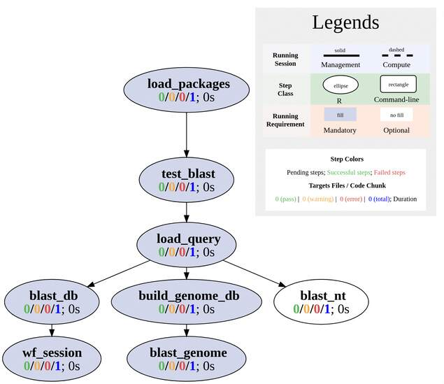

```{css, echo=FALSE}
pre code {
white-space: pre !important;
overflow-x: scroll !important;
word-break: keep-all !important;
word-wrap: initial !important;
}
```

```{r style, echo = FALSE, results = 'asis'}
BiocStyle::markdown()
options(width=60, max.print=1000)
knitr::opts_chunk$set(
    eval=as.logical(Sys.getenv("KNITR_EVAL", "TRUE")),
    cache=as.logical(Sys.getenv("KNITR_CACHE", "TRUE")), 
    tidy.opts=list(width.cutoff=60), tidy=TRUE)
```

```{r setup, echo=FALSE, message=FALSE, warning=FALSE, eval=FALSE}
suppressPackageStartupMessages({
    library(systemPipeR)
})
```

# About the template
This section provides general description and how to use this BLAST workflow. 
In the actual analysis report, this section is usually **removed**. 

This BLAST workflow template is based on the 
[BLAST](https://blast.ncbi.nlm.nih.gov/Blast.cgi).

- The BLAST software can be downloaded from [NCBI](https://ftp.ncbi.nlm.nih.gov/blast/executables/blast+/LATEST/).
  Please make sure it can be run from command-line.

This workflow template:
1. Validate the BLAST installation
2. Create a BLAST database using input fasta file from a reference genome. 
3. BLAST query sequences with against the database




# Introduction

Users want to provide here background information about the design of their
BLAST project.

This report describes the analysis of a BLAST project studying ...

## Experimental design

Typically, users want to specify here all information relevant for the
analysis of their BLAST study. This includes detailed descriptions of
files, experimental design, reference genome, gene annotations,
etc.

# Workflow environment

To create a Workflow within _`systemPipeR`_, we can start by defining an empty
container and checking the directory structure:

```{r create_workflow, message=FALSE, eval=FALSE}
library(systemPipeR)
sal <- SPRproject()
sal
```

To load the entire workflow with default settings, run

```{r load_workflow_default, eval=FALSE}
sal <- importWF(sal, "SPblast.Rmd")
```


## Load packages 

```{r load_packages, eval=FALSE, spr=TRUE}
appendStep(sal) <- LineWise(
    code = {
        library(systemPipeR)
    }, 
    step_name = "load_packages"
)
```

## Test BLAST install

```{r test_blast, eval=FALSE, spr=TRUE}
appendStep(sal) <- LineWise(
    code = {
        # If you have a modular system, use following line
        moduleload("ncbi-blast") 
        # If not, comment out line above you need to install BLAST and configure the PATH. 
        blast_check <- tryCMD("blastn", silent = TRUE)
        if(blast_check  == "error") stop("Check your BLAST installation path.")
    }, 
    step_name = "test_blast",
    dependency = "load_packages"
)
```

## BLAST against reference genome

In this step, we are trying to BLAST the query sequences to a reference genome 
and see if this genome contains the whole or part of the sequences.

In this example, a minimized `tair10` genome is used. In the real analysis, 
please replace it with a full genome `fasta` file. 

Another option is to use NCBI BLAST databases. There are many databases available,
but most of them are very large. For example, `nr` database is 100GB. Make 
sure you have enough storage and memory to download and use them.

```{r build_genome_db, eval=FALSE, spr=TRUE}
appendStep(sal) <- SYSargsList(
    step_name = "build_genome_db", 
    dir = FALSE, 
    targets=NULL, 
    wf_file = "blast/makeblastdb.cwl", 
    input_file="blast/makeblastdb.yml",
    dir_path="param/cwl", 
    dependency = "test_blast"
)
```

## Perform BLAST search

Next BLAST is performed. Since the query sequences are directly taken from the reference gnome, they all should two
return statistically meaningful BLAST results.

```{r blast_genome, eval=FALSE, spr=TRUE}
appendStep(sal) <- SYSargsList(
    step_name = "blast_genome", 
    dir = FALSE,
    targets="targets_blast.txt", 
    wf_file = "blast/blastn.cwl", 
    input_file="blast/blastn.yml",
    inputvars = c(
        FileName = "_query_file_",
        SampleName = "_SampleName_"
    ),
    dir_path="param/cwl", 
    dependency = "build_genome_db"
)
```


## Display the top hits

This step displays the top hits from the BLAST results. The e_value and bit_score
are the most important values to consider.

```{r display_hits, eval=FALSE, spr=TRUE}
appendStep(sal) <- LineWise(
    code = {
        # get the output file path from a Sysargs step using `getColumn`
        tbl_tair10 <- read.delim(getColumn(sal, step = "blast_genome")[1], header = FALSE, stringsAsFactors = FALSE)
        names(tbl_tair10) <- c(
          "query", "subject", "identity", "alignment_length", "mismatches", 
          "gap_openings", "q_start", "q_end", "s_start", "s_end", 
          "e_value", "bit_score"
        )
        print(head(tbl_tair10, n = 20))
    }, 
    step_name = "display_hits",
    dependency = "blast_genome"
)
```

## Workflow session

```{r wf_session, eval=FALSE, spr=TRUE}
appendStep(sal) <- LineWise(
    code = {
        sessionInfo()
    }, 
    step_name = "wf_session", 
    dependency = "display_hits")
```

# Manage the workflow

To run the workflow, use `runWF` function. It executes all the steps store in 
the workflow container. The execution will be on a single machine without 
submitting to a queuing system of a computer cluster. 

```{r runWF, eval=FALSE}
sal <- runWF(sal) 
```

- To use complex workflow control options, such as parallelization, subsetting samples, selecting steps, read the [documents](https://systempipe.org/sp/spr/sp_run/step_run/) on our website. 
- Explore [other details of the workflow object](https://systempipe.org/sp/spr/sp_run/sal_explore/).
- Create [logs and reports](https://systempipe.org/sp/spr/sp_run/step_reports/).
- [Visualize the workflow](https://systempipe.org/sp/spr/sp_run/step_vis/).

# About the workflow
## Tools used 

To check command-line tools used in this workflow, use `listCmdTools`, and use `listCmdModules`
to check if you have a modular system.

The following code will print out tools required in your custom SPR project in the report. 
In case you are running the workflow for the first time and do not have a project yet, or you 
just want to browser this workflow, following code displays the tools required by default.
```{r list_tools}
if(file.exists(file.path(".SPRproject", "SYSargsList.yml"))) {
    local({
        sal <- systemPipeR::SPRproject(resume = TRUE)
        systemPipeR::listCmdTools(sal)
        systemPipeR::listCmdModules(sal)
    })
} else {
    cat(crayon::blue$bold("Tools and modules required by this workflow are:\n"))
    cat(c("BLAST 2.16.0+"), sep = "\n")
}
```


## Session Info
This is the session information for rendering this report. To access the session information
of workflow running, check HTML report of `renderLogs`. 
```{r report_session_info, eval=TRUE}
sessionInfo()
```
