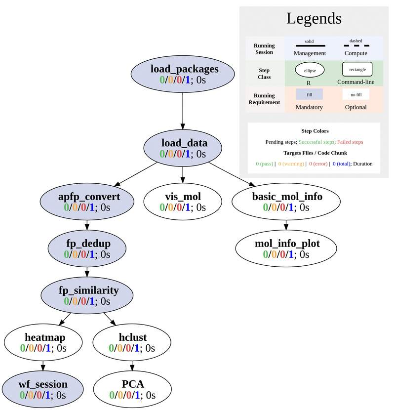
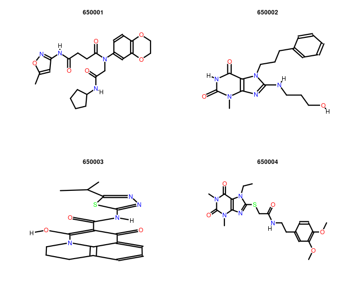
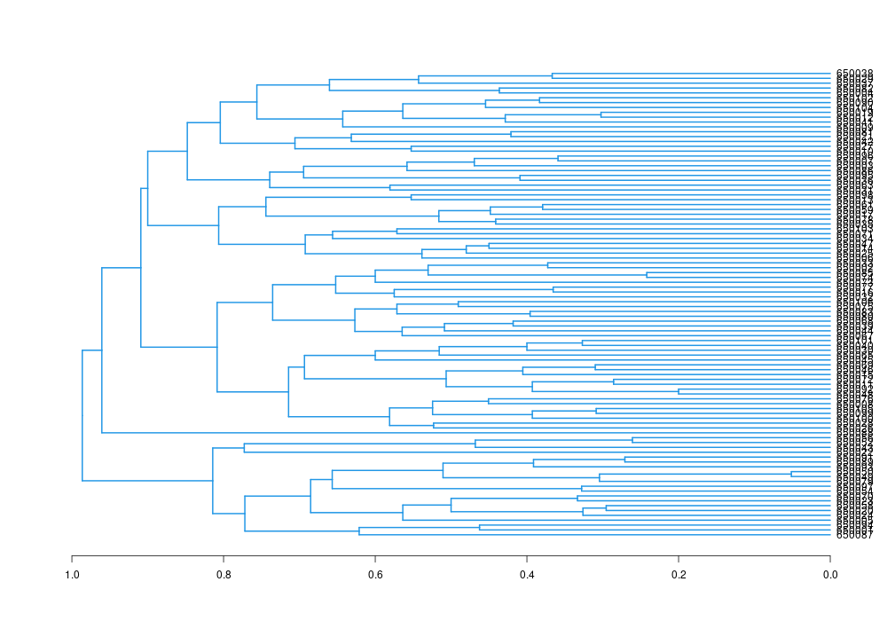
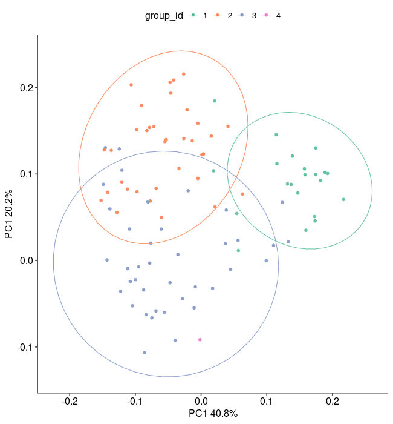
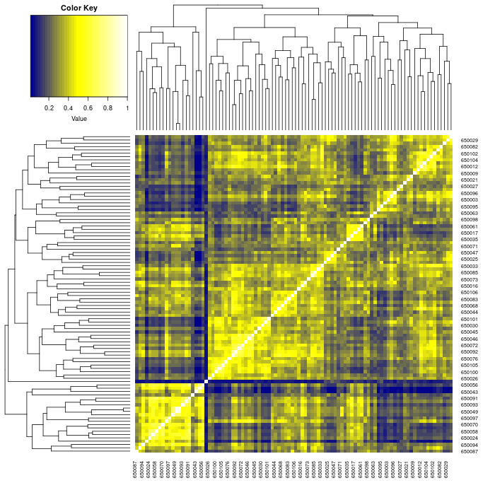

```{css, echo=FALSE}
pre code {
white-space: pre !important;
overflow-x: scroll !important;
word-break: keep-all !important;
word-wrap: initial !important;
}
```

```{r style, echo = FALSE, results = 'asis'}
BiocStyle::markdown()
options(width=60, max.print=1000)
knitr::opts_chunk$set(
    eval=as.logical(Sys.getenv("KNITR_EVAL", "TRUE")),
    cache=as.logical(Sys.getenv("KNITR_CACHE", "TRUE")), 
    tidy.opts=list(width.cutoff=60), tidy=TRUE)
```

```{r setup, echo=FALSE, message=FALSE, warning=FALSE, eval=FALSE}
suppressPackageStartupMessages({
    library(systemPipeR)
})
```

# About the template
This is a cheminformatics workflow template of the [systemPipeRdata](https://bioconductor.org/packages/devel/data/experiment/html/systemPipeRdata.html) 
package, a companion
package to [systemPipeR](https://www.bioconductor.org/packages/devel/bioc/html/systemPipeR.html) [@H_Backman2016-bt]. Like other workflow
templates, it can be loaded with a single command. Users have the
flexibility to utilize the template as is or modify it as needed. More in-depth
information on designing workflows can be found in the main vignette of [systemPipeRdata](https://bioconductor.org/packages/devel/data/experiment/vignettes/systemPipeRdata/inst/doc/systemPipeRdata.html). 
This template serves as a starting point for conducting structure similarity
searching and clustering of small molecules. Most of its steps use functions
of the [ChemmineR](https://www.bioconductor.org/packages/release/bioc/vignettes/ChemmineR/inst/doc/ChemmineR.html)
package from [Bioconductor](https://www.bioconductor.org/packages/release/bioc/html/ChemmineR.html). 
There are no command-line (CL) software tools required for running this
workflow in its current form as all steps are based on R functions. 

The `Rmd` file (`SPcheminfo.Rmd`) associated with this vignette serves a dual purpose. It acts
both as a template for executing the workflow and as a template for generating
a reproducible scientific analysis report. Thus, users want to customize the text
(and/or code) of this vignette to describe their experimental design and
analysis results. This typically involves deleting the instructions how to work
with this workflow, and customizing the text describing experimental designs,
other metadata and analysis results.

The following data analysis routines are included in this workflow template:

- Import of small molecules from a structure definition file (SDF)
- Plotting of small molecule structures
- Computation of atom pairs and finger prints for structure searching
- All-against-all structure comparisons of small molecules
- Heatmap plot of resulting distance matrix



# Workflow environment

The environment of the chosen workflow is generated with the `genWorenvir`
function. After this, the user’s R session needs to be directed into the
resulting directory (here `SPcheminfo`).


```{r gen_spblast_wf, eval=FALSE}
systemPipeRdata::genWorkenvir(workflow = "SPcheminfo", mydirname = "SPcheminfo")
setwd("SPcheminfo")
```

The `SPRproject` function initializes a new workflow project instance. This
function call creates an empty `SAL` workflow container and at the same time a
linked project log directory (default name `.SPRproject`) that acts as a
flat-file database of a workflow. For additional details, please visit this
[section](https://www.bioconductor.org/packages/devel/bioc/vignettes/systemPipeR/inst/doc/systemPipeR.html#5_Detailed_tutorial) 
in `systemPipeR's` main vignette.

```{r create_workflow, message=FALSE, eval=FALSE}
library(systemPipeR)
sal <- SPRproject()
sal
```

The `importWF` function allows to import all the workflow steps outlined in
the source Rmd file of this vignette into a `SAL` (`SYSargsList`) workflow
container. Once imported, the entire workflow can be executed from start to
finish using the `runWF` function. More details regarding this process are
provided in the following section [here](#importwf).

```{r load_workflow_default, eval=FALSE}
sal <- importWF(sal, "SPcheminfo.Rmd")
sal <- runWF(sal)
```

## Step 1: Load packages 

The first step loads the `systemPipeR` and `ChemmineR` packages.

```{r load_packages, eval=FALSE, spr=TRUE}
appendStep(sal) <- LineWise(
    code = {
        library(systemPipeR)
        library(ChemmineR)
    }, 
    step_name = "load_packages"
)
```

## Step 2: Import molecule structures

This step imports 100 small molecule structures from an SDF file with the `read.SDFset` function. The structures
are stored in an `SDFset` object, a class defined by the `ChemmineR` package.

```{r load_data, eval=FALSE, spr=TRUE}
appendStep(sal) <- LineWise(
    code = {
        sdfset <- read.SDFset("https://cluster.hpcc.ucr.edu/~tgirke/Documents/R_BioCond/Samples/sdfsample.sdf") 
    }, 
    step_name = "load_data",
    dependency = "load_packages"
)
```

## Step 3: Visualize molecule structures

The structures of selected molecules (here first four) are be visualized with the `plot` function.

```{r vis_mol, eval=FALSE, spr=TRUE}
appendStep(sal) <- LineWise(
    code = {
        png("results/mols_plot.png", 700, 600)
        # Here only first 4 are plotted. Please choose the ones you want to plot.
        ChemmineR::plot(sdfset[1:4])
        dev.off()
    }, 
    step_name = "vis_mol", 
    dependency = "load_data",
    run_step = "optional"
)
```



## Step 4: Physicochemical properties

Basic physicochemical properties are computed for the small molecules stored in `sdfset`. 
For this example atom frequencies, molecular weight and formula are computed. For more options
users want to consult the vignette of the [ChemmineR](https://www.bioconductor.org/packages/release/bioc/html/ChemmineR.html) 
package.

```{r basic_mol_info, eval=FALSE, spr=TRUE}
appendStep(sal) <- LineWise(
    code = {
        propma <- data.frame(MF=MF(sdfset), MW=MW(sdfset), atomcountMA(sdfset))
        readr::write_csv(propma, "results/basic_mol_info.csv")
    }, 
    step_name = "basic_mol_info", 
    dependency = "load_data",
    run_step = "optional"
)
```

## Step 5: Box plots of properties

In this example, the extracted property data is visualized using a box plot.

```{r mol_info_plot, eval=FALSE, spr=TRUE}
appendStep(sal) <- LineWise(
    code = {
        png("results/atom_req.png", 700, 700)
        boxplot(propma[, 3:ncol(propma)], col="#6cabfa", main="Atom Frequency")
        dev.off()
    }, 
    step_name = "mol_info_plot", 
    dependency = "basic_mol_info",
    run_step = "optional"
)
```


## Step 6: Structural descriptors

For structural comparisons and searching, atom pairs and fingerprints are computed for
the imported small molecules. 

```{r apfp_convert, eval=FALSE, spr=TRUE}
appendStep(sal) <- LineWise(
    code = {
         apset <- sdf2ap(sdfset)
         fpset <- desc2fp(apset, descnames=1024, type="FPset") 
         # The atom pairs and fingerprints can be saved to files.
         readr::write_rds(apset, "results/apset.rds")
         readr::write_rds(fpset, "results/fpset.rds")
    }, 
    step_name = "apfp_convert", 
    dependency = "load_data"
)
```


## Step 7: Removal of identical fingerprint sets

Small molecules yielding identical fingerprints are removed in this step. 

```{r fp_dedup, eval=FALSE, spr=TRUE}
appendStep(sal) <- LineWise(
    code = {
         fpset <- fpset[which(!cmp.duplicated(apset))]
    }, 
    step_name = "fp_dedup", 
    dependency = "apfp_convert"
)
```


## Step 8: Similarity compute

All-against-all similarity scores (here Tanimoto coefficients) are computed and stored in a similarity matrix. 

```{r fp_similarity, eval=FALSE, spr=TRUE}
appendStep(sal) <- LineWise(
    code = {
          simMAfp <- sapply(cid(fpset), function(x) fpSim(x=fpset[x], fpset, sorted=FALSE)) 
    }, 
    step_name = "fp_similarity", 
    dependency = "fp_dedup"
)
```

## Step 9: Hierarchical clustering

The similarity matrix from the previous step can be used for clustering the
small molecules by structural similarities. In the given example, hierarchical 
cluster is performed with the `hclust` function. Since this functions expects
a distance matrix, the similarity matrix needs to be converted to a distance matrix
using `1-simMAfp`. 

```{r hclust, eval=FALSE, spr=TRUE}
appendStep(sal) <- LineWise(
    code = {
          hc <- hclust(as.dist(1-simMAfp))
          png("results/hclust.png", 1000, 700)
          plot(as.dendrogram(hc), edgePar=list(col=4, lwd=2), horiz=TRUE) 
          dev.off()
          # to see the tree groupings, one need to cut the tree, for example, by height of 0.9
          tree_cut <- cutree(hc, h = 0.9)
          grouping <- tibble::tibble(
              cid = names(tree_cut),
              group_id = tree_cut
          ) 
          readr::write_csv(grouping, "results/hclust_grouping.csv")
    }, 
    step_name = "hclust", 
    dependency = "fp_similarity",
    run_step = "optional"
)
```



## Step 10: PCA

Alternatively, PCA can be used to visualize the structural similarities among molecules. 

```{r PCA, eval=FALSE, spr=TRUE}
appendStep(sal) <- LineWise(
    code = {
        library(magrittr)
        library(ggplot2)
        mol_pca <- princomp(simMAfp)
        # find the variance 
        mol_pca_var <- mol_pca$sdev[1:2]^2 / sum(mol_pca$sdev^2)
        # plot 
        png("results/mol_pca.png", 650, 700)
        tibble::tibble(
              PC1 = mol_pca$loadings[, 1],
              PC2 = mol_pca$loadings[, 2],
              group_id = as.factor(grouping$group_id)
          ) %>% 
            # The following colors the by group labels.
            ggplot(aes(x = PC1, y = PC2, color = group_id)) + 
            geom_point(size = 2) +
            stat_ellipse() +
            labs(
                x = paste0("PC1 ", round(mol_pca_var[1], 3)*100, "%"),
                y = paste0("PC1 ", round(mol_pca_var[2], 3)*100, "%")
            ) +
            ggpubr::theme_pubr(base_size = 16) +
            scale_color_brewer(palette = "Set2")
        dev.off()
    }, 
    step_name = "PCA", 
    dependency = "hclust",
    run_step = "optional"
)
```



## Step 11: Include heatmap

This step adds a heatmap to the above hierarchical clustering analysis. Heatmaps
facilitate the identification of patterns in data, here similarity scores. 

```{r heatmap, eval=FALSE, spr=TRUE}
appendStep(sal) <- LineWise(
    code = {
        library(gplots) 
        png("results/mol_heatmap.png", 700, 700)
        heatmap.2(simMAfp, Rowv=as.dendrogram(hc), Colv=as.dendrogram(hc), 
             col=colorpanel(40, "darkblue", "yellow", "white"), 
             density.info="none", trace="none") 
        dev.off()
    }, 
    step_name = "heatmap", 
    dependency = "fp_similarity",
    run_step = "optional"
)
```



## Version information

```{r wf_session, eval=FALSE, spr=TRUE}
appendStep(sal) <- LineWise(
    code = {
        sessionInfo()
    }, 
    step_name = "wf_session", 
    dependency = "heatmap")
```

# Automated routine {#importwf}

Once the above workflow steps have been loaded into `sal` from the source `Rmd`
file of this vignette, the workflow can be executed from start to finish (or
partially) with the `runWF` command. Subsequently, scientific and technical
workflow reports can be generated with the `renderReport`  and `renderLogs`
functions, respectively.

__Note:__ To demonstrate 'systemPipeR's' automation routines without regenerating a new workflow 
environment from scratch, the first line below uses the `overwrite=TRUE` option of the `SPRproject` function. 
This option is generally discouraged as it erases the existing workflow project and `sal` container. 
For information on resuming and restarting workflow runs, users want to consult the relevant section of 
the main vignette (see [here](https://www.bioconductor.org/packages/devel/bioc/vignettes/systemPipeR/inst/doc/systemPipeR.html#10_Restarting_and_resetting_workflows).)

```{r , import_run_routine, eval=FALSE}
sal <- SPRproject(overwrite = TRUE) # Avoid 'overwrite=TRUE' in real runs.
sal <- importWF(sal, file_path = "SPcheminfo.Rmd") # Imports above steps from new.Rmd.
sal <- runWF(sal) # Runs ggworkflow.
plotWF(sal) # Plot toplogy graph of workflow
sal <- renderReport(sal) # Renders scientific report.
sal <- renderLogs(sal) # Renders technical report from log files.
```

## CL tools used 
The `listCmdTools` (and `listCmdModules`) return the CL tools that 
are used by a workflow. To include a CL tool list in a workflow report, 
one can use the following code. Additional details on this topic 
can be found in the main vignette [here](https://www.bioconductor.org/packages/devel/bioc/vignettes/systemPipeR/inst/doc/systemPipeR.html#111_Accessor_methods).

```{r list_tools}
if(file.exists(file.path(".SPRproject", "SYSargsList.yml"))) {
    local({
        sal <- systemPipeR::SPRproject(resume = TRUE)
        systemPipeR::listCmdTools(sal)
        systemPipeR::listCmdModules(sal)
    })
} else {
    cat(crayon::blue$bold("Tools and modules required by this workflow are:\n"))
    cat(c("There are no CL steps in this workflow."), sep = "\n")
}
```

## Session Info
This is the session information for rendering this R Markdown report. To access the 
session information for the workflow run, generate the technical HTML report with `renderLogs`. 

```{r report_session_info, eval=TRUE}
sessionInfo()
```
