```{css, echo=FALSE}
pre code {
white-space: pre !important;
overflow-x: scroll !important;
word-break: keep-all !important;
word-wrap: initial !important;
}
```

```{r style, echo = FALSE, results = 'asis'}
BiocStyle::markdown()
options(width=60, max.print=1000)
knitr::opts_chunk$set(
    eval=as.logical(Sys.getenv("KNITR_EVAL", "TRUE")),
    cache=as.logical(Sys.getenv("KNITR_CACHE", "TRUE")), 
    tidy.opts=list(width.cutoff=60), tidy=TRUE)
```

```{r setup, echo=FALSE, message=FALSE, warning=FALSE, eval=FALSE}
suppressPackageStartupMessages({
    library(systemPipeR)
})
```

# About the template

This section provides general description and how to use this single cell RNAseq (scRNAseq) workflow. 
In the actual analysis report, this section is usually **removed**. 

This scRNAseq workflow template is based on the counted 10x scRNA data. It means 
this workflow expect users have output from cell counting programs, like `cell ranger`. 

The steps in this workflow include:

1. Read in single cell count data.
2. Basic stats on input data.
3. Create some basic QC on cell counting. 
4. Normalization.
5. Find high variable genes. 
6. Scaling.
7. Dim reduction, PCA.
8. Clustering with tSNE, uMAP.
9. Find clustering markers (marker gene).
10. Find cell types. 
11. Visualize cell types and clustering together.

This template is modified from [Seurat Tutorial](https://satijalab.org/seurat/articles/pbmc3k_tutorial.html).


# Introduction

Users want to provide here background information about the design of their
scRNAseq project.

This report describes the analysis of a scRNAseq project studying ...

## Experimental design

Typically, users want to specify here all information relevant for the
analysis of their scRNAseq study. This includes detailed descriptions of
files, experimental design, reference genome, gene annotations,
etc.

# Workflow environment

To create a Workflow within _`systemPipeR`_, we can start by defining an empty
container and checking the directory structure:

```{r create_workflow, message=FALSE, eval=FALSE}
library(systemPipeR)
sal <- SPRproject()
sal
```

To load the entire workflow with default settings, run

```{r load_workflow_default, eval=FALSE}
sal <- importWF(sal, "SPscrna.Rmd")
```

## Load packages 

```{r load_packages, eval=FALSE, spr=TRUE}
cat(crayon::blue$bold("To use this workflow, following R packages are expected:\n"))
cat(c("'Seurat", "ggplot2", "ggpubr", "patchwork", "dplyr", "tibble", "readr'\n"), sep = "', '")
###pre-end
appendStep(sal) <- LineWise(
    code = {
        library(systemPipeR)
        library(Seurat)
        library(dplyr)
        library(ggplot2)
        library(ggpubr)
        library(patchwork)
    }, 
    step_name = "load_packages"
)
```

## Load data
In this example, the single cell data is preprocessed/filtered 10x data from a healthy donor.
Samples taken from peripheral blood mononuclear cells (PBMCs), about 3000 cells. 

Dataset can be downloaded with this link:
https://cf.10xgenomics.com/samples/cell/pbmc3k/pbmc3k_filtered_gene_bc_matrices.tar.gz

If the link is not working, visit [10x website](https://support.10xgenomics.com/single-cell-gene-expression/datasets/1.1.0/pbmc3k?)
for updated links.

For your real data, please preprocess and put the dataset inside `data` directory

```{r load_data, eval=FALSE, spr=TRUE}
appendStep(sal) <- LineWise(
    code = {
        # unzip the data
        untar("data/pbmc3k_filtered_gene_bc_matrices.tar.gz", exdir = "data")
        # load data
        pbmc.data <- Read10X(data.dir = "data/filtered_gene_bc_matrices/hg19/")
        # Use dim to see the size of dataset, example data has 2700 cells x 32738 genes 
        dim(pbmc.data)
    }, 
    step_name = "load_data",
    dependency = "load_packages"
)
```

## Simple count visulization 
We can plot to see how many cells have good expressions.
```{r count_plot, eval=FALSE, spr=TRUE}
appendStep(sal) <- LineWise(
    code = {
        at_least_one <- apply(pbmc.data, 2, function(x) sum(x>0))
        count_p1 <- tibble::as_tibble(at_least_one) %>% 
            ggplot() +
                geom_histogram(aes(x = value), binwidth = floor(nrow(pbmc.data)/400), fill = "#6b97c2", color = "white") +
                theme_pubr(16) +
                scale_y_continuous(expand = c(0, 0)) +
                scale_x_continuous(expand = c(0, 0)) +
                labs(title = "Distribution of detected genes", x = "Genes with at least one tag")
        
        count_p2 <- tibble::as_tibble(MatrixGenerics::colSums(pbmc.data)) %>% 
            ggplot() +
                geom_histogram(aes(x = value), bins = floor(ncol(pbmc.data)/50), fill = "#6b97c2", color = "white") +
                theme_pubr(16) +
                scale_y_continuous(expand = c(0, 0)) +
                scale_x_continuous(expand = c(0, 0)) +
                labs(title = "Expression sum per cell", x = "Sum expression")
        
        png("results/count_plots.png", 1000, 700)
        count_p1 + count_p2 +
            patchwork::plot_annotation(tag_levels = "A")
        dev.off()
    }, 
    step_name = "count_plot",
    dependency = "load_data"
)
```

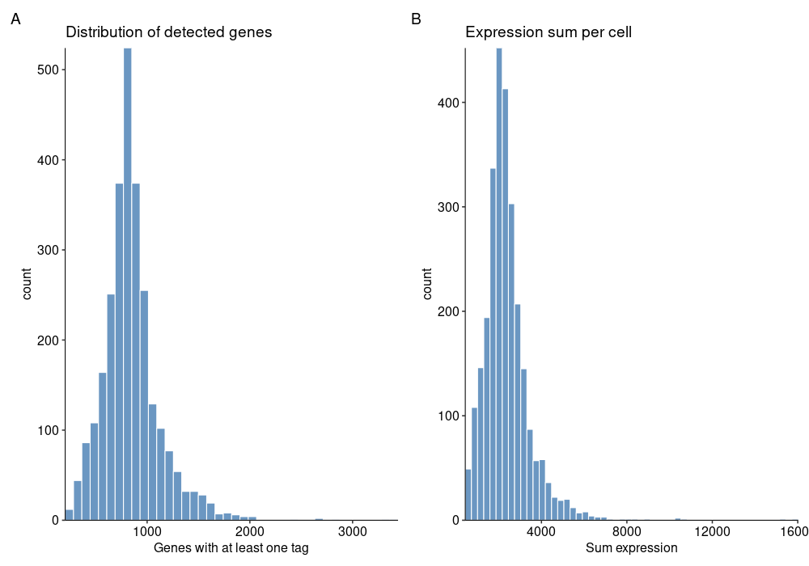

## Create Seurat object
```{r create_seurat, eval=FALSE, spr=TRUE}
appendStep(sal) <- LineWise(
    code = {
        sce <- CreateSeuratObject(counts = pbmc.data, project = "pbmc3k", min.cells = 3, min.features = 200)
        # calculate mitochondria gene ratio 
        sce[['percent.mt']] <- PercentageFeatureSet(sce,pattern='^MT-')
    }, 
    step_name = "create_seurat",
    dependency = "load_data"
)
```

Filters applied here are:

- `min.cells = 3`: for a single gene, it must be presented in at least 3 cells.
- `min.features = 200`: for any cell, it must at least have 200 genes with readable gene counts. 

In your real data, you may want to adjust the filters for different projects.


## QC of cells 

Some indicators are important to show the quality of the cell batch, for example

- N genes (features) per cell
- N counts per cell 
- Mitochondria (mt) gene ratio.
- ...

```{r qc_seurat, eval=FALSE, spr=TRUE}
appendStep(sal) <- LineWise(
    code = {

        png("results/qc1.png", 700, 700)
        VlnPlot(sce, features = c("nFeature_RNA", "nCount_RNA", "percent.mt"), ncol = 3)
        dev.off()
        
        qc_p1 <- FeatureScatter(sce, feature1 = "nCount_RNA", feature2 = "percent.mt")
        qc_p2 <- FeatureScatter(sce, feature1 = "nCount_RNA", feature2 = "nFeature_RNA")
        png("results/qc2.png", 700, 450)
        qc_p1 + qc_p2 + patchwork::plot_annotation(tag_levels = "A")
        dev.off()
    }, 
    step_name = "qc_seurat",
    dependency = "create_seurat"
)
```

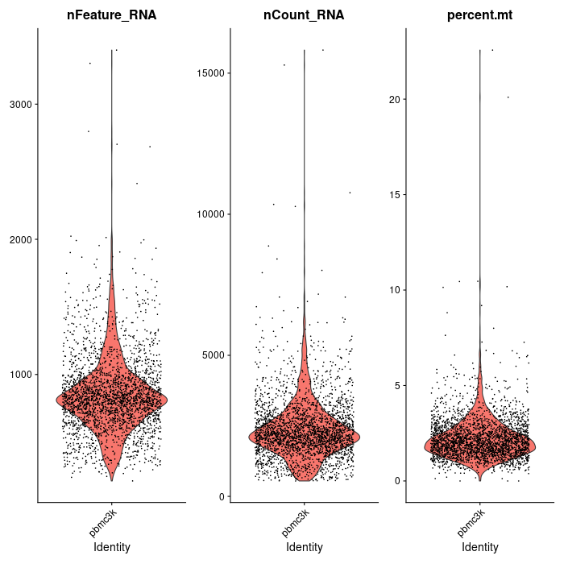

Extreme numbers, outlines are likely low quality sequencing/bad cells.

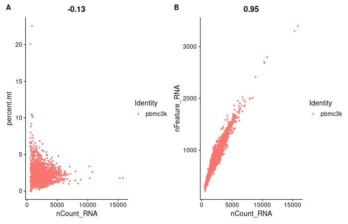

As shown on the figure above, A is the ratio of percent mt _vs._ N count. Normally, no matter 
how many counts you can find from a cell, the percent mt gene ratio should always be stable.
For cells with extremely high mt ratios, they should be removed. Looking at x-axis, 
for a single cell, the N counts should also be inside a reasonable range. Too low 
of counts indicates the cell gel bead is empty during barcoding. Too high of counts 
indicates a single gel bead had more than one cell during barcoding. Either these 
cases are bad, and cells of these should be removed.

B is N genes per cell _vs._ N counts per cell. Normally, if as the N counts increases,
the N genes also increases. All cells should be connected to approximately one line. 
If you see more than one line, there may be problem with the sequencing, or cells 
are not from the same batch. 

## Filter cells
```{r filter_cells, eval=FALSE, spr=TRUE}
appendStep(sal) <- LineWise(
    code = {
        # Based on the QC plots, please change the settings accordingly
        sce <- subset(
            sce, subset = nFeature_RNA > 200 & nFeature_RNA < 2500 &
                nCount_RNA < 10000 & percent.mt <= 5
        )
    }, 
    step_name = "filter_cells",
    dependency = "create_seurat"
)
```

## Normalization
For RNAseq data, usually log transformation and TPM is performed. For scRNA, the 
normalization is 

$$
Normalized\ count\ for\ a\ gene\ in\ a\ cell\ =log1p(\frac{Feature\ counts}{Total\ counts\ in\ a\ cell})\\
where\ log1p\ is\ ln(n+1)
$$

```{r normalize, eval=FALSE, spr=TRUE}
appendStep(sal) <- LineWise(
    code = {
        # scale.factor = 10000 is a convenient number for plotting, so the 
        # normalized counts is ranged between 0.xx to 10. 
        sce <- NormalizeData(sce, normalization.method = "LogNormalize", scale.factor = 10000)
        
        # compare counts before and after
        count_p_norm <- tibble::as_tibble(MatrixGenerics::colSums(sce$RNA@layers$data)) %>% 
            ggplot() +
                geom_histogram(aes(x = value), bins = floor(ncol(pbmc.data)/50), fill = "#6b97c2", color = "white") +
                theme_pubr(16) +
                scale_y_continuous(expand = c(0, 0)) +
                scale_x_continuous(expand = c(0, 0)) +
                labs(title = "Total expression after normalization", x = "Sum expression")
        png("results/normalize_count_compare.png", 1000, 700)
        count_p2 + count_p_norm + patchwork::plot_annotation(tag_levels = "A")
        dev.off()
    }, 
    step_name = "normalize",
    dependency = "filter_cells"
)
```

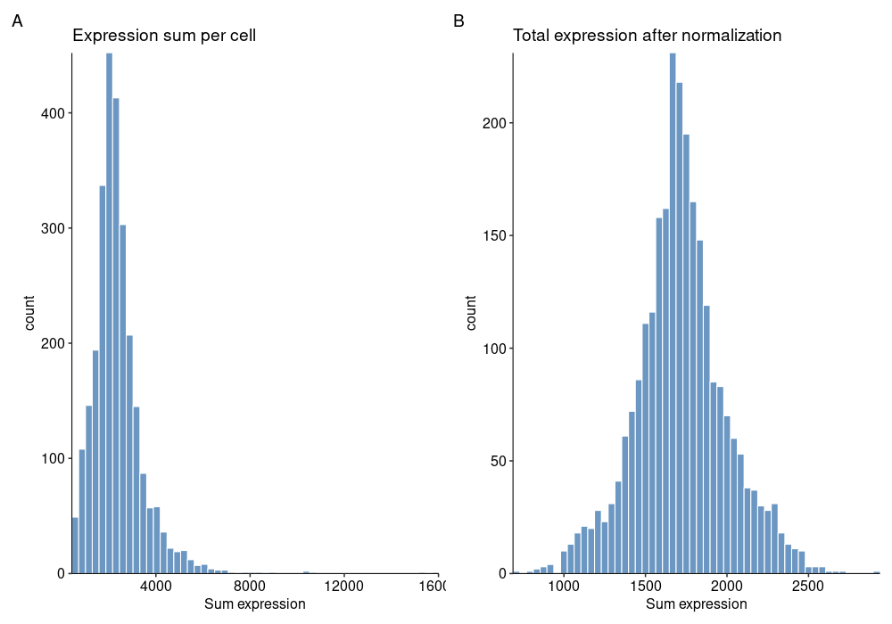

After the normalization, expression is close to a normal distribution.

## Find highly variable genes
Some genes are highly variable among cells. These genes are the key for the 
research. Here, some top-ranked variable genes are calculated and will be used 
for downstream analysis. 


```{r find_var_genes, eval=FALSE, spr=TRUE}
appendStep(sal) <- LineWise(
    code = {
        # 2000 is default
        sce <- FindVariableFeatures(sce, selection.method = "vst", nfeatures = 2000)
        # top 10 variable genes 
        top10_var <- head(VariableFeatures(sce), 10)
        # plot the top 2000 variable genes and mark top 10
        png("results/variable_genes.png", 700, 600)
        VariableFeaturePlot(sce) %>% 
            LabelPoints(points = top10_var, repel = TRUE) +
            theme_pubr(16)
        dev.off()
    }, 
    step_name = "find_var_genes",
    dependency = "normalize"
)
```

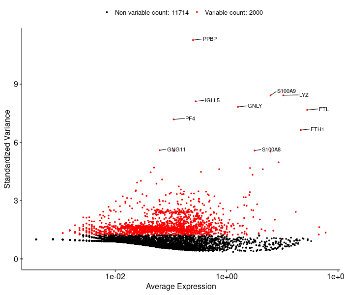

## Scaling

To make the visualization within a reasonable range, scaling is performed. This 
changes the expression data points to be centered at 0 with standard deviation of 1. 

```{r scaling, eval=FALSE, spr=TRUE}
appendStep(sal) <- LineWise(
    code = {
        sce <- ScaleData(sce, features = rownames(sce))
    }, 
    step_name = "scaling",
    dependency = "find_var_genes"
)
```

## PCA

```{r pca, eval=FALSE, spr=TRUE}
appendStep(sal) <- LineWise(
    code = {
        # only use the top 2000 genes, first 50 PCs (default)
        sce <- RunPCA(sce,features = VariableFeatures(object = sce), npcs = 50)
        # we can use following command to see first 5 genes in each PC
        print(sce$pca, dims = 1:5, nfeatures = 5)
    }, 
    step_name = "pca",
    dependency = "scaling"
)
```


## Plot PCA results
```{r pca_plots, eval=FALSE, spr=TRUE}
appendStep(sal) <- LineWise(
    code = {
        # plot PCA overview
        png("results/pca_overview.png", 500, 500)
        DimPlot(sce , reduction = "pca")
        dev.off()
        # plot top contributed genes in PC 1 and 2
        png("results/pca_loadings.png", 700, 550)
        VizDimLoadings(sce , dims = 1:2, reduction = "pca")
        dev.off()
        # we can also use heatmap to show top genes in different PCs
        png("results/pca_heatmap.png", 700, 700)
        DimHeatmap(sce,dims = 1:6, cells = ncol(sce)/5, balanced = TRUE, slot = "scale.data")
        dev.off()
    }, 
    step_name = "pca_plots",
    dependency = "pca"
)
```

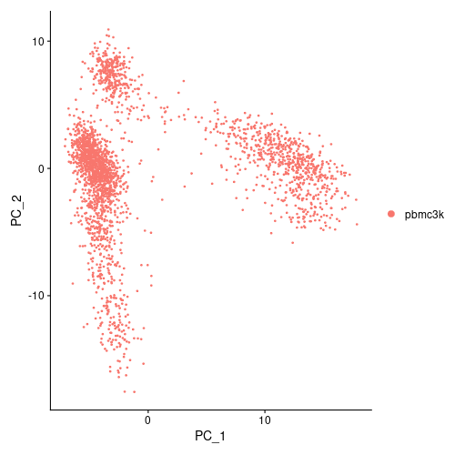

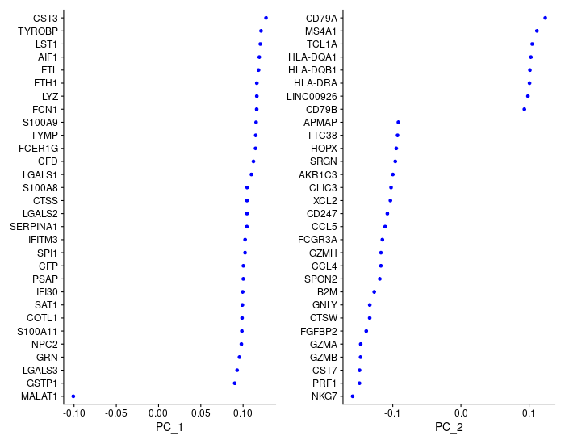

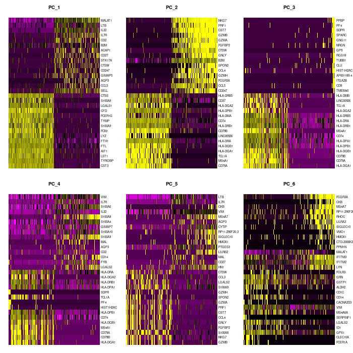


## Find optimal PCs
After PCA, the dimension has reduced from tens of thousands (features) to 50. Before,
we do the clustering, we can further reduced the PCs to only a few important ones, so 
the computation work can be easier. How to choose the best number of PCs is 
hard to decide. Here, the JackStraw plot and Elbow plot can be good ways to 
help us make the decision. 

```{r choose_pcs, eval=FALSE, spr=TRUE}
appendStep(sal) <- LineWise(
    code = {
        # for demo purposes, only a few replicates are used to speed up the calculation
        # in your real data, use larger number like 100, etc.
        sce <- JackStraw(sce, num.replicate = 30)
        sce <- ScoreJackStraw(sce, dims = 1:20)
        png("results/jackstraw.png", 660, 750)
        JackStrawPlot(sce, dims = 1:20)
        dev.off()
        
        png("results/elbow.png", 500, 500)
        ElbowPlot(sce)
        dev.off()
    }, 
    step_name = "choose_pcs",
    dependency = "pca"
)
```


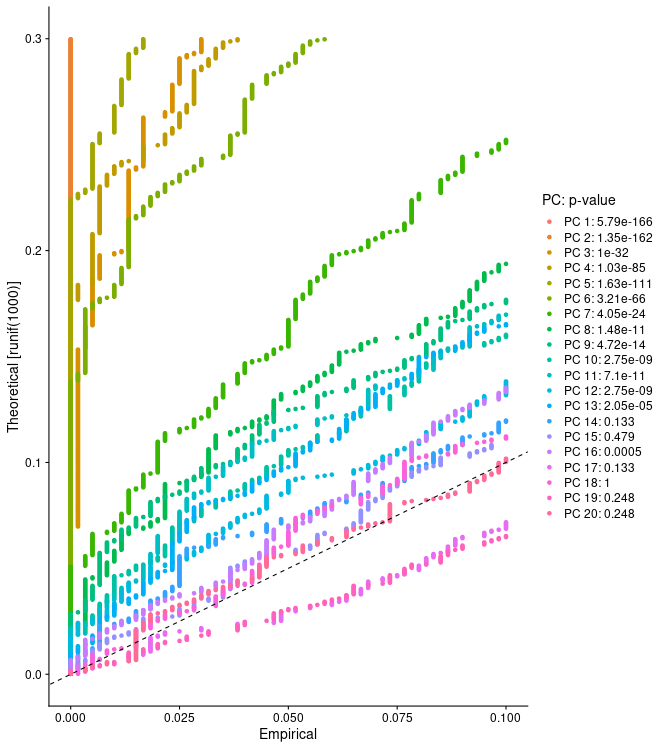

There is a gap of values between PCs 1-6 and other PCs. Therefore PCs 1-6 are 
the most important. One could also include PCs 7-13 since they have $p\leq0.05$.
One would need to adjust the PC choice based on different datasets. 

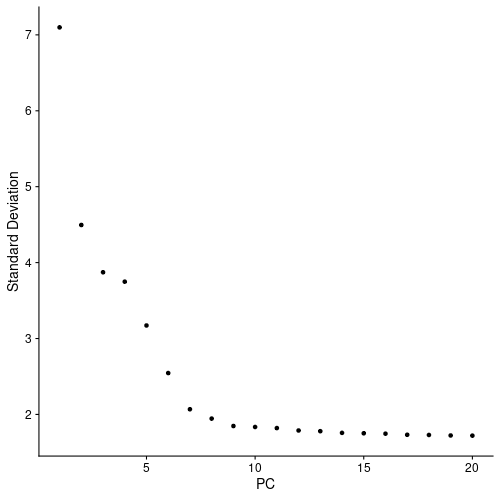

The Elbow plot also shows there is turning point around PC 7-8. All other following 
PCs did not change too much. 

It seems we should choose PC 6 or 7 as the cutoff point based on plots above. However, 
Seurat documents recommend to combine methods above with GSEA. Some cell populations 
may relate to genes in later PCs, e.g. dendritic cell and NK aficionados are 
linked to PCs 12, 13. Therefore, if your computational resources allow, it would be
good to include a few more PCs. 

The Seurat documents recommend to repeat with 10, 15 or PCs. However, in our experiences,
the results did not change significantly. 

In the downstream analysis, this template choose  **10** PCs.

## Clustering 
Seurat uses graph-based methods like KNN to find the clusters.
```{r find_clusters, eval=FALSE, spr=TRUE}
appendStep(sal) <- LineWise(
    code = {
        sce<- FindNeighbors(sce, dims = 1:10) 
        # resolution 0.4-1.2 good for 3000 cells, if you have more cells, increase 
        # the number will give you more clusters 
        sce<- FindClusters(sce, resolution = 0.5)
    }, 
    step_name = "find_clusters",
    dependency = "pca"
)
```

## Visualize clusters with UMAP/tSNE
```{r plot_cluster, eval=FALSE, spr=TRUE}
appendStep(sal) <- LineWise(
    code = {
        sce <- RunUMAP(sce,dims = 1:20)
        p_umap <- DimPlot(sce,reduction = 'umap', label = TRUE)
        sce <- RunTSNE(sce,dims = 1:20)
        p_tsne <- DimPlot(sce,reduction = 'tsne', label = TRUE)
        png("results/plot_clusters.png", 1000, 570)
        p_umap + p_tsne
        dev.off()
    }, 
    step_name = "plot_cluster",
    dependency = "find_clusters"
)
```


## Find cluster biomarkers
Find genes that represent different clusters.
```{r find_markers, eval=FALSE, spr=TRUE}
appendStep(sal) <- LineWise(
    code = {
        # find markers for every cluster compared to all remaining cells, report only the positive ones
        sce.markers <- FindAllMarkers(sce, only.pos = TRUE, min.pct = 0.25, logfc.threshold = 0.25)
        sce.markers %>% group_by(cluster) %>% top_n(n = 2, wt = avg_log2FC)
    }, 
    step_name = "find_markers",
    dependency = "find_clusters"
)
```


## Visualize markers
```{r plot_markers, eval=FALSE, spr=TRUE}
appendStep(sal) <- LineWise(
    code = {
        png("results/vlnplot.png", 600, 600)
        VlnPlot(sce, features = c("MS4A1", "CD79A"))
        dev.off()
        
        png("results/marker_features.png", 700, 500)
        FeaturePlot(sce, features = c("MS4A1", "GNLY", "CD3E", "CD14"))
        dev.off()    
        
        # plot top 10 DEG genes in each cluster as a heatmap
        top10_markers <- sce.markers %>% group_by(cluster) %>% top_n(n = 10, wt = avg_log2FC)
        png("results/marker_heatmap.png", 1100, 700)
        DoHeatmap(sce, features = top10_markers$gene) + NoLegend()
        dev.off()
    }, 
    step_name = "plot_markers",
    dependency = "find_markers"
)
```

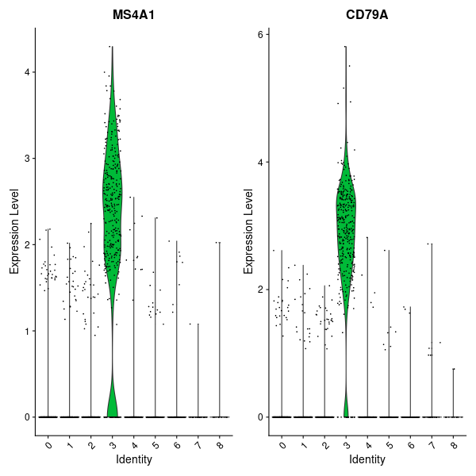

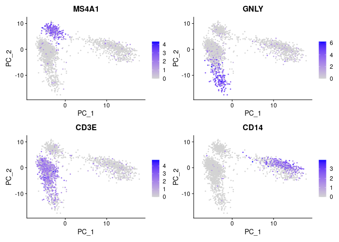


## Classify cell types 
There are a few ways one can classify different clusters into different cell types. 
The best way is you know what are the markers for targeting cell types. 
CellMarker(http://biocc.hrbmu.edu.cn/CellMarker/) is a great source to find 
markers of different cell types. If you do not know the markers, use `singleR` 
package may be helpful. This package automatically classify clusters into cell 
types. However, the accuracy is not promised. 


For example, if we know the markers of different cell types as following:

| Cluster | Markers    | Cell Type |
|---|---------------|--------------|
| 0 | IL7R, CCR7    | Naive CD4+ T |
| 1 | CD14, LYZ     | CD14+ Mono   |
| 2 | IL7R, S100A4  | Memory CD4+  |
| 3 | MS4A1         | B            |
| 4 | CD8A          | CD8+ T       |
| 5 | FCGR3A, MS4A7 | FCGR3A+ Mono |
| 6 | GNLY, NKG7    | NK           |
| 7 | FCER1A, CST3  | DC           |
| 8 | PPBP          | Platelet     |

```{r label_cell_type, eval=FALSE, spr=TRUE}
appendStep(sal) <- LineWise(
    code = {
        new.cluster.ids <- c("Naive CD4 T", "CD14+ Mono", "Memory CD4 T", "B", 
                             "CD8 T", "FCGR3A+ Mono","NK", "DC", "Platelet")
        names(new.cluster.ids) <- levels(sce)
        sce<- RenameIdents(sce, new.cluster.ids)
        png("results/marker_labels.png", 700, 700)
        DimPlot(sce, reduction = "umap", label = TRUE, pt.size = 0.5) + NoLegend()
        dev.off()
        
    }, 
    step_name = "label_cell_type",
    dependency = c("plot_cluster", "find_markers")
)
```

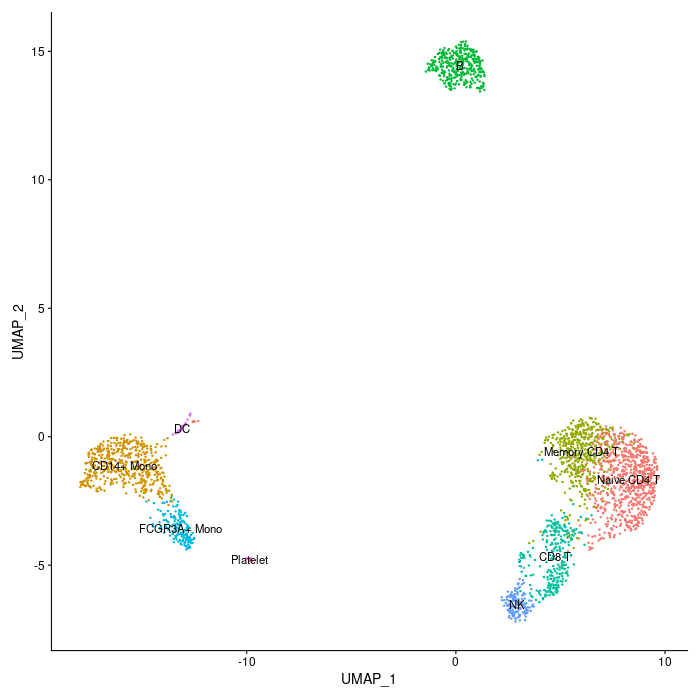

## Workflow session

```{r wf_session, eval=FALSE, spr=TRUE}
appendStep(sal) <- LineWise(
    code = {
        sessionInfo()
    }, 
    step_name = "wf_session", 
    dependency = "label_cell_type")
```

# Manage the workflow

To run the workflow, use `runWF` function. It executes all the steps store in 
the workflow container. The execution will be on a single machine without 
submitting to a queuing system of a computer cluster. 

```{r runWF, eval=FALSE}
sal <- runWF(sal, run_step = "mandatory") # remove `run_step` to run all steps to include optional steps
```

- To use complex workflow control options, such as parallelization, subsetting samples, selecting steps, read the [documents](https://systempipe.org/sp/spr/sp_run/step_run/) on our website. 
- Explore [other details of the workflow object](https://systempipe.org/sp/spr/sp_run/sal_explore/).
- Create [logs and reports](https://systempipe.org/sp/spr/sp_run/step_reports/).
- [Visualize the workflow](https://systempipe.org/sp/spr/sp_run/step_vis/).

# About the workflow
## Tools used 
To check command-line tools used in this workflow, use `listCmdTools`, and use `listCmdModules`
to check if you have a modular system.

The following code will print out tools required in your custom SPR project in the report. 
In case you are running the workflow for the first time and do not have a project yet, or you 
just want to browser this workflow, following code displays the tools required by default.
```{r list_tools}
if(file.exists(file.path(".SPRproject", "SYSargsList.yml"))) {
    local({
        sal <- systemPipeR::SPRproject(resume = TRUE)
        systemPipeR::listCmdTools(sal)
        systemPipeR::listCmdModules(sal)
    })
} else {
    cat(crayon::blue$bold("Tools and modules required by this workflow are:\n"))
    cat(c("NA"), sep = "\n")
}
```


## Session Info
This is the session information for rendering this report. To access the session information
of workflow running, check HTML report of `renderLogs`. 
```{r report_session_info, eval=TRUE}
sessionInfo()
```
