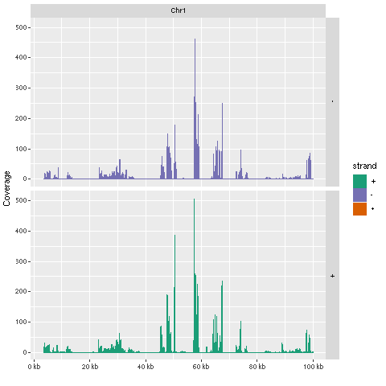
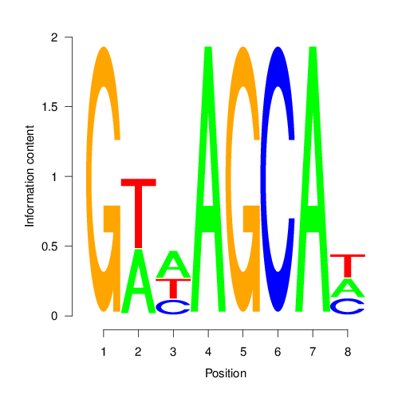

<!--
# Compile from command-line
Rscript -e "rmarkdown::render('systemPipeChIPseq.Rmd', c('BiocStyle::html_document'), clean=FALSE)"
-->

```{css, echo=FALSE}
pre code {
white-space: pre !important;
overflow-x: scroll !important;
word-break: keep-all !important;
word-wrap: initial !important;
}
```

```{r style, echo = FALSE, results = 'asis'}
BiocStyle::markdown()
options(width = 60, max.print = 1000)
knitr::opts_chunk$set(
    eval = as.logical(Sys.getenv("KNITR_EVAL", "TRUE")),
    cache = as.logical(Sys.getenv("KNITR_CACHE", "TRUE")), 
    tidy.opts = list(width.cutoff = 60), tidy = TRUE)
```

```{r setup, echo=FALSE, messages=FALSE, warnings=FALSE}
suppressPackageStartupMessages({
    library(systemPipeR)
})
```

# Introduction

Users want to provide here background information about the design of their 
ChIP-Seq project.

## Background and objectives

This report describes the analysis of several ChIP-Seq experiments
studying the DNA binding patterns of the transcriptions factors ... from *organism* ....

## Experimental design

Typically, users want to specify here all information relevant for the
analysis of their NGS study. This includes detailed descriptions of
FASTQ files, experimental design, reference genome, gene annotations,
etc.

# Samples and environment settings

## Environment settings and input data 

[*systemPipeRdata*](http://bioconductor.org/packages/release/data/experiment/html/systemPipeRdata.html) package is a helper package to generate a fully populated [*systemPipeR*](http://bioconductor.org/packages/release/bioc/html/systemPipeR.html)
workflow environment in the current working directory with a single command. 
All the instruction for generating the workflow are provide in the *systemPipeRdata* vignette [here](http://www.bioconductor.org/packages/devel/data/experiment/vignettes/systemPipeRdata/inst/doc/systemPipeRdata.html#1_Introduction). 

```{r genNew_wf, eval=FALSE}
systemPipeRdata::genWorkenvir(workflow = "chipseq", mydirname = "chipseq")
setwd("chipseq")
```

After building and loading the workflow environment generated by `genWorkenvir` 
from *systemPipeRdata* all data inputs are stored in
a `data/` directory and all analysis results will be written to a separate
`results/` directory, while the `systemPipeChIPseq.Rmd` script and the `targets` 
file are expected to be located in the parent directory. The R session is expected 
to run from this parent directory. Additional parameter files are stored under `param/`.

The chosen data set used by this report [SRP010938](http://www.ncbi.nlm.nih.gov/sra/?term=SRP010938)
contains 18 paired-end (PE) read sets from *Arabidposis thaliana*
[@Howard2013-fq]. To minimize processing time during testing, each FASTQ
file has been subsetted to 90,000-100,000 randomly sampled PE reads that
map to the first 100,000 nucleotides of each chromosome of the *A.
thaliana* genome. The corresponding reference genome sequence (FASTA) and
its GFF annotation files have been truncated accordingly. This way the entire 
test sample data set is less than 200MB in storage space. A PE read set has been
chosen for this test data set for flexibility, because it can be used for testing both types
of analysis routines requiring either SE (single end) reads or PE reads.

To work with real data, users want to organize their own data similarly
and substitute all test data for their own data. To rerun an established
workflow on new data, the initial `targets` file along with the corresponding
FASTQ files are usually the only inputs the user needs to provide.

For more details, please consult the documentation 
[here](http://www.bioconductor.org/packages/release/bioc/vignettes/systemPipeR/inst/doc/systemPipeR.html). More information about the `targets` files from *systemPipeR* can be found [here](http://www.bioconductor.org/packages/release/bioc/vignettes/systemPipeR/inst/doc/systemPipeR.html#42_Structure_of_initial_targets_data). 

### Experiment definition provided by `targets` file

The `targets` file defines all FASTQ files and sample comparisons of the analysis workflow.

```{r load_targets_file, eval=TRUE}
targetspath <- system.file("extdata", "targetsPE_chip.txt", package = "systemPipeR")
targets <- read.delim(targetspath, comment.char = "#")
targets[1:4,-c(5,6)]
```

To work with custom data, users need to generate a _`targets`_ file containing 
the paths to their own FASTQ files. 

# Workflow environment

_`systemPipeR`_ workflows can be designed and built from start to finish with a 
single command, importing from an R Markdown file or stepwise in interactive 
mode from the R console. 

This tutorial will demonstrate how to build the workflow in an interactive mode, 
appending each step. The workflow is constructed by connecting each step via 
`appendStep` method. Each `SYSargsList` instance contains instructions needed 
for processing a set of input files with a specific command-line or R software 
and the paths to the corresponding outfiles generated by a particular tool/step. 

To create a Workflow within _`systemPipeR`_, we can start by defining an empty
container and checking the directory structure:

```{r create_workflow, message=FALSE, eval=FALSE}
library(systemPipeR)
sal <- SPRproject()
sal
```

## Required packages and resources

The `systemPipeR` package needs to be loaded [@H_Backman2016-bt].

```{r load_SPR, message=FALSE, eval=FALSE, spr=TRUE}
appendStep(sal) <- LineWise(code = {
                            library(systemPipeR)
                            }, step_name = "load_SPR")
```

## Read preprocessing

### FASTQ quality report

The following `seeFastq` and `seeFastqPlot` functions generate and plot a series of useful 
quality statistics for a set of FASTQ files, including per cycle quality box
plots, base proportions, base-level quality trends, relative k-mer
diversity, length, and occurrence distribution of reads, number of reads
above quality cutoffs and mean quality distribution. The results are
written to a png file named `fastqReport.png`.

This is the pre-trimming fastq report. Another post-trimming fastq report step 
is not included in the default. It is recommended to run this step first to
decide whether the trimming is needed.

Please note that initial targets files are being used here. In this case, 
it has been added to the first step using the `updateColumn` function, and 
later, we used the `getColumn` function to extract a named vector. 

```{r fastq_report, eval=FALSE, message=FALSE, spr=TRUE}
appendStep(sal) <- LineWise(
    code = {
        targets <- read.delim("targetsPE_chip.txt", comment.char = "#")
        updateColumn(sal, step = "load_SPR", position = "targetsWF") <- targets
        fq_files <- getColumn(sal, "load_SPR", "targetsWF", column = 1)
        fqlist <- seeFastq(fastq = fq_files, batchsize = 10000, klength = 8)
        png("./results/fastqReport.png", height = 162, width = 288 * length(fqlist))
        seeFastqPlot(fqlist)
        dev.off()
    },
    step_name = "fastq_report",
    dependency = "load_SPR"
)
```


<div align="center">Figure 1: FASTQ quality report for 18 samples</div></br>

### Preprocessing with `preprocessReads` function

The function `preprocessReads` allows to apply predefined or custom
read preprocessing functions to all FASTQ files referenced in a
`SYSargsList` container, such as quality filtering or adapter trimming
routines. Internally, `preprocessReads` uses the `FastqStreamer` function from
the `ShortRead` package to stream through large FASTQ files in a
memory-efficient manner. The following example performs adapter trimming with
the `trimLRPatterns` function from the `Biostrings` package.

Here, we are appending this step to the `SYSargsList` object created previously. 
All the parameters are defined on the `preprocessReads-pe.yml` file.

```{r preprocessing, message=FALSE, eval=FALSE, spr=TRUE}
appendStep(sal) <- SYSargsList(
    step_name = "preprocessing",
    targets = "targetsPE_chip.txt", dir = TRUE,
    wf_file = "preprocessReads/preprocessReads-pe.cwl",
    input_file = "preprocessReads/preprocessReads-pe.yml",
    dir_path = system.file("extdata/cwl", package = "systemPipeR"),
    inputvars = c(
        FileName1 = "_FASTQ_PATH1_",
        FileName2 = "_FASTQ_PATH2_",
        SampleName = "_SampleName_"
    ),
    dependency = c("fastq_report")
)
```

After the preprocessing step, the `outfiles` files can be used to generate the new 
targets files containing the paths to the trimmed FASTQ files. The new targets 
information can be used for the next workflow step instance, _e.g._ running the 
NGS alignments with the trimmed FASTQ files. The `appendStep` function is
automatically handling this connectivity between steps. Please check the next 
step for more details.

The following example shows how one can design a custom read _'preprocessReads'_
function using utilities provided by the `ShortRead` package, and then run it
in batch mode with the _'preprocessReads'_ function. Here, it is possible to 
replace the function used on the `preprocessing` step and modify the `sal` object. 
Because it is a custom function, it is necessary to save the part in the R object, 
and internally the `preprocessReads.doc.R` is loading the custom function.
If the R object is saved with a different name (here `"param/customFCT.RData"`),
please replace that accordingly in the `preprocessReads.doc.R`.

Please, note that this step is not added to the workflow, here just for
demonstration.

First, we defined the custom function in the workflow:

```{r custom_preprocessing_function, eval=FALSE}
appendStep(sal) <- LineWise(
    code = {
        filterFct <- function(fq, cutoff = 20, Nexceptions = 0) {
            qcount <- rowSums(as(quality(fq), "matrix") <= cutoff, na.rm = TRUE)
            # Retains reads where Phred scores are >= cutoff with N exceptions
            fq[qcount <= Nexceptions]
        }
        save(list = ls(), file = "param/customFCT.RData")
    },
    step_name = "custom_preprocessing_function",
    dependency = "preprocessing"
)
```

After, we can edit the input parameter:

```{r editing_preprocessing, message=FALSE, eval=FALSE}
yamlinput(sal, "preprocessing")$Fct
yamlinput(sal, "preprocessing", "Fct") <- "'filterFct(fq, cutoff=20, Nexceptions=0)'"
yamlinput(sal, "preprocessing")$Fct ## check the new function
cmdlist(sal, "preprocessing", targets = 1) ## check if the command line was updated with success
```

## Alignments

### Read mapping with `Bowtie2` 

The NGS reads of this project will be aligned with `Bowtie2` against the
reference genome sequence [@Langmead2012-bs]. The parameter settings of the
Bowtie2 index are defined in the `bowtie2-index.cwl` and `bowtie2-index.yml` files. 

Building the index:

```{r bowtie2_index, eval=FALSE, spr=TRUE}
appendStep(sal) <- SYSargsList(
    step_name = "bowtie2_index",
    dir = FALSE, targets = NULL,
    wf_file = "bowtie2/bowtie2-index.cwl",
    input_file = "bowtie2/bowtie2-index.yml",
    dir_path = system.file("extdata/cwl", package = "systemPipeR"),
    inputvars = NULL,
    dependency = c("preprocessing")
)
```

The parameter settings of the aligner are defined in the `workflow_bowtie2-pe.cwl` 
and `workflow_bowtie2-pe.yml` files. The following shows how to construct the 
corresponding *SYSargsList* object.

In ChIP-Seq experiments it is usually more appropriate to eliminate reads mapping 
to multiple locations. To achieve this, users want to remove the argument setting 
`-k 50 non-deterministic` in the configuration files.

```{r bowtie2_alignment, eval=FALSE, spr=TRUE}
appendStep(sal) <- SYSargsList(
    step_name = "bowtie2_alignment",
    dir = TRUE,
    targets = "targetsPE_chip.txt",
    wf_file = "workflow-bowtie2/workflow_bowtie2-pe.cwl",
    input_file = "workflow-bowtie2/workflow_bowtie2-pe.yml",
    dir_path = system.file("extdata/cwl", package = "systemPipeR"),
    inputvars = c(
        FileName1 = "_FASTQ_PATH1_",
        FileName2 = "_FASTQ_PATH2_",
        SampleName = "_SampleName_"
    ),
    dependency = c("bowtie2_index")
)
```

To double-check the command line for each sample, please use the following:

```{r bowtie2_alignment_check, eval=FALSE}
cmdlist(sal, step="bowtie2_alignment", targets=1)
```

### Read and alignment stats

The following provides an overview of the number of reads in each sample
and how many of them aligned to the reference.

```{r align_stats, eval=FALSE, spr=TRUE}
appendStep(sal) <- LineWise(
    code = {
        fqpaths <- getColumn(sal, step = "bowtie2_alignment", "targetsWF", column = "FileName1")
        bampaths <- getColumn(sal, step = "bowtie2_alignment", "outfiles", column = "samtools_sort_bam")
        read_statsDF <- alignStats(args = bampaths, fqpaths = fqpaths, pairEnd = TRUE)
        write.table(read_statsDF, "results/alignStats.xls", row.names=FALSE, quote=FALSE, sep="\t")
        }, 
    step_name = "align_stats", 
    dependency = "bowtie2_alignment")
```

### Create symbolic links for viewing BAM files in IGV

The `symLink2bam` function creates symbolic links to view the BAM alignment files in a
genome browser such as IGV without moving these large files to a local
system. The corresponding URLs are written to a file with a path
specified under `urlfile`, here `IGVurl.txt`. 
Please replace the directory and the user name. 

```{r bam_IGV, eval=FALSE, spr=TRUE}
appendStep(sal) <- LineWise(
    code = {
        bampaths <- getColumn(sal, step = "bowtie2_alignment", "outfiles", 
                              column = "samtools_sort_bam")
        symLink2bam(
            sysargs = bampaths, htmldir = c("~/.html/", "somedir/"),
            urlbase = "http://cluster.hpcc.ucr.edu/~tgirke/",
            urlfile = "./results/IGVurl.txt")
    },
    step_name = "bam_IGV",
    dependency = "bowtie2_alignment",
    run_step = "optional"
)
```

## Utilities for coverage data

The following introduces several utilities useful for ChIP-Seq data. 
They are not part of the actual workflow. These utilities can be explored once 
the workflow is executed. 

### Rle object stores coverage information

```{r rle_object, eval=FALSE}
bampaths <- getColumn(sal, step = "bowtie2_alignment", "outfiles", column = "samtools_sort_bam")
aligns <- readGAlignments(bampaths[1])
cov <- coverage(aligns)
cov
```

### Resizing aligned reads

```{r resize_align, eval=FALSE}
trim(resize(as(aligns, "GRanges"), width = 200))
```

### Naive peak calling

```{r rle_slice, eval=FALSE}
islands <- slice(cov, lower = 15)
islands[[1]]
```

### Plot coverage for defined region

```{r plot_coverage, eval=FALSE}
library(ggbio)
myloc <- c("Chr1", 1, 100000)
ga <- readGAlignments(bampaths[1], use.names=TRUE,
                      param=ScanBamParam(which=GRanges(myloc[1], 
                        IRanges(as.numeric(myloc[2]), as.numeric(myloc[3])))))
autoplot(ga, aes(color = strand, fill = strand), facets = strand ~ seqnames, stat = "coverage")
```



<div align="center">Figure 2: Plot coverage for chromosome 1 region.</div></br>

## Peak calling with MACS2

### Merge BAM files of replicates prior to peak calling

Merging BAM files of technical and/or biological replicates can improve
the sensitivity of the peak calling by increasing the depth of read
coverage. The `mergeBamByFactor` function merges BAM files based on grouping information
specified by a `factor`, here the `Factor` column of the imported targets file. 
It also returns an updated `targets` object containing the paths to the
merged BAM files as well as to any unmerged files without replicates.
The updated `targets` object can be used to update the `SYSargsList` object.

This step can be skipped if merging of BAM files is not desired.

```{r merge_bams, eval=FALSE, spr=TRUE}
appendStep(sal) <- LineWise(
    code = {
        bampaths <- getColumn(sal, step = "bowtie2_alignment", "outfiles", column = "samtools_sort_bam")
        merge_bams <- mergeBamByFactor(args=bampaths, targetsDF = targetsWF(sal)[["bowtie2_alignment"]], out_dir = file.path("results", "merge_bam") ,overwrite=TRUE)
        updateColumn(sal, step = "merge_bams", position = "targetsWF") <- merge_bams
    },
    step_name = "merge_bams",
    dependency = "bowtie2_alignment"
)
```

### Peak calling without input/reference sample

MACS2 can perform peak calling on ChIP-Seq data with and without input
samples [@Zhang2008-pc]. The following performs peak calling without
input on all samples specified in the corresponding `targets` object. Note, due to
the small size of the sample data, MACS2 needs to be run here with the
`nomodel` setting. For real data sets, users want to remove this parameter 
in the corresponding `*.param` file(s).

```{r call_peaks_macs_noref, eval=FALSE, spr=TRUE}
cat("Running preprocessing for call_peaks_macs_noref\n")
# Previous Linewise step is not run at workflow building time, 
# but we need the output as input for this sysArgs step. So 
# we use some preprocess code to predict the output paths 
# to update the output targets of merge_bams, and then
# them into this next step during workflow building phase.
mergebam_out_dir = file.path("results", "merge_bam") # make sure this is the same output directory used in merge_bams
targets_merge_bam <- targetsWF(sal)$bowtie2_alignment
targets_merge_bam <- targets_merge_bam[, -which(colnames(targets_merge_bam) %in% c("FileName1", "FileName2", "FileName"))]
targets_merge_bam <- targets_merge_bam[!duplicated(targets_merge_bam$Factor), ]
targets_merge_bam <- cbind(FileName = file.path(mergebam_out_dir, paste0(targets_merge_bam$Factor, "_merged.bam")), targets_merge_bam)
updateColumn(sal, step = "merge_bams", position = "targetsWF") <- targets_merge_bam
# write it out as backup, so you do not need to use preprocess code above again
writeTargets(sal, step = "merge_bams", file = "targets_merge_bams.txt", overwrite = TRUE) 

###pre-end
appendStep(sal) <- SYSargsList(
    step_name = "call_peaks_macs_noref",
    targets = "targets_merge_bams.txt", # or use "merge_bams" to directly grab from the previous step
    wf_file = "MACS2/macs2-noinput.cwl",
    input_file = "MACS2/macs2-noinput.yml",
    dir_path = system.file("extdata/cwl", package = "systemPipeR"),
    inputvars = c(
        FileName = "_FASTQ_PATH1_",
        SampleName = "_SampleName_"
    ),
    dependency = c("merge_bams")
)
```

### Peak calling with input/reference sample

To perform peak calling with input samples, they can be most
conveniently specified in the `SampleReference` column of the initial
`targets` file. The `writeTargetsRef` function uses this information to create a `targets` 
file intermediate for running MACS2 with the corresponding input samples.

```{r call_peaks_macs_withref, eval=FALSE, spr=TRUE}
cat("Running preprocessing for call_peaks_macs_withref\n")
# To generate the reference targets file for the next step, use `writeTargetsRef`,
# this file needs to be present at workflow building time
# Use following preprocess code to do so:
writeTargetsRef(infile = "targets_merge_bams.txt", outfile = "targets_bam_ref.txt", silent = FALSE, overwrite = TRUE)

###pre-end
appendStep(sal) <- SYSargsList(
    step_name = "call_peaks_macs_withref",
    targets = "targets_bam_ref.txt",
    wf_file = "MACS2/macs2-input.cwl",
    input_file = "MACS2/macs2-input.yml",
    dir_path = system.file("extdata/cwl", package = "systemPipeR"),
    inputvars = c(
        FileName1 = "_FASTQ_PATH1_", 
        FileName2 = "_FASTQ_PATH2_", 
        SampleName = "_SampleName_"
    ),
    dependency = c("merge_bams")
)
```

The peak calling results from MACS2 are written for each sample to
separate files in the `results/call_peaks_macs_withref` directory. They are named after the corresponding files with extensions used by MACS2.

### Identify consensus peaks

The following example shows how one can identify consensus peaks among two peak sets sharing either a minimum absolute overlap and/or minimum relative overlap using the `subsetByOverlaps` or `olRanges` functions, respectively. Note, the latter is a custom function imported below by sourcing it.

```{r consensus_peaks, eval=FALSE, spr=TRUE}
appendStep(sal) <- LineWise(
    code = {
        peaks_files <- getColumn(sal, step = "call_peaks_macs_noref", "outfiles", column = "peaks_xls")
        peak_M1A <- peaks_files["M1A"]
        peak_M1A <- as(read.delim(peak_M1A, comment="#")[,1:3], "GRanges")
        peak_A1A <- peaks_files["A1A"]
        peak_A1A <- as(read.delim(peak_A1A, comment="#")[,1:3], "GRanges")
        (myol1 <- subsetByOverlaps(peak_M1A, peak_A1A, minoverlap=1)) 
            # Returns any overlap
        myol2 <- olRanges(query=peak_M1A, subject=peak_A1A, output="gr") 
            # Returns any overlap with OL length information
        myol2[values(myol2)["OLpercQ"][,1]>=50] 
            # Returns only query peaks with a minimum overlap of 50%
    },
    step_name = "consensus_peaks",
    dependency = "call_peaks_macs_noref"
)
```

## Annotate peaks with genomic context

### Annotation with `ChIPseeker` package

The following annotates the identified peaks with genomic context information
using the `ChIPseeker` package [@Yu2015-xu].

```{r annotation_ChIPseeker, eval=FALSE, spr=TRUE}
appendStep(sal) <- LineWise(
    code = {
        library(ChIPseeker); library(GenomicFeatures)
        peaks_files <- getColumn(sal, step = "call_peaks_macs_noref", "outfiles", column = "peaks_xls")
        txdb <- suppressWarnings(makeTxDbFromGFF(file="data/tair10.gff", format="gff", dataSource="TAIR", 
                                organism="Arabidopsis thaliana"))
        for(i in seq(along=peaks_files)) {
            peakAnno <- annotatePeak(peaks_files[i], TxDb=txdb, verbose=FALSE)
            df <- as.data.frame(peakAnno)
            outpaths <- paste0("./results/", names(peaks_files), "_ChIPseeker_annotated.xls")
            names(outpaths) <- names(peaks_files)
            write.table(df, outpaths[i], quote=FALSE, row.names=FALSE, sep="\t")
        }
        updateColumn(sal, step = "annotation_ChIPseeker", position = "outfiles") <- data.frame(outpaths)
    },
    step_name = "annotation_ChIPseeker",
    dependency = "call_peaks_macs_noref"
)
```

The peak annotation results are written for each peak set to separate
files in the `results/` directory. 

Summary plots provided by the `ChIPseeker` package. Here applied only to one sample
for demonstration purposes.

```{r ChIPseeker_plots, eval=FALSE, spr=TRUE}
appendStep(sal) <- LineWise(
    code = {
        peaks_files <- getColumn(sal, step = "call_peaks_macs_noref", "outfiles", column = "peaks_xls")
        peak <- readPeakFile(peaks_files[1])
        png("results/peakscoverage.png")
        covplot(peak, weightCol="X.log10.pvalue.")
        dev.off()
        png("results/peaksHeatmap.png")
        peakHeatmap(peaks_files[1], TxDb=txdb, upstream=1000, downstream=1000, 
                    color="red")
        dev.off()
        png("results/peaksProfile.png")
        plotAvgProf2(peaks_files[1], TxDb=txdb, upstream=1000, downstream=1000, 
                     xlab="Genomic Region (5'->3')", ylab = "Read Count Frequency", 
                     conf=0.05)
        dev.off()
    },
    step_name = "ChIPseeker_plots",
    dependency = "annotation_ChIPseeker"
)
```

### Annotation with `ChIPpeakAnno` package

Same as in previous step but using the `ChIPpeakAnno` package [@Zhu2010-zo] for 
annotating the peaks.

```{r annotation_ChIPpeakAnno, eval=FALSE, spr=TRUE}
appendStep(sal) <- LineWise(
    code = {
        library(ChIPpeakAnno); library(GenomicFeatures)
        peaks_files <- getColumn(sal, step = "call_peaks_macs_noref", "outfiles", column = "peaks_xls")
        txdb <- suppressWarnings(makeTxDbFromGFF(file="data/tair10.gff", format="gff", dataSource="TAIR", 
                                organism="Arabidopsis thaliana"))
        ge <- genes(txdb, columns=c("tx_name", "gene_id", "tx_type")) 
        for(i in seq(along=peaks_files)) {
            peaksGR <- as(read.delim(peaks_files[i], comment="#"), "GRanges")
            annotatedPeak <- annotatePeakInBatch(peaksGR, AnnotationData=genes(txdb))
            df <- data.frame(as.data.frame(annotatedPeak), 
                             as.data.frame(values(ge[values(annotatedPeak)$feature,])))
            df$tx_name <- as.character(lapply(df$tx_name, function(x) paste(unlist(x), sep='', collapse=', ')))
            df$tx_type <- as.character(lapply(df$tx_type, function(x) paste(unlist(x), sep='', collapse=', ')))
            outpaths <- paste0("./results/", names(peaks_files), "_ChIPpeakAnno_annotated.xls")
            names(outpaths) <- names(peaks_files)
            write.table(df, outpaths[i], quote=FALSE, row.names=FALSE, sep="\t")
            }
    },
    step_name = "annotation_ChIPpeakAnno",
    dependency = "call_peaks_macs_noref", 
    run_step = "optional"
)
```

The peak annotation results are written for each peak set to separate
files in the `results/` directory. 

## Count reads overlapping peaks

The `countRangeset` function is a convenience wrapper to perform read counting
iteratively over several range sets, here peak range sets. Internally,
the read counting is performed with the `summarizeOverlaps` function from the 
`GenomicAlignments` package. The resulting count tables are directly saved to 
files, one for each peak set.

```{r count_peak_ranges, eval=FALSE, spr=TRUE}
appendStep(sal) <- LineWise(
    code = {
        library(GenomicRanges)
        bam_files <- getColumn(sal, step = "bowtie2_alignment", "outfiles", column = "samtools_sort_bam")
        args <- getColumn(sal, step = "call_peaks_macs_noref", "outfiles", column = "peaks_xls")
        outfiles <- paste0("./results/", names(args), "_countDF.xls")
        bfl <- BamFileList(bam_files, yieldSize=50000, index=character())
        countDFnames <- countRangeset(bfl, args, outfiles, mode="Union", ignore.strand=TRUE)
        updateColumn(sal, step = "count_peak_ranges", position = "outfiles") <- data.frame(countDFnames)
    },
    step_name = "count_peak_ranges",
    dependency = "call_peaks_macs_noref",
)
```

## Differential binding analysis

The `runDiff` function performs differential binding analysis in batch mode for
several count tables using `edgeR` or `DESeq2` [@Robinson2010-uk; @Love2014-sh].
Internally, it calls the functions `run_edgeR` and `run_DESeq2`. It also returns 
the filtering results and plots from the downstream `filterDEGs` function using 
the fold change and FDR cutoffs provided under the `dbrfilter` argument.

```{r diff_bind_analysis, eval=FALSE, spr=TRUE}
appendStep(sal) <- LineWise(
    code = {
        countDF_files <- getColumn(sal, step = "count_peak_ranges", "outfiles")
        outfiles <- paste0("./results/", names(countDF_files), "_peaks_edgeR.xls")
        names(outfiles) <- names(countDF_files)
        cmp <- readComp(file =stepsWF(sal)[["bowtie2_alignment"]],
                        format="matrix") 
        dbrlist <- runDiff(args=countDF_files, outfiles = outfiles, diffFct=run_edgeR, 
                           targets=targetsWF(sal)[["bowtie2_alignment"]], cmp=cmp[[1]], 
                           independent=TRUE, dbrfilter=c(Fold=2, FDR=1))
    },
    step_name = "diff_bind_analysis",
    dependency = "count_peak_ranges",
)
```

## GO term enrichment analysis

The following performs GO term enrichment analysis for each annotated peak set.

```{r go_enrich, eval=FALSE, spr=TRUE}
appendStep(sal) <- LineWise(
    code = {
        annofiles <- getColumn(sal, step = "annotation_ChIPseeker", "outfiles")
        gene_ids <- sapply(annofiles, 
                           function(x) unique(as.character
                                              (read.delim(x)[,"geneId"])), simplify=FALSE)
        load("data/GO/catdb.RData")
        BatchResult <- GOCluster_Report(catdb=catdb, setlist=gene_ids, method="all", 
                                        id_type="gene", CLSZ=2, cutoff=0.9, 
                                        gocats=c("MF", "BP", "CC"), recordSpecGO=NULL)
        write.table(BatchResult, "results/GOBatchAll.xls", quote=FALSE, row.names=FALSE, sep="\t")
    },
    step_name = "go_enrich",
    dependency = "annotation_ChIPseeker",
)
```

## Motif analysis

### Parse DNA sequences of peak regions from genome

Enrichment analysis of known DNA binding motifs or _de novo_ discovery
of novel motifs requires the DNA sequences of the identified peak
regions. To parse the corresponding sequences from the reference genome,
the `getSeq` function from the `Biostrings` package can be used. The 
following example parses the sequences for each peak set and saves the 
results to separate FASTA files, one for each peak set. In addition, the 
sequences in the FASTA files are ranked (sorted) by increasing p-values 
as expected by some motif discovery tools, such as `BCRANK`.

```{r parse_peak_sequences, eval=FALSE, spr=TRUE}
appendStep(sal) <- LineWise(
    code = {
        library(Biostrings); library(seqLogo); library(BCRANK)
        rangefiles <- getColumn(sal, step = "call_peaks_macs_noref", "outfiles")
        for(i in seq(along=rangefiles)) {
            df <- read.delim(rangefiles[i], comment="#")
            peaks <- as(df, "GRanges")
            names(peaks) <- paste0(as.character(seqnames(peaks)), "_", start(peaks), 
                                   "-", end(peaks))
            peaks <- peaks[order(values(peaks)$X.log10.pvalue., decreasing=TRUE)]
            pseq <- getSeq(FaFile("./data/tair10.fasta"), peaks)
            names(pseq) <- names(peaks)
            writeXStringSet(pseq, paste0(rangefiles[i], ".fasta")) 
            }
        },
    step_name = "parse_peak_sequences",
    dependency = "call_peaks_macs_noref",
)
```

### Motif discovery with `BCRANK`

The Bioconductor package `BCRANK` is one of the many tools available for 
_de novo_ discovery of DNA binding motifs in peak regions of ChIP-Seq
experiments. The given example applies this method on the first peak
sample set and plots the sequence logo of the highest ranking motif.

```{r bcrank_enrich, eval=FALSE, spr=TRUE}
appendStep(sal) <- LineWise(
    code = {
        library(Biostrings); library(seqLogo); library(BCRANK)
        rangefiles <- getColumn(sal, step = "call_peaks_macs_noref", "outfiles")
        set.seed(0)
        BCRANKout <- bcrank(paste0(rangefiles[1], ".fasta"), restarts=25, 
                            use.P1=TRUE, use.P2=TRUE)
        toptable(BCRANKout)
        topMotif <- toptable(BCRANKout, 1)
        weightMatrix <- pwm(topMotif, normalize = FALSE)
        weightMatrixNormalized <- pwm(topMotif, normalize = TRUE)
        png("results/seqlogo.png")
        seqLogo(weightMatrixNormalized)
        dev.off()
        },
    step_name = "bcrank_enrich",
    dependency = "call_peaks_macs_noref",
)
```



<div align="center">Figure 3: One of the motifs identified by `BCRANK`</div></br>


## Version Information

```{r sessionInfo, eval=FALSE, spr=TRUE}
appendStep(sal) <- LineWise(
    code = {
        sessionInfo()
        },
    step_name = "sessionInfo",
    dependency = "bcrank_enrich"
)
```

```{r sessionInfo2, eval=FALSE, spr=TRUE}
appendStep(sal) <- LineWise(
    code = {
        sessionInfo()
        },
    step_name = "sessionInfo2",
    dependency = "bcrank_enrich"
)
```


# Running workflow

## Interactive job submissions in a single machine

For running the workflow, `runWF` function will execute all the steps store in 
the workflow container. The execution will be on a single machine without 
submitting to a queuing system of a computer cluster. 

```{r runWF, eval=FALSE}
sal <- runWF(sal)
```

## Parallelization on clusters

Alternatively, the computation can be greatly accelerated by processing many files 
in parallel using several compute nodes of a cluster, where a scheduling/queuing
system is used for load balancing. 

The `resources` list object provides the number of independent parallel cluster 
processes defined under the `Njobs` element in the list. The following example 
will run 18 processes in parallel using each 4 CPU cores. 
If the resources available on a cluster allow running all 18 processes at the 
same time, then the shown sample submission will utilize in a total of 72 CPU cores.

Note, `runWF` can be used with most queueing systems as it is based on utilities 
from the `batchtools` package, which supports the use of template files (_`*.tmpl`_)
for defining the run parameters of different schedulers. To run the following 
code, one needs to have both a `conffile` (see _`.batchtools.conf.R`_ samples [here](https://mllg.github.io/batchtools/)) 
and a `template` file (see _`*.tmpl`_ samples [here](https://github.com/mllg/batchtools/tree/master/inst/templates)) 
for the queueing available on a system. The following example uses the sample 
`conffile` and `template` files for the Slurm scheduler provided by this package. 

The resources can be appended when the step is generated, or it is possible to 
add these resources later, as the following example using the `addResources` 
function:

```{r runWF_cluster, eval=FALSE}
resources <- list(conffile=".batchtools.conf.R",
                  template="batchtools.slurm.tmpl", 
                  Njobs=18, 
                  walltime=120, ## minutes
                  ntasks=1,
                  ncpus=4, 
                  memory=1024, ## Mb
                  partition = "short"
                  )
sal <- addResources(sal, c("bowtie2_alignment"), resources = resources)
sal <- runWF(sal)
```

## Visualize workflow

_`systemPipeR`_ workflows instances can be visualized with the `plotWF` function.

```{r plotWF, eval=FALSE}
plotWF(sal, rstudio = TRUE)
```

## Checking workflow status

To check the summary of the workflow, we can use:

```{r statusWF, eval=FALSE}
sal
statusWF(sal)
```

## Accessing logs report

_`systemPipeR`_ compiles all the workflow execution logs in one central location,
making it easier to check any standard output (`stdout`) or standard error
(`stderr`) for any command-line tools used on the workflow or the R code stdout.

```{r logsWF, eval=FALSE}
sal <- renderLogs(sal)
```

If you are running on a single machine, use following code as an example to check 
if some tools used in this workflow are in your environment **PATH**. No warning 
message should be shown if all tools are installed.

## Session Info
This is the session information for rendering this report. To access the session information
of workflow running, check HTML report of `renderLogs`. 
```{r eval=TRUE}
sessionInfo()
```

# Funding

This project was supported by funds from the National Institutes of
Health (NIH) and the National Science Foundation (NSF).

# References

