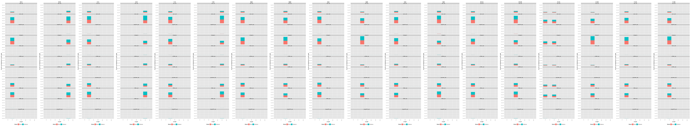
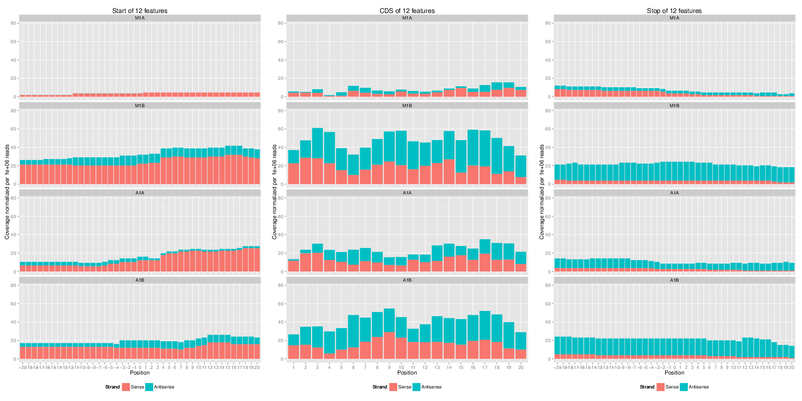
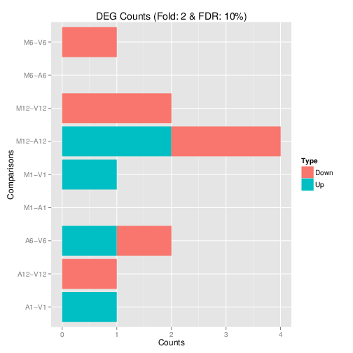
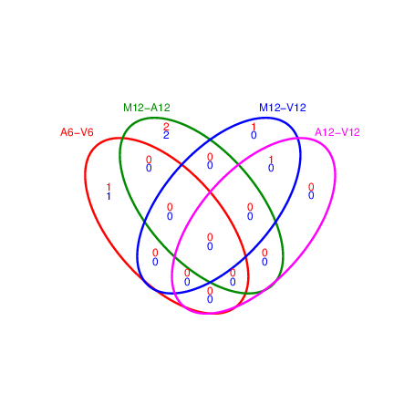

<!--
- Compile from command-line
Rscript -e "rmarkdown::render('systemPipeRIBOseq.Rmd', c('BiocStyle::html_document'), clean=F); knitr::knit('systemPipeRIBOseq.Rmd', tangle=TRUE)"
-->

```{css, echo=FALSE}
pre code {
white-space: pre !important;
overflow-x: scroll !important;
word-break: keep-all !important;
word-wrap: initial !important;
}
```

```{r style, echo = FALSE, results = 'asis'}
BiocStyle::markdown()
options(width=60, max.print=1000)
knitr::opts_chunk$set(
    eval=as.logical(Sys.getenv("KNITR_EVAL", "TRUE")),
    cache=as.logical(Sys.getenv("KNITR_CACHE", "TRUE")), 
    tidy.opts=list(width.cutoff=60), tidy=TRUE)
```

```{r setup, echo=FALSE, message=FALSE, warning=FALSE, eval=FALSE}
suppressPackageStartupMessages({
    library(systemPipeR)
})
```

# Introduction

Ribo-Seq and polyRibo-Seq are a specific form of RNA-Seq gene expression
experiments utilizing mRNA subpopulations directly bound to ribosomes.
Compared to standard RNA-Seq, their readout of gene expression provides a
better approximation of downstream protein abundance profiles due to their
close association with translational processes. The most important difference
among the two is that polyRibo-Seq utilizes polyribosomal RNA for sequencing,
whereas Ribo-Seq is a footprinting approach restricted to sequencing RNA
fragments protected by ribosomes [@Ingolia2009-cb; @Aspden2014-uu; @Juntawong2015-ru]. 

The workflow presented in this vignette contains most of the data analysis
steps described by [@Juntawong2014-ny] including functionalities useful for
processing both polyRibo-Seq and Ribo-Seq experiments. To improve re-usability
and adapt to recent changes of software versions (_e.g._ R, Bioconductor and
short read aligners), the code has been optimized accordingly. Thus, the
results obtained with the updated workflow are expected to be similar but not
necessarily identical with the published results described in the original
paper. 

Relevant analysis steps of this workflow include read preprocessing, read
alignments against a reference genome, counting of reads overlapping with a
wide range of genomic features (_e.g._ CDSs, UTRs, uORFs, rRNAs, etc.),
differential gene expression and differential ribosome binding analyses, as
well as a variety of genome-wide summary plots for visualizing RNA expression
trends. Functions are provided for evaluating the quality of Ribo-seq data,
for identifying novel expressed regions in the genomes, and for gaining
insights into gene regulation at the post-transcriptional and translational
levels. For example, the functions `genFeatures` and
`featuretypeCounts` can be used to quantify the expression output for
all feature types included in a genome annotation (`e.g.` genes,
introns, exons, miRNAs, intergenic regions, etc.). To determine the approximate
read length of ribosome footprints in Ribo-Seq experiments, these feature type
counts can be obtained and plotted for specific read lengths separately.
Typically, the most abundant read length obtained for translated features
corresponds to the approximate footprint length occupied by the ribosomes of a
given organism group. Based on the results from several Ribo-Seq studies, these
ribosome footprints are typically ~30 nucleotides long
[@Ingolia2011-fc; @Ingolia2009-cb; @Juntawong2014-ny].  However, their
length can vary by several nucleotides depending upon the optimization of the
RNA digestion step and various factors associated with translational
regulation.  For quality control purposes of Ribo-Seq experiments it is also
useful to monitor the abundance of reads mapping to rRNA genes due to the high
rRNA content of ribosomes. This information can be generated with the 
`featuretypeCounts` function described above.

Coverage trends along transcripts summarized for any number of transcripts can
be obtained and plotted with the functions `featureCoverage` and
`plotfeatureCoverage`, respectively. Their results allow monitoring
of the phasing of ribosome movements along triplets of coding sequences.
Commonly, high quality data will display here for the first nucleotide of each
codon the highest depth of coverage computed for the 5' ends of the aligned
reads. 
 
Ribo-seq data can also be used to evaluate various aspects of translational
control due to ribosome occupancy in upstream open reading frames (uORFs). The
latter are frequently present in (or near) 5' UTRs of transcripts. For this,
the function `predORFs` can be used to identify ORFs in the
nucleotide sequences of transcripts or their subcomponents such as UTR regions.
After scaling the resulting ORF coordinates back to the corresponding genome
locations using `scaleRanges`, one can use these novel features
(_e.g._ uORFs) for expression analysis routines similar to those
employed for pre-existing annotations, such as the exonic regions of genes. For
instance, in Ribo-Seq experiments one can use this approach to systematically identify all transcripts occupied by ribosomes in their uORF regions. The binding of
ribosomes to uORF regions may indicate a regulatory role in the translation of
the downstream main ORFs and/or translation of the uORFs into functionally
relevant peptides. 

## Experimental design

Typically, users want to specify here all information relevant for the analysis
of their NGS study. This includes detailed descriptions of FASTQ files,
experimental design, reference genome, gene annotations, etc.  

# Workflow environment

## Load packages and sample data

The `systemPipeR` package needs to be loaded to perform the analysis 
steps shown in this report [@H_Backman2016-bt]. The package allows users
to run the entire analysis workflow interactively or with a single command 
while also generating the corresponding analysis report. For details
see `systemPipeR's` main [vignette](http://www.bioconductor.org/packages/devel/bioc/vignettes/systemPipeR/inst/doc/systemPipeR.html).

```{r load_systempiper, eval=TRUE, message=FALSE, warning=FALSE}
library(systemPipeR)
```

## Generate workflow environment

[*systemPipeRdata*](http://bioconductor.org/packages/release/data/experiment/html/systemPipeRdata.html) package is a helper package to generate a fully populated [*systemPipeR*](http://bioconductor.org/packages/release/bioc/html/systemPipeR.html)
workflow environment in the current working directory with a single command. 
All the instruction for generating the workflow template are provide in the *systemPipeRdata* vignette [here](http://www.bioconductor.org/packages/devel/data/experiment/vignettes/systemPipeRdata/inst/doc/systemPipeRdata.html#1_Introduction). 

```{r genNew_wf, eval=FALSE}
systemPipeRdata::genWorkenvir(workflow = "riboseq", mydirname = "riboseq")
setwd("riboseq")
```

After building and loading the workflow environment generated by `genWorkenvir` 
from *systemPipeRdata* all data inputs are stored in
a `data/` directory and all analysis results will be written to a separate
`results/` directory, while the `systemPipeRIBOseq.Rmd` script and the `targets` file are expected to be located in the parent directory. The R session is expected to run from this parent
directory. Additional parameter files are stored under `param/`.

To work with real data, users want to organize their own data similarly
and substitute all test data for their own data. To rerun an established
workflow on new data, the initial `targets` file along with the corresponding
FASTQ files are usually the only inputs the user needs to provide. Please check
the initial `targets` file details below.

For more details, please consult the documentation 
[here](http://www.bioconductor.org/packages/release/bioc/vignettes/systemPipeR/inst/doc/systemPipeR.html). More information about the `targets` files from *systemPipeR* can be found [here](http://www.bioconductor.org/packages/release/bioc/vignettes/systemPipeR/inst/doc/systemPipeR.html#42_Structure_of_initial_targets_data). 

## Experiment definition provided by `targets` file

The `targets` file defines all FASTQ files and sample comparisons of the analysis workflow. 

```{r load_targets, eval=TRUE}
targetspath <- system.file("extdata", "targetsPE.txt", package="systemPipeR")
targets <- read.delim(targetspath, comment.char = "#")[,1:4]
targets
```

# Workflow environment

_`systemPipeR`_ workflows can be designed and built from start to finish with a 
single command, importing from an R Markdown file or stepwise in interactive 
mode from the R console. 

This tutorial will demonstrate how to build the workflow in an interactive mode, 
appending each step. The workflow is constructed by connecting each step via 
`appendStep` method. Each `SYSargsList` instance contains instructions needed 
for processing a set of input files with a specific command-line or R software 
and the paths to the corresponding outfiles generated by a particular tool/step. 

To create a Workflow within _`systemPipeR`_, we can start by defining an empty
container and checking the directory structure:

```{r create_workflow, message=FALSE, eval=FALSE}
library(systemPipeR)
sal <- SPRproject()
sal
```

## Required packages and resources

The `systemPipeR` package needs to be loaded [@H_Backman2016-bt].

```{r load_SPR, message=FALSE, eval=FALSE, spr=TRUE}
appendStep(sal) <- LineWise(
    code = {
        library(systemPipeR)
        library(rtracklayer)
        library(GenomicFeatures)
        library(ggplot2)
        library(grid)
        library(BiocParallel)
        library(DESeq2, quietly=TRUE)
        library(ape, warn.conflicts=FALSE)
        library(edgeR)
        library(biomaRt)
        library(BBmisc) # Defines suppressAll()
        library(pheatmap)
        library(BiocParallel)
    }, step_name = "load_SPR")
```

## Read preprocessing

### Preprocessing with `preprocessReads` function

The function `preprocessReads` allows to apply predefined or custom
read preprocessing functions to all FASTQ files referenced in a
`SYSargsList` container, such as quality filtering or adapter trimming
routines. Internally, `preprocessReads` uses the `FastqStreamer` function from
the `ShortRead` package to stream through large FASTQ files in a
memory-efficient manner.

Here, we are appending a new step to the `SYSargsList` object created previously. 
All the parameters are defined on the `preprocessReads/preprocessReads-pe_riboseq.yml` file.

```{r preprocessing, message=FALSE, eval=FALSE, spr=TRUE}
appendStep(sal) <- SYSargsList(
    step_name = "preprocessing",
    targets = "targetsPE.txt", dir = TRUE,
    wf_file = "preprocessReads/preprocessReads-pe.cwl",
    input_file = "preprocessReads/preprocessReads-pe_riboseq.yml",
    dir_path = system.file("extdata/cwl", package = "systemPipeR"),
    inputvars = c(
        FileName1 = "_FASTQ_PATH1_",
        FileName2 = "_FASTQ_PATH2_",
        SampleName = "_SampleName_"
    ),
    dependency = c("load_SPR"))
```

The function `trimbatch` used trims adapters hierarchically from the longest to
the shortest match of the right end of the reads. If `internalmatch=TRUE` then 
internal matches will trigger the same behavior. The argument `minpatternlength` 
defines the shortest adapter match to consider in this iterative process. In 
addition, the function removes reads containing Ns or homopolymer regions. 
More detailed information on read preprocessing is provided in `systemPipeR's` main vignette.

```{r preprocessing_check, message=FALSE, eval=FALSE}
yamlinput(sal, step="preprocessing")$Fct
# [1] "'trimbatch(fq, pattern=\"ACACGTCT\", internalmatch=FALSE, minpatternlength=6, Nnumber=1, polyhomo=50, minreadlength=16, maxreadlength=101)'"
cmdlist(sal, step = "preprocessing", targets = 1 )
```

### FASTQ quality report

The following `seeFastq` and `seeFastqPlot` functions generate and plot a series of useful 
quality statistics for a set of FASTQ files, including per cycle quality box
plots, base proportions, base-level quality trends, relative k-mer
diversity, length, and occurrence distribution of reads, number of reads
above quality cutoffs and mean quality distribution. The results are
written to a PDF file named `fastqReport.pdf`.

This is the pre-trimming fastq report. Another post-trimming fastq report step 
is not included in the default. It is recommended to run this step first to
decide whether the trimming is needed.

Please note that initial targets files are being used here. In this case, 
we used the `getColumn` function to extract a named vector. 

```{r fastq_report, eval=FALSE, message=FALSE, spr=TRUE}
appendStep(sal) <- LineWise(
    code = {
        fq_files <- getColumn(sal, "preprocessing", "targetsWF", column = 1)
        fqlist <- seeFastq(fastq = fq_files, batchsize = 10000, klength = 8)
        pdf("./results/fastqReport.pdf", height = 18, width = 4 * length(fqlist))
        seeFastqPlot(fqlist)
        dev.off()
    },
    step_name = "fastq_report",
    dependency = "preprocessing"
)
```


<div align="center"><b>Figure 1:</b> FASTQ quality report. To zoom in, right click image and open it in a separate browser tab. </div></br>

## Alignments

### Read mapping with `HISAT2`

The following steps will demonstrate how to use the short read aligner `Hisat2`
[@Kim2015-ve]. First, the `Hisat2` index needs to be created.

```{r hisat2_index, eval=FALSE, spr=TRUE}
appendStep(sal) <- SYSargsList(
    step_name = "hisat2_index", 
    dir = FALSE, 
    targets=NULL, 
    wf_file = "hisat2/hisat2-index.cwl", 
    input_file="hisat2/hisat2-index.yml",
    dir_path="param/cwl", 
    dependency = "load_SPR"
)
```

### `HISAT2` mapping

The parameter settings of the aligner are defined in the `workflow_hisat2-pe.cwl` 
and `workflow_hisat2-pe.yml` files. The following shows how to construct the 
corresponding *SYSargsList* object.

```{r hisat2_mapping, eval=FALSE, spr=TRUE}
appendStep(sal) <- SYSargsList(
    step_name = "hisat2_mapping",
    dir = TRUE, 
    targets ="targetsPE.txt", 
    wf_file = "workflow-hisat2/workflow_hisat2-pe.cwl",
    input_file = "workflow-hisat2/workflow_hisat2-pe.yml",
    dir_path = "param/cwl",
    inputvars = c(FileName1 = "_FASTQ_PATH1_", FileName2 = "_FASTQ_PATH2_", 
                  SampleName = "_SampleName_"),
    dependency = c("hisat2_index")
)
```

To double-check the command line for each sample, please use the following:

```{r bowtie2_alignment, eval=FALSE}
cmdlist(sal, step="hisat2_mapping", targets=1)
```

### Read and alignment stats

The following provides an overview of the number of reads in each sample
and how many of them aligned to the reference.

```{r align_stats, eval=FALSE, spr=TRUE}
appendStep(sal) <- LineWise(
    code = {
        fqpaths <- getColumn(sal, step = "hisat2_mapping", "targetsWF", column = "FileName1")
        bampaths <- getColumn(sal, step = "hisat2_mapping", "outfiles", column = "samtools_sort_bam")
        read_statsDF <- alignStats(args = bampaths, fqpaths = fqpaths, pairEnd = TRUE)
        write.table(read_statsDF, "results/alignStats.xls", row.names=FALSE, quote=FALSE, sep="\t")
        }, 
    step_name = "align_stats", 
    dependency = "hisat2_mapping")
```

## Create symbolic links for viewing BAM files in IGV

The `symLink2bam` function creates symbolic links to view the BAM alignment files in a
genome browser such as IGV without moving these large files to a local
system. The corresponding URLs are written to a file with a path
specified under `urlfile`, here `IGVurl.txt`. 
Please replace the directory and the user name. 

```{r bam_IGV, eval=FALSE, spr=TRUE}
appendStep(sal) <- LineWise(
    code = {
        bampaths <- getColumn(sal, step = "hisat2_mapping", "outfiles", 
                  column = "samtools_sort_bam")
        symLink2bam(
            sysargs = bampaths, htmldir = c("~/.html/", "somedir/"),
            urlbase = "http://cluster.hpcc.ucr.edu/~tgirke/",
            urlfile = "./results/IGVurl.txt")
    },
    step_name = "bam_IGV",
    dependency = "hisat2_mapping",
    run_step = "optional"
)
```

## Read distribution across genomic features

The `genFeatures` function generates a variety of feature types from
`TxDb` objects using utilities provided by the `GenomicFeatures` package. 

### Obtain feature types

The first step is the generation of the feature type ranges based on
annotations provided by a GFF file that can be transformed into a
`TxDb` object. This includes ranges for mRNAs, exons, introns, UTRs,
CDSs, miRNAs, rRNAs, tRNAs, promoter and intergenic regions. In addition, any
number of custom annotations can be included in this routine.

```{r genFeatures, eval=FALSE, spr=TRUE}
appendStep(sal) <- LineWise(
    code = {
        txdb <- suppressWarnings(makeTxDbFromGFF(file="data/tair10.gff", format="gff3", dataSource="TAIR", organism="Arabidopsis thaliana"))
        feat <- genFeatures(txdb, featuretype="all", reduce_ranges=TRUE, upstream=1000, 
                            downstream=0, verbose=TRUE)
    },
    step_name = "genFeatures",
    dependency = "hisat2_mapping",
    run_step = "mandatory"
)
```

### Count and plot reads of any length

The `featuretypeCounts` function counts how many reads in short read
alignment files (BAM format) overlap with entire annotation categories. This
utility is useful for analyzing the distribution of the read mappings across
feature types, _e.g._ coding versus non-coding genes. By default the
read counts are reported for the sense and antisense strand of each feature
type separately. To minimize memory consumption, the BAM files are processed in
a stream using utilities from the `Rsamtools` and `GenomicAlignment` packages. 
The counts can be reported for each read length separately or as a single value 
for reads of any length.  Subsequently, the counting results can be plotted with
the associated `plotfeaturetypeCounts` function.

The following generates and plots feature counts for any read length.

```{r featuretypeCounts, eval=FALSE, spr=TRUE}
appendStep(sal) <- LineWise(
    code = {
        outpaths <- getColumn(sal, step = "hisat2_mapping", "outfiles", column = "samtools_sort_bam")
        fc <- featuretypeCounts(bfl=BamFileList(outpaths, yieldSize=50000), grl=feat, 
                                singleEnd=FALSE, readlength=NULL, type="data.frame")
        p <- plotfeaturetypeCounts(x=fc, graphicsfile="results/featureCounts.png", 
                                   graphicsformat="png", scales="fixed", anyreadlength=TRUE, 
                                   scale_length_val=NULL)
    },
    step_name = "featuretypeCounts",
    dependency = "genFeatures",
    run_step = "mandatory"
)
```


<div align="center">Figure 2: Read distribution plot across annotation features for any read length.</div></br>

### Count and plot reads of specific lengths

To determine the approximate read length of ribosome footprints in Ribo-Seq 
experiments, one can generate and plot the feature counts for specific read lengths
separately. Typically, the most abundant read length obtained for translated 
features corresponds to the approximate footprint length occupied by the ribosomes.

```{r featuretypeCounts_length, eval=FALSE, spr=TRUE}
appendStep(sal) <- LineWise(
    code = {
        fc2 <- featuretypeCounts(bfl=BamFileList(outpaths, yieldSize=50000), grl=feat, 
                                 singleEnd=TRUE, readlength=c(74:76,99:102), type="data.frame")
        p2 <- plotfeaturetypeCounts(x=fc2, graphicsfile="results/featureCounts2.png",
                                    graphicsformat="png", scales="fixed", anyreadlength=FALSE,
                            scale_length_val=NULL)
    },
    step_name = "featuretypeCounts_length",
    dependency = "featuretypeCounts",
    run_step = "mandatory"
)
```


<div align="center">Figure 3: Read distribution plot across annotation features for specific read lengths.</div></br>

## Adding custom features to workflow

### Predicting uORFs in 5' UTR regions

The function `predORF` can be used to identify open reading frames (ORFs) and 
coding sequences (CDSs) in DNA sequences provided as `DNAString` or `DNAStringSet` 
objects. The setting `mode='ORF'` returns continuous reading frames that begin 
with a start codon and end with a stop codon, while `mode='CDS'` returns continuous 
reading frames that do not need to begin or end with start or stop codons, 
respectively. Non-canonical start and stop condons are supported by allowing 
the user to provide any custom set of triplets under the `startcodon` and 
`stopcodon` arguments (`i.e.` non-ATG start codons). The argument `n` defines 
the maximum number of ORFs to return for each input sequence (_e.g._ `n=1` 
returns only the longest ORF). It also supports the identification of overlapping 
and nested ORFs. Alternatively, one can return all non-overlapping ORFs including
the longest ORF for each input sequence with `n="all"` and `longest_disjoint=TRUE`.

```{r pred_ORF, eval=FALSE, spr=TRUE}
appendStep(sal) <- LineWise(
    code = {
        txdb <- suppressWarnings(makeTxDbFromGFF(file="data/tair10.gff", format="gff3", organism="Arabidopsis"))
        futr <- fiveUTRsByTranscript(txdb, use.names=TRUE)
        dna <- extractTranscriptSeqs(FaFile("data/tair10.fasta"), futr)
        uorf <- predORF(dna, n="all", mode="orf", longest_disjoint=TRUE, strand="sense")
    },
    step_name = "pred_ORF",
    dependency = "featuretypeCounts_length"
)
```

To use the predicted ORF ranges for expression analysis given genome alignments
as input, it is necessary to scale them to the corresponding genome
coordinates. The function `scaleRanges` does this by transforming the
mappings of spliced features (query ranges) to their corresponding genome
coordinates (subject ranges). The method accounts for introns in the subject
ranges that are absent in the query ranges. The above uORFs predicted in the
provided 5' UTRs sequences using `predORF` are a typical use case
for this application. These query ranges are given relative to the 5' UTR 
sequences and `scaleRanges` will convert them to the corresponding 
genome coordinates. The resulting `GRangesList` object (here `grl_scaled`) 
can be directly used for read counting.

```{r scale_ranges, eval=FALSE, spr=TRUE}
appendStep(sal) <- LineWise(
    code = {
        grl_scaled <- scaleRanges(subject=futr, query=uorf, type="uORF", verbose=TRUE)
        export.gff3(unlist(grl_scaled), "results/uorf.gff")
    },
    step_name = "scale_ranges",
    dependency = "pred_ORF"
)
```

To confirm the correctness of the obtained uORF ranges, one can parse their
corresponding DNA sequences from the reference genome with the `getSeq`
function and then translate them with the `translate` function into
proteins. Typically, the returned protein sequences should start with a
`M` (corresponding to start codon) and end with `*` (corresponding to stop codon). 
The following example does this for a single uORF containing three exons.

```{r translate, eval=FALSE, spr=TRUE}
appendStep(sal) <- LineWise(
    code = {
        translate(unlist(getSeq(FaFile("data/tair10.fasta"), grl_scaled[[7]])))
    },
    step_name = "translate",
    dependency = "scale_ranges"
)
```

### Adding custom features to other feature types

If required custom feature ranges can be added to the standard features generated
with the `genFeatures` function above. The following does this for the uORF ranges
predicted with `predORF`.

```{r add_features, eval=FALSE, spr=TRUE}
appendStep(sal) <- LineWise(
    code = {
        feat <- genFeatures(txdb, featuretype="all", reduce_ranges=FALSE)
        feat <- c(feat, GRangesList("uORF"=unlist(grl_scaled)))
    },
    step_name = "add_features",
    dependency = c("genFeatures", "scale_ranges")
)
```

### Predicting sORFs in intergenic regions

The following identifies continuous ORFs in intergenic regions. Note,
`predORF` can only identify continuous ORFs in query sequences. The
function does not identify and remove introns prior to the ORF prediction.  

```{r pred_sORFs, eval=FALSE, spr=TRUE}
appendStep(sal) <- LineWise(
    code = {
        feat <- genFeatures(txdb, featuretype="intergenic", reduce_ranges=TRUE)
        intergenic <- feat$intergenic
        strand(intergenic) <- "+"
        dna <- getSeq(FaFile("data/tair10.fasta"), intergenic)
        names(dna) <- mcols(intergenic)$feature_by
        sorf <- suppressWarnings(predORF(dna, n="all", mode="orf", longest_disjoint=TRUE, strand="both"))
        sorf <- sorf[width(sorf) > 60] # Remove sORFs below length cutoff, here 60bp
        intergenic <- split(intergenic, mcols(intergenic)$feature_by)
        grl_scaled_intergenic <- scaleRanges(subject=intergenic, query=sorf, type="sORF", verbose=TRUE)
        export.gff3(unlist(grl_scaled_intergenic), "sorf.gff")
        translate(getSeq(FaFile("data/tair10.fasta"), unlist(grl_scaled_intergenic)))
    },
    step_name = "pred_sORFs",
    dependency = c("add_features")
)
```

## Genomic read coverage along transripts or CDSs

The `featureCoverage` function computes the read coverage along
single and multi component features based on genomic alignments. The coverage
segments of component features are spliced to continuous ranges, such as exons
to transcripts or CDSs to ORFs. The results can be obtained with single
nucleotide resolution (_e.g._ around start and stop codons) or as mean coverage
of relative bin sizes, such as 100 bins for each feature. The latter allows
comparisons of coverage trends among transcripts of variable length. Additionally, 
the results can be obtained for single or many features (_e.g._ any number of
transcripts) at once. Visualization of the coverage results is facilitated by
the downstream `plotfeatureCoverage` function. 

### Binned CDS coverage to compare many transcripts

```{r binned_CDS_coverage, eval=FALSE, spr=TRUE}
appendStep(sal) <- LineWise(
    code = {
        grl <- cdsBy(txdb, "tx", use.names=TRUE)
        fcov <- featureCoverage(bfl=BamFileList(outpaths[1:2]), grl=grl[1:4],
                                resizereads=NULL, readlengthrange=NULL, Nbins=20, method=mean,
                                fixedmatrix=FALSE, resizefeatures=TRUE, upstream=20,
                                downstream=20, outfile="results/featureCoverage.xls",
                                overwrite=TRUE)
    },
    step_name = "binned_CDS_coverage",
    dependency = c("add_features")
)
```

### Coverage upstream and downstream of start and stop codons

```{r coverage_upstream_downstream, eval=FALSE, spr=TRUE}
appendStep(sal) <- LineWise(
    code = {
        fcov <- featureCoverage(bfl=BamFileList(outpaths[1:4]), grl=grl[1:12], resizereads=NULL,
                                readlengthrange=NULL, Nbins=NULL, method=mean, fixedmatrix=TRUE,
                                resizefeatures=TRUE, upstream=20, downstream=20,
                                outfile="results/featureCoverage.xls", overwrite=TRUE)
        png("./results/coverage_upstream_downstream.png", height=12, width=24, units="in", res=72)
        plotfeatureCoverage(covMA=fcov, method=mean, scales="fixed", extendylim=2,
                            scale_count_val=10^6)
        dev.off() 
    },
    step_name = "coverage_upstream_downstream",
    dependency = c("binned_CDS_coverage")
)
```

### Combined coverage for both binned CDS and start/stop codons

```{r coverage_combined, eval=FALSE, spr=TRUE}
appendStep(sal) <- LineWise(
    code = {
        fcov <- featureCoverage(bfl=BamFileList(outpaths[1:4]), grl=grl[1:4],
                                resizereads=NULL, readlengthrange=NULL, Nbins=20, method=mean,
                                fixedmatrix=TRUE, resizefeatures=TRUE, upstream=20,
                                downstream=20,outfile="results/featureCoverage.xls",
                                overwrite=TRUE)
        png("./results/featurePlot.png", height=12, width=24, units="in", res=72)
        plotfeatureCoverage(covMA=fcov, method=mean, scales="fixed", extendylim=2,
                            scale_count_val=10^6)
        dev.off() 
    },
    step_name = "coverage_combined",
    dependency = c("binned_CDS_coverage", "coverage_upstream_downstream")
)
```


<div align="center">Figure 4: Feature coverage plot with single nucleotide resolution around start and stop codons and binned coverage between them.</div></br>

## Nucleotide level coverage along entire transcripts/CDSs

```{r coverage_nuc_level, eval=FALSE, spr=TRUE}
appendStep(sal) <- LineWise(
    code = {
        fcov <- featureCoverage(bfl=BamFileList(outpaths[1:2]), grl=grl[1],
                                resizereads=NULL, readlengthrange=NULL, Nbins=NULL, method=mean,
                                fixedmatrix=FALSE, resizefeatures=TRUE, upstream=20,
                                downstream=20, outfile=NULL)
    },
    step_name = "coverage_nuc_level",
    dependency = c("coverage_combined")
)
```

## Read quantification per annotation range

### Read counting with `summarizeOverlaps` in parallel mode using multiple cores

Reads overlapping with annotation ranges of interest are counted for each
sample using the `summarizeOverlaps` function [@Lawrence2013-kt]. The
read counting is preformed for exonic gene regions in a non-strand-specific
manner while ignoring overlaps among different genes. Subsequently, the
expression count values are normalized by \textit{reads per kp per million
mapped reads} (RPKM). The raw read count table (`countDFeByg.xls`) and the corresponding
RPKM table (`rpkmDFeByg.xls`) are written to separate files in the `results` 
directory of this project.
Parallelization is achieved with the `BiocParallel` package, here using 8 CPU cores.

```{r read_counting, eval=FALSE, spr=TRUE}
appendStep(sal) <- LineWise(
    code = {
        txdb <- loadDb("./data/tair10.sqlite")
        eByg <- exonsBy(txdb, by=c("gene"))
        bfl <- BamFileList(outpaths, yieldSize=50000, index=character())
        multicoreParam <- MulticoreParam(workers = 8); register(multicoreParam); registered()
        counteByg <- bplapply(bfl, function(x) summarizeOverlaps(eByg, x, mode="Union", 
                                                                 ignore.strand=TRUE, 
                                                                 inter.feature=FALSE, 
                                                                 singleEnd=FALSE, 
                                                                 BPPARAM = multicoreParam)) 
        countDFeByg <- sapply(seq(along=counteByg), function(x) assays(counteByg[[x]])$counts)
        rownames(countDFeByg) <- names(rowRanges(counteByg[[1]]))
        colnames(countDFeByg) <- names(bfl)
        rpkmDFeByg <- apply(countDFeByg, 2, function(x) returnRPKM(counts=x, ranges=eByg))
        write.table(countDFeByg, "results/countDFeByg.xls", col.names=NA, quote=FALSE, sep="\t")
        write.table(rpkmDFeByg, "results/rpkmDFeByg.xls", col.names=NA, quote=FALSE, sep="\t")
        ## Creating a SummarizedExperiment object
        colData <- data.frame(row.names=SampleName(sal, "hisat2_mapping"), 
                              condition=getColumn(sal, "hisat2_mapping", position = "targetsWF", column = "Factor"))
        colData$condition <- factor(colData$condition)
        countDF_se <- SummarizedExperiment::SummarizedExperiment(assays = countDFeByg, 
                                                                 colData = colData)
        ## Add results as SummarizedExperiment to the workflow object
        SE(sal, "read_counting") <- countDF_se
    },
    step_name = "read_counting",
    dependency = c("featuretypeCounts")
)
```

When providing a `BamFileList` as in the example above, `summarizeOverlaps` methods
use by default `bplapply` and use the register interface from BiocParallel package. 
If the number of workers is not set, `MulticoreParam` will use the number of cores 
returned by `parallel::detectCores()`. For more information, 
please check `help("summarizeOverlaps")` documentation.

Sample of data slice of count table:

```{r read_counting_view, eval=TRUE}
read.delim(system.file("extdata/countDFeByg.xls", package = "systemPipeR"),
           row.names=1, check.names=FALSE)[1:4,1:5]
```

Sample of data slice of RPKM table

```{r read_rpkm_view, eval=FALSE}
read.delim(system.file("extdata/rpkmDFeByg.xls", package = "systemPipeR"),
           row.names=1, check.names=FALSE)[1:4,1:5]
```

Note, for most statistical differential expression or abundance analysis
methods, such as `edgeR` or `DESeq2`, the raw count values
should be used as input. The usage of RPKM values should be restricted to
specialty applications required by some users, _e.g._ manually comparing
the expression levels among different genes or features. 

### Sample-wise correlation analysis

The following computes the sample-wise Spearman correlation coefficients from
the `rlog` transformed expression values generated with the
`DESeq2` package. After transformation to a distance matrix,
hierarchical clustering is performed with the `hclust` function and
the result is plotted as a dendrogram and written to a file named `sample_tree.png`
in the `results` directory. 

```{r sample_tree, eval=FALSE, eval=FALSE, spr=TRUE}
appendStep(sal) <- LineWise(
    code = {
        ## Extracting SummarizedExperiment object 
        se <- SE(sal, "read_counting")
        dds <- DESeqDataSet(se, design = ~ condition)
        d <- cor(assay(rlog(dds)), method="spearman")
        hc <- hclust(dist(1-d))
        pdf("results/sample_tree.pdf")
        plot.phylo(as.phylo(hc), type="p", edge.col="blue", edge.width=2, show.node.label=TRUE, no.margin=TRUE)
        dev.off()
        }, 
    step_name = "sample_tree", 
    dependency = "read_counting")
```


<div align="center">Figure 5: Correlation dendrogram of samples.</div></br>


## Analysis of differentially expressed genes with `edgeR`

The analysis of differentially expressed genes (DEGs) is performed with the glm
method from the `edgeR` package [@Robinson2010-uk]. The sample
comparisons used by this analysis are defined in the header lines of the
`targetsPE.txt` file starting with `<CMP>`.

```{r run_edgeR, eval=FALSE, spr=TRUE}
appendStep(sal) <- LineWise(
    code = {
        countDF <- read.delim("results/countDFeByg.xls", row.names=1, check.names=FALSE) 
        cmp <- readComp(stepsWF(sal)[['hisat2_mapping']], format="matrix", delim="-")
        edgeDF <- run_edgeR(countDF=countDF, targets=targetsWF(sal)[['hisat2_mapping']], cmp=cmp[[1]], independent=FALSE, mdsplot="")
        }, 
    step_name = "run_edgeR", 
    dependency = "read_counting")
```

Add functional gene descriptions, here from `biomaRt`. 

```{r custom_annot, eval=FALSE, spr=TRUE}
appendStep(sal) <- LineWise(
    code = {
        m <- useMart("plants_mart", dataset="athaliana_eg_gene", host="https://plants.ensembl.org")
        desc <- getBM(attributes=c("tair_locus", "description"), mart=m)
        desc <- desc[!duplicated(desc[,1]),]
        descv <- as.character(desc[,2]); names(descv) <- as.character(desc[,1])
        edgeDF <- data.frame(edgeDF, Desc=descv[rownames(edgeDF)], check.names=FALSE)
        write.table(edgeDF, "./results/edgeRglm_allcomp.xls", quote=FALSE, sep="\t", col.names = NA)
        },
    step_name = "custom_annot", 
    dependency = "run_edgeR")
```

### Plot DEG results

Filter and plot DEG results for up and down regulated genes. The
definition of *up* and *down* is given in the corresponding help
file. To open it, type `?filterDEGs` in the R console.

```{r filter_degs, eval=FALSE, spr=TRUE}
appendStep(sal) <- LineWise(
    code = {
        edgeDF <- read.delim("results/edgeRglm_allcomp.xls", row.names=1, check.names=FALSE) 
        pdf("results/DEGcounts.pdf")
        DEG_list <- filterDEGs(degDF=edgeDF, filter=c(Fold=2, FDR=20))
        dev.off()
        write.table(DEG_list$Summary, "./results/DEGcounts.xls", quote=FALSE, sep="\t", row.names=FALSE)
        }, 
    step_name = "filter_degs", 
    dependency = "custom_annot")
```


<div align="center">Figure 6: Up and down regulated DEGs.</div></br>

### Venn diagrams of DEG sets

The `overLapper` function can compute Venn intersects for large numbers of sample
sets (up to 20 or more) and plots 2-5 way Venn diagrams. A useful
feature is the possibility to combine the counts from several Venn
comparisons with the same number of sample sets in a single Venn diagram
(here for 4 up and down DEG sets).

```{r venn_diagram, eval=FALSE, spr=TRUE}
appendStep(sal) <- LineWise(
    code = {
        vennsetup <- overLapper(DEG_list$Up[6:9], type="vennsets")
        vennsetdown <- overLapper(DEG_list$Down[6:9], type="vennsets")
        pdf("results/vennplot.pdf")
        vennPlot(list(vennsetup, vennsetdown), mymain="", mysub="", colmode=2, ccol=c("blue", "red"))
        dev.off()
        }, 
    step_name = "venn_diagram", 
    dependency = "filter_degs")
```


<div align="center">Figure 7: Venn Diagram for 4 Up and Down DEG Sets</div></br>

## GO term enrichment analysis of DEGs

### Obtain gene-to-GO mappings

The following shows how to obtain gene-to-GO mappings from `biomaRt`
(here for _A. thaliana_) and how to organize them for the downstream GO
term enrichment analysis. Alternatively, the gene-to-GO mappings can be
obtained for many organisms from Bioconductor's `*.db` genome
annotation packages or GO annotation files provided by various genome
databases. For each annotation this relatively slow preprocessing step needs to
be performed only once. Subsequently, the preprocessed data can be loaded with
the `load` function as shown in the next subsection. 

```{r get_go_annot, eval=FALSE, spr=TRUE}
appendStep(sal) <- LineWise(
    code = {
        # listMarts() # To choose BioMart database
        # listMarts(host="plants.ensembl.org")
        # m <- useMart("plants_mart", host="https://plants.ensembl.org")
        #listDatasets(m)
        m <- useMart("plants_mart", dataset="athaliana_eg_gene", host="https://plants.ensembl.org")
        # listAttributes(m) # Choose data types you want to download
        go <- getBM(attributes=c("go_id", "tair_locus", "namespace_1003"), mart=m)
        go <- go[go[,3]!="",]; go[,3] <- as.character(go[,3])
        go[go[,3]=="molecular_function", 3] <- "F"; go[go[,3]=="biological_process", 3] <- "P"; go[go[,3]=="cellular_component", 3] <- "C"
        go[1:4,]
        if(!dir.exists("./data/GO")) dir.create("./data/GO")
        write.table(go, "data/GO/GOannotationsBiomart_mod.txt", quote=FALSE, row.names=FALSE, col.names=FALSE, sep="\t")
        catdb <- makeCATdb(myfile="data/GO/GOannotationsBiomart_mod.txt", lib=NULL, org="", colno=c(1,2,3), idconv=NULL)
        save(catdb, file="data/GO/catdb.RData")
        }, 
    step_name = "get_go_annot", 
    dependency = "filter_degs")
```

### Batch GO term enrichment analysis

Apply the enrichment analysis to the DEG sets obtained the above differential
expression analysis. Note, in the following example the `FDR` filter is set
here to an unreasonably high value, simply because of the small size of the toy
data set used in this vignette. Batch enrichment analysis of many gene sets is
performed with the function. When `method=all`, it returns all GO terms passing
the p-value cutoff specified under the `cutoff` arguments. When `method=slim`,
it returns only the GO terms specified under the `myslimv` argument. The given
example shows how a GO slim vector for a specific organism can be obtained from
`BioMart`.

```{r go_enrich, eval=FALSE, spr=TRUE}
appendStep(sal) <- LineWise(
    code = {
        load("data/GO/catdb.RData")
        DEG_list <- filterDEGs(degDF=edgeDF, filter=c(Fold=2, FDR=50), plot=FALSE)
        up_down <- DEG_list$UporDown; names(up_down) <- paste(names(up_down), "_up_down", sep="")
        up <- DEG_list$Up; names(up) <- paste(names(up), "_up", sep="")
        down <- DEG_list$Down; names(down) <- paste(names(down), "_down", sep="")
        DEGlist <- c(up_down, up, down)
        DEGlist <- DEGlist[sapply(DEGlist, length) > 0]
        BatchResult <- GOCluster_Report(catdb=catdb, setlist=DEGlist, method="all", id_type="gene", CLSZ=2, cutoff=0.9, gocats=c("MF", "BP", "CC"), recordSpecGO=NULL)
        m <- useMart("plants_mart", dataset="athaliana_eg_gene", host="https://plants.ensembl.org")
        goslimvec <- as.character(getBM(attributes=c("goslim_goa_accession"), mart=m)[,1])
        BatchResultslim <- GOCluster_Report(catdb=catdb, setlist=DEGlist, method="slim", id_type="gene", myslimv=goslimvec, CLSZ=10, cutoff=0.01, gocats=c("MF", "BP", "CC"), recordSpecGO=NULL)
        }, 
    step_name = "go_enrich", 
    dependency = "get_go_annot")
```

### Plot batch GO term results

The `data.frame` generated by `GOCluster` can be plotted with the `goBarplot` function. 
Because of the variable size of the sample sets, it may not always be desirable to show
the results from different DEG sets in the same bar plot. Plotting single sample
sets is achieved by subsetting the input data frame as shown in the first line 
of the following example.

```{r go_plot, eval=FALSE, spr=TRUE}
appendStep(sal) <- LineWise(
    code = {
        gos <- BatchResultslim[grep("M6-V6_up_down", BatchResultslim$CLID), ]
        gos <- BatchResultslim
        pdf("results/GOslimbarplotMF.pdf", height=8, width=10)
        goBarplot(gos, gocat="MF")
        goBarplot(gos, gocat="BP")
        goBarplot(gos, gocat="CC")
        dev.off()
        },
    step_name = "go_plot", 
    dependency = "go_enrich")
```


<div align="center">Figure 8: GO Slim Barplot for MF Ontology.</div></br>

## Differential ribosome loading analysis (translational efficiency)

Combined with mRNA-Seq data, Ribo-Seq or polyRibo-Seq experiments can be used
to study changes in translational efficiencies of genes and/or transcripts for
different treatments. For test purposes the following generates a small test
data set from the sample data used in this vignette, where two types of RNA
samples (`assays`) are considered: polyribosomal mRNA (`Ribo`)
and total mRNA (`mRNA`). In addition, there are two treatments
(`conditions`): `M1` and `A1`. 

```{r diff_loading, eval=FALSE, spr=TRUE}
appendStep(sal) <- LineWise(
    code = {
        countDFeByg <- read.delim("results/countDFeByg.xls", row.names=1, check.names=FALSE) 
        coldata <- S4Vectors::DataFrame(assay=factor(rep(c("Ribo","mRNA"), each=4)), 
                                        condition= factor(rep(as.character(targetsWF(sal)[['hisat2_mapping']]$Factor[1:4]), 2)), 
                                        row.names=as.character(targetsWF(sal)[['hisat2_mapping']]$SampleName)[1:8])
        coldata
        },
    step_name = "diff_loading", 
    dependency = "go_plot")
```

Differences in translational efficiencies can be calculated by ratios of ratios
for the two conditions: 

$$(Ribo\_A1 / mRNA\_A1) / (Ribo\_M1 / mRNA\_M1)$$

The latter can be modeled with the `DESeq2` package using the design 
$\sim assay + condition + assay:condition$, where the interaction term 
$assay:condition$ represents the ratio of ratios. Using the likelihood ratio
test of `DESeq2`, which removes the interaction term in the reduced model, 
one can test whether the translational efficiency (ribosome loading) is different
in condition `A1` than in `M1`.

```{r diff_translational_eff, eval=FALSE, spr=TRUE}
appendStep(sal) <- LineWise(
    code = {
        dds <- DESeq2::DESeqDataSetFromMatrix(countData=as.matrix(countDFeByg[,rownames(coldata)]), 
                                              colData = coldata, 
                                              design = ~ assay + condition + assay:condition)
        # model.matrix(~ assay + condition + assay:condition, coldata) # Corresponding design matrix
        dds <- DESeq2::DESeq(dds, test="LRT", reduced = ~ assay + condition)
        res <- DESeq2::results(dds)
        head(res[order(res$padj),],4)
        write.table(res, file="transleff.xls", quote=FALSE, col.names = NA, sep="\t")
        },
    step_name = "diff_translational_eff", 
    dependency = "diff_loading")
```

## Clustering and heat maps

The following example performs hierarchical clustering on the `rlog` transformed 
expression matrix subsetted by the DEGs identified in the above differential 
expression analysis. It uses a Pearson correlation-based distance measure and 
complete linkage for cluster joining.

```{r heatmap, eval=FALSE, spr=TRUE}
appendStep(sal) <- LineWise(
    code = {
        geneids <- unique(as.character(unlist(DEG_list[[1]])))
        y <- assay(rlog(dds))[geneids, ]
        y <- y[rowSums(y[])>0,]
        pdf("results/heatmap1.pdf")
        pheatmap(y, scale="row", clustering_distance_rows="correlation", clustering_distance_cols="correlation")
        dev.off()
        }, 
    step_name = "heatmap", 
    dependency = "diff_translational_eff")
```


<div align="center">Figure 9: Heat map with hierarchical clustering dendrograms of DEGs</div></br>

## Version Information

```{r sessionInfo, eval=FALSE, spr=TRUE}
appendStep(sal) <- LineWise(
    code = {
        sessionInfo()
        }, 
    step_name = "sessionInfo", 
    dependency = "heatmap")
```

# Running workflow

## Interactive job submissions in a single machine

For running the workflow, `runWF` function will execute all the steps store in 
the workflow container. The execution will be on a single machine without 
submitting to a queuing system of a computer cluster. 

```{r runWF, eval=FALSE}
sal <- runWF(sal, run_step = "mandatory")
```

## Parallelization on clusters

Alternatively, the computation can be greatly accelerated by processing many files 
in parallel using several compute nodes of a cluster, where a scheduling/queuing
system is used for load balancing. 

The `resources` list object provides the number of independent parallel cluster 
processes defined under the `Njobs` element in the list. The following example 
will run 18 processes in parallel using each 4 CPU cores. 
If the resources available on a cluster allow running all 18 processes at the 
same time, then the shown sample submission will utilize in a total of 72 CPU cores.

Note, `runWF` can be used with most queueing systems as it is based on utilities 
from the `batchtools` package, which supports the use of template files (_`*.tmpl`_)
for defining the run parameters of different schedulers. To run the following 
code, one needs to have both a `conffile` (see _`.batchtools.conf.R`_ samples [here](https://mllg.github.io/batchtools/)) 
and a `template` file (see _`*.tmpl`_ samples [here](https://github.com/mllg/batchtools/tree/master/inst/templates)) 
for the queueing available on a system. The following example uses the sample 
`conffile` and `template` files for the Slurm scheduler provided by this package. 

The resources can be appended when the step is generated, or it is possible to 
add these resources later, as the following example using the `addResources` 
function:

```{r runWF_cluster, eval=FALSE}
resources <- list(conffile=".batchtools.conf.R",
                  template="batchtools.slurm.tmpl", 
                  Njobs=18, 
                  walltime=120, ## minutes
                  ntasks=1,
                  ncpus=4, 
                  memory=1024, ## Mb
                  partition = "short"
                  )
sal <- addResources(sal, c("hisat2_mapping"), resources = resources)
sal <- runWF(sal, run_step = "mandatory")
```

## Visualize workflow

_`systemPipeR`_ workflows instances can be visualized with the `plotWF` function.

```{r plotWF, eval=FALSE}
plotWF(sal, rstudio = TRUE)
```

## Checking workflow status

To check the summary of the workflow, we can use:

```{r statusWF, eval=FALSE}
sal
statusWF(sal)
```

## Accessing logs report

_`systemPipeR`_ compiles all the workflow execution logs in one central location,
making it easier to check any standard output (`stdout`) or standard error
(`stderr`) for any command-line tools used on the workflow or the R code stdout.

```{r logsWF, eval=FALSE}
sal <- renderLogs(sal)
```

# Version Information

```{r sessionInfo_final}
sessionInfo()
```

# Funding
This research was funded by National Science Foundation Grants IOS-0750811 and
MCB-1021969, and a Marie Curie European Economic Community Fellowship
PIOF-GA-2012-327954.

# References
