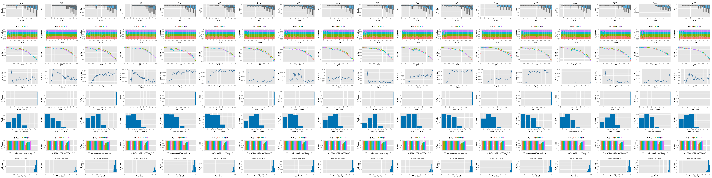
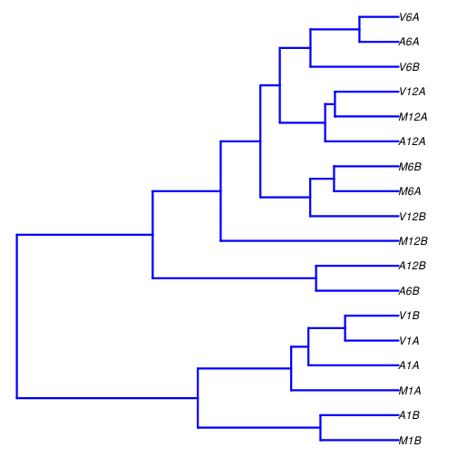
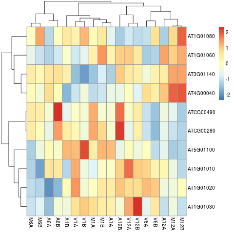

<!--
Rscript -e "rmarkdown::render('systemPipeRNAseq.Rmd', c('BiocStyle::html_document'), clean=F); knitr::knit('systemPipeRNAseq.Rmd', tangle=TRUE)"; Rscript -e "rmarkdown::render('systemPipeRNAseq.Rmd', c('BiocStyle::pdf_document'))"
-->

```{css, echo=FALSE}
pre code {
white-space: pre !important;
overflow-x: scroll !important;
word-break: keep-all !important;
word-wrap: initial !important;
}
```


```{r style, echo = FALSE, results = 'asis'}
BiocStyle::markdown()
options(width = 60, max.print = 1000)
knitr::opts_chunk$set(
    eval = as.logical(Sys.getenv("KNITR_EVAL", "TRUE")),
    cache = as.logical(Sys.getenv("KNITR_CACHE", "TRUE")), 
    tidy.opts = list(width.cutoff = 60), tidy = TRUE)
```

# Introduction

Users want to provide here background information about the design of their RNA-Seq project.

# Samples and environment settings

## Environment settings and input data

Typically, the user wants to record here the sources and versions of the
reference genome sequence along with the corresponding annotations. In
the provided sample data set all data inputs are stored in a `data`
subdirectory and all results will be written to a separate `results` directory,
while the `systemPipeRNAseq.Rmd` script and the `targets` file are expected to be 
located in the parent directory. The R session is expected to run from this parent directory.

[*systemPipeRdata*](http://bioconductor.org/packages/release/data/experiment/html/systemPipeRdata.html) package is a helper package to generate a fully populated [*systemPipeR*](http://bioconductor.org/packages/release/bioc/html/systemPipeR.html)
workflow environment in the current working directory with a single command. 
All the instruction for generating the workflow are provide in the *systemPipeRdata* vignette [here](http://www.bioconductor.org/packages/devel/data/experiment/vignettes/systemPipeRdata/inst/doc/systemPipeRdata.html#1_Introduction). 

The mini sample FASTQ files used by this report as well as the associated reference genome files
can be loaded via the *systemPipeRdata* package. 
The chosen data set [SRP010938](http://www.ncbi.nlm.nih.gov/sra/?term=SRP010938)
contains 18 paired-end (PE) read sets from *Arabidposis thaliana*
[@Howard2013-fq]. To minimize processing time during testing, each FASTQ
file has been subsetted to 90,000-100,000 randomly sampled PE reads that
map to the first 100,000 nucleotides of each chromosome of the *A.
thaliana* genome. The corresponding reference genome sequence (FASTA) and
its GFF annotation files have been truncated accordingly. This way the entire 
test sample data set is less than 200MB in storage space. A PE read set has been
chosen for this test data set for flexibility, because it can be used for testing both types
of analysis routines requiring either SE (single end) reads or PE reads.

```{r genNew_wf, eval=FALSE}
systemPipeRdata::genWorkenvir(workflow = "rnaseq", mydirname = "rnaseq")
setwd("rnaseq")
```

# Create the workflow interactively

This template provides some common steps for a RNAseq workflow. One can add, remove, modify 
workflow steps by operating on the `sal` object. 
For full documentation and details of SPR features and functions, please see the 
[main vignette](http://bioconductor.org/packages/devel/bioc/vignettes/systemPipeR/inst/doc/systemPipeR.html).

```{r project, eval=FALSE}
sal <- SPRproject() 
```

If you desire to import this entire workflow in one step, please skip this 
tutorial and follow:

```{r project_import, eval=FALSE}
systemPipeRdata::genWorkenvir(workflow = "rnaseq")
setwd("rnaseq")
sal <- SPRproject() 
sal <- importWF(sal, 
                   file_path = "systemPipeRNAseq_import.Rmd", 
                    verbose = FALSE)
sal <- runWF(sal)
plotWF(sal, rstudio = TRUE)
sal <- renderLogs(sal)
```

## Required packages and resources

The `systemPipeR` package needs to be loaded [@H_Backman2016-bt].

```{r load_SPR, message=FALSE, eval=FALSE, spr='r'}
library(systemPipeR)
appendStep(sal) <- LineWise({
                            library(systemPipeR)
                            }, step_name = "load_SPR")
```

## Read preprocessing

### Read trimming with Trimmomatic

Next, we need to populate the object created with the first step in the
workflow. Here, an example of how to perform this task using parameters template
files for trimming FASTQ files with [Trimmomatic](http://www.usadellab.org/cms/?page=trimmomatic) software [@Bolger2014-yr].

```{r trimming, eval=FALSE, spr='sysargs', spr.dep='load_SPR'}
targetspath <- "targetsPE.txt"
appendStep(sal) <- SYSargsList(
    step_name = "trimming",
    targets=targetspath, 
    wf_file = "trimmomatic/trimmomatic-pe.cwl", input_file = "trimmomatic/trimmomatic-pe.yml",
    dir_path= "param/cwl",
    inputvars=c(FileName1="_FASTQ_PATH1_", FileName2="_FASTQ_PATH2_", SampleName="_SampleName_"), 
    dependency = "load_SPR")
```

### FASTQ quality report

The following `seeFastq` and `seeFastqPlot` functions generate and plot a series of useful 
quality statistics for a set of FASTQ files including per cycle quality box
plots, base proportions, base-level quality trends, relative k-mer
diversity, length and occurrence distribution of reads, number of reads
above quality cutoffs and mean quality distribution. The results are
written to a PDF file named `fastqReport.pdf`.

```{r fastq_report, eval=FALSE, message=FALSE, spr='r', spr.dep='trimming'}
appendStep(sal) <- LineWise({
                            fastq <- getColumn(sal, step = "trimming", "targetsWF", column = 1)
                            fqlist <- seeFastq(fastq=fastq, batchsize=10000, klength=8)
                            pdf("./results/fastqReport.pdf", height=18, width=4*length(fqlist))
                            seeFastqPlot(fqlist)
                            dev.off()
                            }, step_name = "fastq_report", 
                            dependency = "trimming")
``` 



<div align="center">Figure 1: FASTQ quality report for 18 samples</div></br>

## Alignments

### Read mapping with `HISAT2`

The following steps will demonstrate how to use the short read aligner `Hisat2`
[@Kim2015-ve] in both interactive job submissions and batch submissions to
queuing systems of clusters using the _`systemPipeR's`_ new CWL command-line interface.

Build `Hisat2` index.

```{r hisat2_index, eval=FALSE, spr='sysargs', spr.dep='load_SPR'}
appendStep(sal) <- SYSargsList(
  step_name = "hisat2_index", dir = FALSE, targets=NULL, 
  wf_file = "hisat2/hisat2-index.cwl", 
  input_file="hisat2/hisat2-index.yml",
  dir_path="param/cwl", 
  dependency = "load_SPR"
)
```

### HISAT2 mapping

The parameter settings of the aligner are defined in the `hisat2-mapping-se.cwl` 
and `hisat2-mapping-se.yml` files. The following shows how to construct the 
corresponding *SYSargsList* object.

```{r hisat2_mapping, eval=FALSE, spr='sysargs', spr.dep='trimming;hisat2_index'}
appendStep(sal) <- SYSargsList(
  step_name = "hisat2_mapping",
  targets ="trimming", dir = TRUE, 
  wf_file = "workflow-hisat2/workflow_hisat2-pe.cwl",
  input_file = "workflow-hisat2/workflow_hisat2-pe.yml",
  dir_path = "param/cwl",
  inputvars = c(trimmomatic_1_paired = "_FASTQ_PATH1_", trimmomatic_2_paired = "_FASTQ_PATH2_", 
                SampleName = "_SampleName_"),
  rm_targets_col = c("FileName1", "FileName2"), 
  dependency = c("trimming", "hisat2_index")
)
```

### Read and alignment stats

The following provides an overview of the number of reads in each sample
and how many of them aligned to the reference.

```{r align_stats, eval=FALSE, spr='r', spr.dep='hisat2_mapping'}
appendStep(sal) <- LineWise({
                           bampaths <- getColumn(sal, step = "hisat2_mapping", "outfiles", column = "samtools_sort_bam")
                           fqpaths <- getColumn(sal, step = "trimming", "targetsWF", column = "FileName1")
                           read_statsDF <- alignStats(args=bampaths, fqpaths = fqpaths, pairEnd = TRUE)
                           write.table(read_statsDF, "results/alignStats.xls", row.names=FALSE, quote=FALSE, sep="\t")
                            }, step_name = "align_stats", 
                            dependency = "hisat2_mapping")
```

## Read quantification

Reads overlapping with annotation ranges of interest are counted for
each sample using the `summarizeOverlaps` function [@Lawrence2013-kt]. The read counting is
preformed for exon gene regions in a non-strand-specific manner while
ignoring overlaps among different genes. Subsequently, the expression
count values are normalized by *reads per kp per million mapped reads*
(RPKM). The raw read count table (`countDFeByg.xls`) and the corresponding 
RPKM table (`rpkmDFeByg.xls`) are written to separate files in the directory of this project. Parallelization is achieved with the `BiocParallel` package, here using 8 CPU cores.

### Create a database for gene annotation

```{r create_db, eval=FALSE, spr='r', spr.dep='hisat2_mapping'}
appendStep(sal) <- LineWise({
                    library("GenomicFeatures"); library(BiocParallel)
                    (function(){
                    # if db is there, skip this step
                    if(file.exists("./data/tair10.sqlite")) return(TRUE)
                    # otherwise prepare the db
                    txdb <- makeTxDbFromGFF(file="data/tair10.gff", format="gff", dataSource="TAIR", organism="Arabidopsis thaliana")
                    saveDb(txdb, file="./data/tair10.sqlite")
                    })()
                    }, step_name = "create_db", 
                    dependency = "hisat2_mapping")
```

### Read counting with `summarizeOverlaps` in parallel mode using multiple cores

```{r read_counting, eval=FALSE, spr='r', spr.dep='create_db'}
appendStep(sal) <- LineWise({
                    txdb <- loadDb("./data/tair10.sqlite")
                    outpaths <- getColumn(sal, step = "hisat2_mapping", "outfiles", column = "samtools_sort_bam")
                    eByg <- exonsBy(txdb, by=c("gene"))
                    bfl <- BamFileList(outpaths, yieldSize=50000, index=character())
                    multicoreParam <- MulticoreParam(workers=2); register(multicoreParam); registered()
                    counteByg <- bplapply(bfl, function(x) summarizeOverlaps(eByg, x, mode="Union", 
                                                                   ignore.strand=TRUE, 
                                                                   inter.feature=FALSE, 
                                                                   singleEnd=TRUE)) 
                    countDFeByg <- sapply(seq(along=counteByg), function(x) assays(counteByg[[x]])$counts)
                    rownames(countDFeByg) <- names(rowRanges(counteByg[[1]])); colnames(countDFeByg) <- names(bfl)
                    rpkmDFeByg <- apply(countDFeByg, 2, function(x) returnRPKM(counts=x, ranges=eByg))
                    write.table(countDFeByg, "results/countDFeByg.xls", col.names=NA, quote=FALSE, sep="\t")
                    write.table(rpkmDFeByg, "results/rpkmDFeByg.xls", col.names=NA, quote=FALSE, sep="\t")
                    }, step_name = "read_counting", 
                    dependency = "create_db")
```

Note, for most statistical differential expression or abundance analysis
methods, such as `edgeR` or `DESeq2`, the raw count values should be used as input. The
usage of RPKM values should be restricted to specialty applications
required by some users, *e.g.* manually comparing the expression levels
among different genes or features.

### Sample-wise correlation analysis

The following computes the sample-wise Spearman correlation coefficients from
the `rlog` transformed expression values generated with the `DESeq2` package. After
transformation to a distance matrix, hierarchical clustering is performed with
the `hclust` function and the result is plotted as a dendrogram
(also see file `sample_tree.pdf`).

```{r sample_tree, eval=FALSE, spr='r', spr.dep='read_counting'}
appendStep(sal) <- LineWise({
                    library(DESeq2, quietly=TRUE); library(ape,  warn.conflicts=FALSE)
                    countDF <- as.matrix(read.table("./results/countDFeByg.xls"))
                    colData <- data.frame(row.names=SampleName(sal, "hisat2_mapping"), condition=getColumn(sal, "hisat2_mapping", position = "targetsWF", column = "Factor" ))
                    dds <- DESeqDataSetFromMatrix(countData = countDF, colData = colData, design = ~ condition)
                    d <- cor(assay(rlog(dds)), method="spearman")
                    hc <- hclust(dist(1-d))
                    pdf("results/sample_tree.pdf")
                    plot.phylo(as.phylo(hc), type="p", edge.col="blue", edge.width=2, show.node.label=TRUE, no.margin=TRUE)
                    dev.off()
                    }, step_name = "sample_tree", 
                    dependency = "read_counting")
```


<div align="center">Figure 2: Correlation dendrogram of samples</div></br>

## Analysis of DEGs

The analysis of differentially expressed genes (DEGs) is performed with
the `glm` method of the `edgeR` package [@Robinson2010-uk]. The sample
comparisons used by this analysis are defined in the header lines of the 
`targets.txt` file starting with `<CMP>`.

### Run `edgeR`

```{r run_edger, eval=FALSE, spr='r', spr.dep='read_counting'}
appendStep(sal) <- LineWise({
                    library(edgeR)
                    countDF <- read.delim("results/countDFeByg.xls", row.names=1, check.names=FALSE) 
                    cmp <- readComp(stepsWF(sal)[['hisat2_mapping']], format="matrix", delim="-")
                    edgeDF <- run_edgeR(countDF=countDF, targets=targetsWF(sal)[['hisat2_mapping']], cmp=cmp[[1]], independent=FALSE, mdsplot="")
                    }, step_name = "run_edger", 
                    dependency = "read_counting")
```

### Add gene descriptions

```{r custom_annot, eval=FALSE, spr='r', spr.dep='run_edger'}
appendStep(sal) <- LineWise({
                    library("biomaRt")
                    m <- useMart("plants_mart", dataset="athaliana_eg_gene", host="plants.ensembl.org")
                    desc <- getBM(attributes=c("tair_locus", "description"), mart=m)
                    desc <- desc[!duplicated(desc[,1]),]
                    descv <- as.character(desc[,2]); names(descv) <- as.character(desc[,1])
                    edgeDF <- data.frame(edgeDF, Desc=descv[rownames(edgeDF)], check.names=FALSE)
                    write.table(edgeDF, "./results/edgeRglm_allcomp.xls", quote=FALSE, sep="\t", col.names = NA)
                    }, step_name = "custom_annot", 
                    dependency = "run_edger")
```

### Plot DEG results

Filter and plot DEG results for up and down regulated genes. The
definition of *up* and *down* is given in the corresponding help
file. To open it, type `?filterDEGs` in the R console.

```{r filter_degs, eval=FALSE, spr='r', spr.dep='custom_annot'}
appendStep(sal) <- LineWise({
                    edgeDF <- read.delim("results/edgeRglm_allcomp.xls", row.names=1, check.names=FALSE) 
                    pdf("results/DEGcounts.pdf")
                    DEG_list <- filterDEGs(degDF=edgeDF, filter=c(Fold=2, FDR=20))
                    dev.off()
                    write.table(DEG_list$Summary, "./results/DEGcounts.xls", quote=FALSE, sep="\t", row.names=FALSE)
                    }, step_name = "filter_degs", 
                    dependency = "custom_annot")
```

### Venn diagrams of DEG sets

The `overLapper` function can compute Venn intersects for large numbers of sample
sets (up to 20 or more) and plots 2-5 way Venn diagrams. A useful
feature is the possibility to combine the counts from several Venn
comparisons with the same number of sample sets in a single Venn diagram
(here for 4 up and down DEG sets).

```{r venn_diagram, eval=FALSE, spr='r', spr.dep='filter_degs'}
appendStep(sal) <- LineWise({
                    vennsetup <- overLapper(DEG_list$Up[6:9], type="vennsets")
                    vennsetdown <- overLapper(DEG_list$Down[6:9], type="vennsets")
                    pdf("results/vennplot.pdf")
                    vennPlot(list(vennsetup, vennsetdown), mymain="", mysub="", colmode=2, ccol=c("blue", "red"))
                    dev.off()
                    }, step_name = "venn_diagram", 
                    dependency = "filter_degs")
```

## GO term enrichment analysis

### Obtain gene-to-GO mappings

The following shows how to obtain gene-to-GO mappings from `biomaRt` (here for *A.
thaliana*) and how to organize them for the downstream GO term
enrichment analysis. Alternatively, the gene-to-GO mappings can be
obtained for many organisms from Bioconductor’s `*.db` genome annotation
packages or GO annotation files provided by various genome databases.
For each annotation this relatively slow preprocessing step needs to be
performed only once. Subsequently, the preprocessed data can be loaded
with the `load` function as shown in the next subsection.

```{r get_go_annot, eval=FALSE, spr='r', spr.dep='filter_degs'}
appendStep(sal) <- LineWise({
                    library("biomaRt")
                    (function(){
                      if (file.exists("data/GO/catdb.RData")) return(TRUE)
                      # listMarts() # To choose BioMart database
                      # listMarts(host="plants.ensembl.org")
                      m <- useMart("plants_mart", host="plants.ensembl.org")
                      listDatasets(m)
                      m <- useMart("plants_mart", dataset="athaliana_eg_gene", host="plants.ensembl.org")
                      # listAttributes(m) # Choose data types you want to download
                      go <- getBM(attributes=c("go_id", "tair_locus", "namespace_1003"), mart=m)
                      go <- go[go[,3]!="",]; go[,3] <- as.character(go[,3])
                      go[go[,3]=="molecular_function", 3] <- "F"; go[go[,3]=="biological_process", 3] <- "P"; go[go[,3]=="cellular_component", 3] <- "C"
                      go[1:4,]
                      dir.create("./data/GO")
                      write.table(go, "data/GO/GOannotationsBiomart_mod.txt", quote=FALSE, row.names=FALSE, col.names=FALSE, sep="\t")
                      catdb <- makeCATdb(myfile="data/GO/GOannotationsBiomart_mod.txt", lib=NULL, org="", colno=c(1,2,3), idconv=NULL)
                      save(catdb, file="data/GO/catdb.RData")
                    })()
                    }, step_name = "get_go_annot", 
                    dependency = "filter_degs")
```

### Batch GO term enrichment analysis

Apply the enrichment analysis to the DEG sets obtained the above differential
expression analysis. Note, in the following example the `FDR` filter is set
here to an unreasonably high value, simply because of the small size of the toy
data set used in this vignette. Batch enrichment analysis of many gene sets is
performed with the function. When `method=all`, it returns all GO terms passing
the p-value cutoff specified under the `cutoff` arguments. When `method=slim`,
it returns only the GO terms specified under the `myslimv` argument. The given
example shows how a GO slim vector for a specific organism can be obtained from
`BioMart`.

```{r go_enrich, eval=FALSE, spr='r', spr.dep='get_go_annot'}
appendStep(sal) <- LineWise({
library("biomaRt")
                    load("data/GO/catdb.RData")
                    DEG_list <- filterDEGs(degDF=edgeDF, filter=c(Fold=2, FDR=50), plot=FALSE)
                    up_down <- DEG_list$UporDown; names(up_down) <- paste(names(up_down), "_up_down", sep="")
                    up <- DEG_list$Up; names(up) <- paste(names(up), "_up", sep="")
                    down <- DEG_list$Down; names(down) <- paste(names(down), "_down", sep="")
                    DEGlist <- c(up_down, up, down)
                    DEGlist <- DEGlist[sapply(DEGlist, length) > 0]
                    BatchResult <- GOCluster_Report(catdb=catdb, setlist=DEGlist, method="all", id_type="gene", CLSZ=2, cutoff=0.9, gocats=c("MF", "BP", "CC"), recordSpecGO=NULL)
                    library("biomaRt")
                    m <- useMart("plants_mart", dataset="athaliana_eg_gene", host="plants.ensembl.org")
                    goslimvec <- as.character(getBM(attributes=c("goslim_goa_accession"), mart=m)[,1])
                    BatchResultslim <- GOCluster_Report(catdb=catdb, setlist=DEGlist, method="slim", id_type="gene", myslimv=goslimvec, CLSZ=10, cutoff=0.01, gocats=c("MF", "BP", "CC"), recordSpecGO=NULL)
                    }, step_name = "go_enrich", 
                    dependency = "get_go_annot")
```

### Plot batch GO term results

The `data.frame` generated by `GOCluster` can be plotted with the `goBarplot` function. Because of the
variable size of the sample sets, it may not always be desirable to show
the results from different DEG sets in the same bar plot. Plotting
single sample sets is achieved by subsetting the input data frame as
shown in the first line of the following example.

```{r go_plot, eval=FALSE, spr='r', spr.dep='go_enrich'}
appendStep(sal) <- LineWise({
                    gos <- BatchResultslim[grep("M6-V6_up_down", BatchResultslim$CLID), ]
                    gos <- BatchResultslim
                    pdf("results/GOslimbarplotMF.pdf", height=8, width=10)
                    goBarplot(gos, gocat="MF")
                    dev.off()
                    goBarplot(gos, gocat="BP")
                    goBarplot(gos, gocat="CC")
                    }, step_name = "go_plot", 
                    dependency = "go_enrich")
```


<div align="center">Figure 5: GO Slim Barplot for MF Ontology</div></br>

## Clustering and heat maps

The following example performs hierarchical clustering on the `rlog`
transformed expression matrix subsetted by the DEGs identified in the above
differential expression analysis. It uses a Pearson correlation-based distance
measure and complete linkage for cluster joining.

```{r heatmap, eval=FALSE, spr='r', spr.dep='go_enrich'}
appendStep(sal) <- LineWise({
                    library(pheatmap)
                    geneids <- unique(as.character(unlist(DEG_list[[1]])))
                    y <- assay(rlog(dds))[geneids, ]
                    pdf("results/heatmap1.pdf")
                    pheatmap(y, scale="row", clustering_distance_rows="correlation", clustering_distance_cols="correlation")
                    dev.off()
                    }, step_name = "heatmap", 
                    dependency = "go_enrich")
```


<div align="center">Figure 6: Heat Map with Hierarchical Clustering Dendrograms of DEGs</div></br>

## Version Information

```{r sessionInfo, eval=FALSE, spr='r', spr.dep='heatmap'}
appendStep(sal) <- LineWise({
                    sessionInfo()
                    }, step_name = "sessionInfo", 
                    dependency = "heatmap")
```

# Running workflow

```{r run_echo, eval=FALSE}
sal <- runWF(sal)
```

## Visualize workflow

```{r plot_echo, eval=FALSE}
plotWF(sal, rstudio = TRUE)
```

## Checking workflow status

```{r status_echo, eval=FALSE}
statusWF(sal)
```

## Accessing logs report

```{r logs_echo, eval=FALSE}
sal <- renderLogs(sal)
```

# Funding

This project was supported by funds from the National Institutes of Health (NIH).

# References
