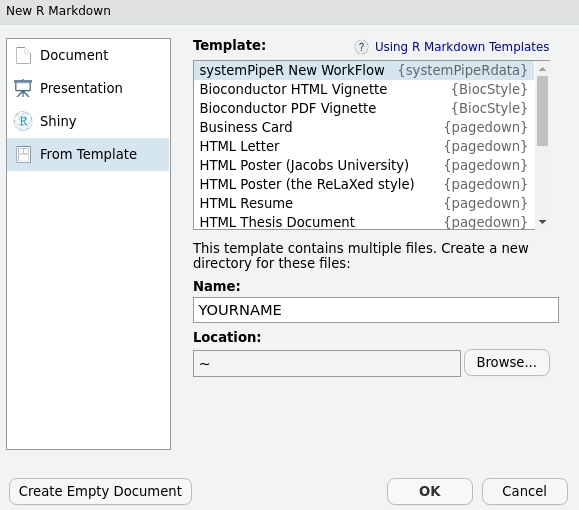
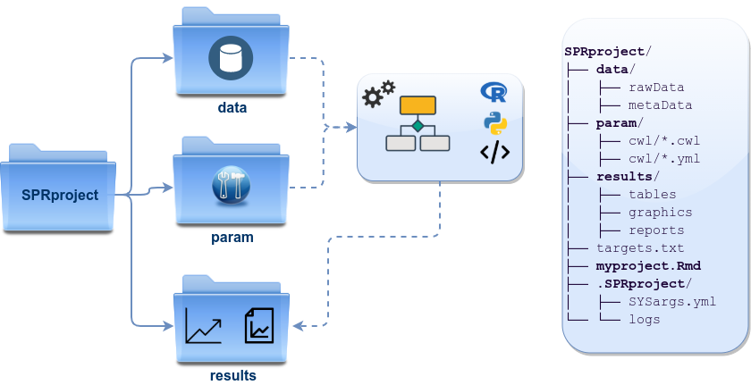

```{css, echo=FALSE}
pre code {
white-space: pre !important;
overflow-x: scroll !important;
word-break: keep-all !important;
word-wrap: initial !important;
}
```

<!---
- Compile from command-line
Rscript -e "rmarkdown::render('systemPipeRdata.Rmd', c('BiocStyle::html_document'), clean=F); knitr::knit('systemPipeRdata.Rmd', tangle=TRUE)"; Rscript -e "rmarkdown::render('systemPipeRdata.Rmd', c('BiocStyle::pdf_document'))"

- Commit to github
git commit -am "some edits"; git push -u origin master
-->

```{r style, echo = FALSE, results = 'asis'}
BiocStyle::markdown()
options(width=60, max.print=1000)
knitr::opts_chunk$set(
    eval=as.logical(Sys.getenv("KNITR_EVAL", "TRUE")),
    cache=as.logical(Sys.getenv("KNITR_CACHE", "TRUE")), 
    tidy.opts=list(width.cutoff=60), tidy=TRUE)
```

```{r setup, echo=FALSE, messages=FALSE, warnings=FALSE}
suppressPackageStartupMessages({
    library(systemPipeRdata)
})
```

**Note:** the most recent version of this vignette can be found <a href="https://github.com/tgirke/systemPipeRdata/blob/master/vignettes/systemPipeRdata.Rmd">here</a>.

**Note:** if you use _`systemPipeR`_ and _`systemPipeRdata`_ in published research, please cite:

Backman, T.W.H and Girke, T. (2016). *systemPipeR*: Workflow and Report Generation Environment. *BMC Bioinformatics*, 17: 388. [10.1186/s12859-016-1241-0](https://doi.org/10.1186/s12859-016-1241-0).

# Introduction

[_`systemPipeRdata`_](https://github.com/tgirke/systemPipeRdata) is a helper package 
to generate with a single command  workflow templates that are intended to be 
used by its parent package [_`systemPipeR`_](http://www.bioconductor.org/packages/devel/bioc/html/systemPipeR.html) [@H_Backman2016-bt]. 
The *systemPipeR* project provides a suite of R/Bioconductor packages for designing,
building and running end-to-end analysis workflows on local machines, HPC clusters 
and cloud systems, while generating at the same time publication quality analysis reports.

To test workflows quickly or design new ones from existing templates, users can
generate with a single command workflow instances fully populated with sample data 
and parameter files required for running a chosen workflow.
Pre-configured directory structure of the workflow environment and the sample data 
used by _`systemPipeRdata`_ are described [here](http://bioconductor.org/packages/release/bioc/vignettes/systemPipeR/inst/doc/systemPipeR.html#load-sample-data-and-workflow-templates).

# Getting started

## Installation

The _`systemPipeRdata`_ package is available at [Bioconductor](http://www.bioconductor.org/packages/release/data/experiment/html/systemPipeRdata.html) and can be installed from within R as follows: 

```{r install, eval=FALSE}
if (!requireNamespace("BiocManager", quietly=TRUE))
    install.packages("BiocManager")
BiocManager::install("systemPipeRdata") # Installs Release version from Bioconductor 
BiocManager::install("systemPipeRdata", version = "devel", build_vignettes=TRUE,
                     dependencies=TRUE)  # Installs Devel version from Bioconductor
```

## Loading package and documentation

```{r load_systemPipeRdata, eval=TRUE, messages=FALSE, warnings=FALSE}
library("systemPipeRdata") # Loads the package
```
```{r documentation_systemPipeRdata, eval=FALSE}
library(help="systemPipeRdata") # Lists package info
vignette("systemPipeRdata") # Opens vignette
```

## Starting with preconfigured workflow templates

Load one of the available workflows into your current working directory. 
The following does this for the _`varseq`_ workflow template. The name of the resulting 
workflow directory can be specified under the _`mydirname`_ argument. The default _`NULL`_ 
uses the name of the chosen workflow. An error is issued if a directory of the same 
name and path exists already. 

```{r generate_workenvir, eval=FALSE}
genWorkenvir(workflow="varseq", mydirname=NULL, url=NULL, urlname=NULL)
setwd("varseq")
```

On Linux and OS X systems the same can be achieved from the command-line of a terminal with the following commands.

```{bash generate_workenvir_from_shell, eval=FALSE}
$ Rscript -e "systemPipeRdata::genWorkenvir(workflow='varseq', mydirname=NULL)"
```

### Workflow templates collection

A collection of workflow templates are available and it is possible to browse the 
current availability, as follows:

```{r eval=FALSE, tidy=FALSE}
availableWF(github = TRUE)
```

This function returns the list of workflow templates available within the package 
and [systemPipeR Organization](https://github.com/systemPipeR) on GitHub. Each one 
listed template can be created as described above. 

```{r eval=FALSE, tidy=FALSE}
genWorkenvir(workflow="systemPipeR/systemPipeVARseq", mydirname="NULL")
```

The workflow template choose from Github will be installed as an R package, and 
also it creates the environment with all the settings and files to run the demo 
analysis quickly.

Besides, it is possible to choose different versions of the workflow template, 
defined through other branches on the GitHub Repository. By default, the _`master`_ 
branch is selected, however, it is possible to define a different branch with the _`ref`_ argument. 

```{r eval=FALSE, tidy=FALSE}
genWorkenvir(workflow="systemPipeR/systemPipeRNAseq", ref = "singleMachine")
```

### Download a specific R Markdown file

Also, it is possible to download a specific workflow script for your analysis. The URL can 
be specified under _`url`_ argument and the file name in the _`urlname`_ argument. 
The default _`NULL`_ copies the current version available in the chose template.

```{r eval=FALSE, tidy=FALSE}
genWorkenvir(workflow="rnaseq", url = "https://raw.githubusercontent.com/systemPipeR/systemPipeRNAseq/cluster/vignettes/systemPipeRNAseq.Rmd", 
             urlname = "rnaseq_V-cluster.Rmd")
```

## Dinamic generation of workflow template

It is possible to create a new workflow structure from RStudio 
menu `File -> New File -> R Markdown -> From Template -> systemPipeR New WorkFlow`.
This interactive option creates the same environment as demonstrated above.


**Figure 1:** Selecting workflow template within RStudio.

## Directory Structure

The workflow templates generated by _`genWorkenvir`_ contain the following preconfigured directory structure:

* <span style="color:green">_**workflow/**_</span> (*e.g.* *rnaseq/*) 
    + This is the root directory of the R session running the workflow.
    + Run script ( *\*.Rmd*) and sample annotation (*targets.txt*) files are located here.
    + Note, this directory can have any name (*e.g.* <span style="color:green">_**rnaseq**_</span>, <span style="color:green">_**varseq**_</span>). Changing its name does not require any modifications in the run script(s).
  + **Important subdirectories**: 
    + <span style="color:green">_**param/**_</span> 
        + Stores non-CWL parameter files such as: *\*.param*, *\*.tmpl* and *\*.run.sh*. These files are only required for backwards compatibility to run old workflows using the previous custom command-line interface.
        + <span style="color:green">_**param/cwl/**_</span>: This subdirectory stores all the CWL parameter files. To organize workflows, each can have its own subdirectory, where all `CWL param` and `input.yml` files need to be in the same subdirectory. 
    + <span style="color:green">_**data/**_ </span>
        + FASTQ files
        + FASTA file of reference (*e.g.* reference genome)
        + Annotation files
        + etc.
    + <span style="color:green">_**results/**_</span>
        + Analysis results are usually written to this directory, including: alignment, variant and peak files (BAM, VCF, BED); tabular result files; and image/plot files
        + Note, the user has the option to organize results files for a given sample and analysis step in a separate subdirectory.

**Note**: Directory names are indicated in  <span style="color:grey">***green***</span>. 
Users can change this structure as needed, but need to adjust the code in their workflows
accordingly. 

<center></center>

**Figure 2:** *systemPipeR's* preconfigured directory structure.

## Run workflows

Next, run from within R the chosen sample workflow by executing the code provided 
in the corresponding _`*.Rmd`_ template file. 
Much more detailed information on running and customizing [_`systemPipeR`_](http://www.bioconductor.org/packages/devel/bioc/html/systemPipeR.html) 
workflows is available in its overview vignette [here](http://www.bioconductor.org/packages/devel/bioc/vignettes/systemPipeR/inst/doc/systemPipeR.html). 
This vignette can also be opened from R with the following command. 

```{r load_systemPipeR, eval=FALSE, messages=FALSE}
library("systemPipeR") # Loads systemPipeR which needs to be installed via BiocManager::install() from Bioconductor
```

```{r documentation_systemPipeR, eval=FALSE}
vignette("systemPipeR", package = "systemPipeR")
```

## Return paths to sample data

The location of the sample data provided by _`systemPipeRdata`_ can be returned as a _`list`_.

```{r return_samplepaths, eval=TRUE}
pathList()
```

# Version information

```{r sessionInfo}
sessionInfo()
```

# Funding

This project was supported by funds from the National Institutes of Health (NIH) and the National Science Foundation (NSF).

# References
